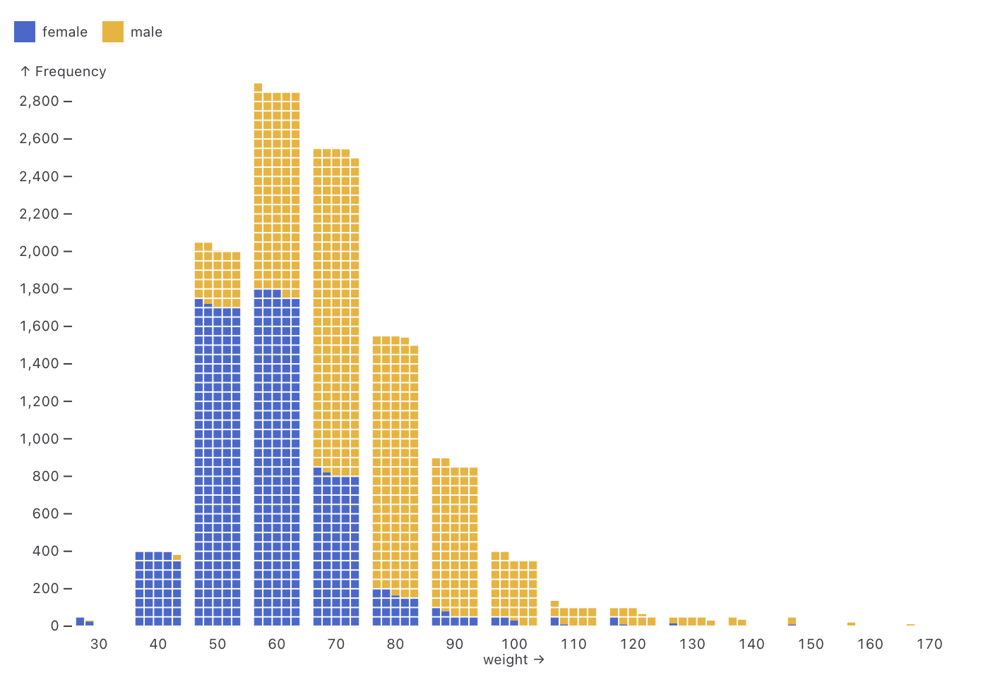
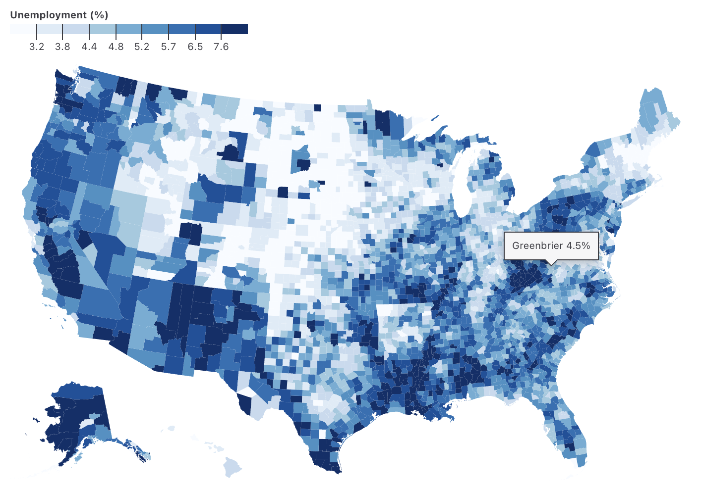
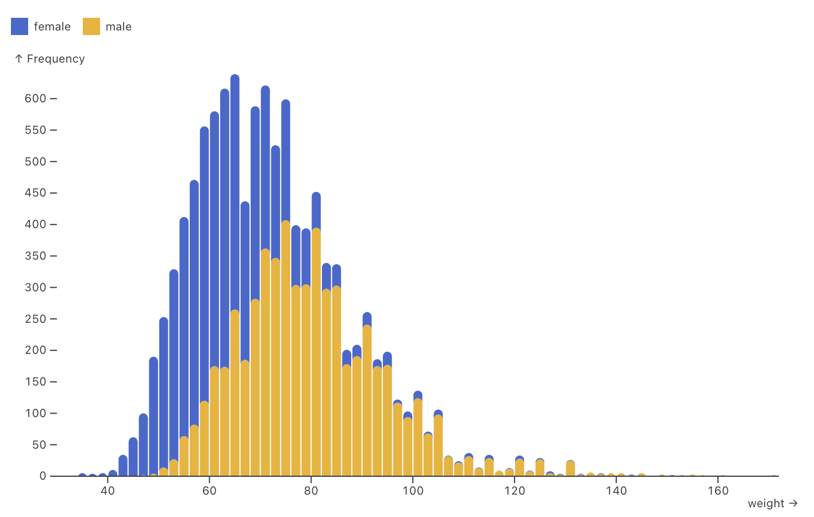
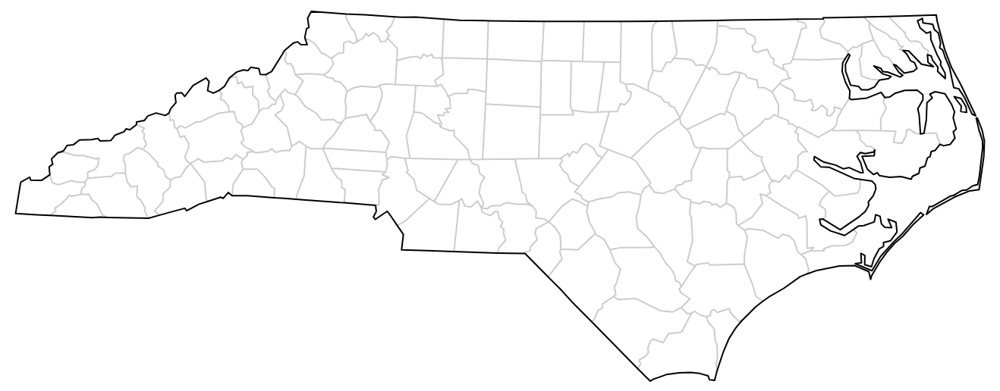
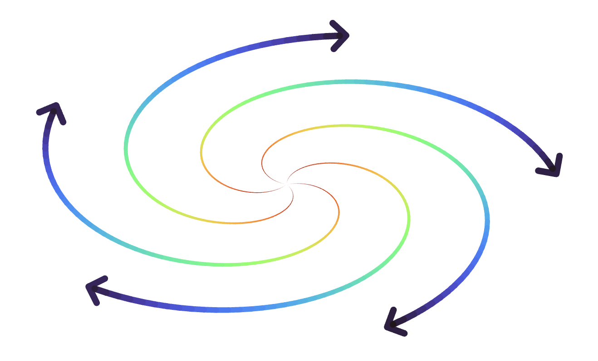

# Observable Plot - Changelog [2024]

Year: [Current (2025)](./CHANGELOG.md) · **2024** · [2023](./CHANGELOG-2023.md) · [2022](./CHANGELOG-2022.md) · [2021](./CHANGELOG-2021.md)

## 0.6.16

[Released August 6, 2024.](https://github.com/observablehq/plot/releases/tag/v0.6.16)

The new [waffle mark](https://observablehq.com/plot/marks/waffle) 🧇 displays a quantity (or quantitative extent) for a given category; unlike a [bar](https://observablehq.com/plot/marks/bar), a waffle is subdivided into cells that allow easier counting, making waffles useful for reading and comparing exact quantities. Plot’s waffle mark is highly configurable: it supports stacking, positive and negative values, rounded corners, partial cells for fractional counts, automatic row or column size determination (with optional override), and more!

[](https://observablehq.com/plot/marks/waffle)

```js
Plot.plot({
  fx: {interval: 10},
  color: {legend: true},
  marks: [Plot.waffleY(olympians, Plot.groupZ({y: "count"}, {fill: "sex", sort: "sex", fx: "weight", unit: 10}))]
})
```

All marks now support GeoJSON data and GeoJSON property shorthand, making it easier to work with GeoJSON. For example, below the data `counties` is a GeoJSON FeatureCollection, and `unemployment` refers to a property on each feature; the **fill** option is thus shorthand for `(d) => d.properties.unemployment`. The [geo mark](https://observablehq.com/plot/marks/geo) now also supports the **tip** option (via an implicit [centroid transform](https://observablehq.com/plot/transforms/centroid)), making it easier to use Plot’s [interactive tooltips](https://observablehq.com/plot/interactions/pointer).

[](https://observablehq.com/plot/marks/geo)

```js
Plot.plot({
  projection: "albers-usa",
  color: {
    type: "quantile",
    n: 9,
    scheme: "blues",
    label: "Unemployment (%)",
    legend: true
  },
  marks: [
    Plot.geo(counties, {
      fill: "unemployment",
      title: (d) => `${d.properties.name} ${d.properties.unemployment}%`,
      tip: true
    })
  ]
})
```

All marks now also support column name channel shorthand when using Apache Arrow tables as data, and we’ve added detection of Arrow date-type columns. (Arrow represents temporal data using BigInt rather than Date.)

```js
Plot.dot(gistemp, {x: "Date", y: "Anomaly"}).plot() // gistemp is an Arrow Table!
```

The rect-like marks ([rect](https://observablehq.com/plot/marks/rect), [bar](https://observablehq.com/plot/marks/bar), [cell](https://observablehq.com/plot/marks/cell), and [frame](https://observablehq.com/plot/marks/frame)) now support individual rounding options for each side (**rx1**, **ry1**, *etc.*) and corner (**rx1y1**, **rx2y1**, *etc.*). This allows you to round just the top side of rects. You can even use a negative corner radius on the bottom side for seamless stacking, as in the histogram of Olympic athletes below.

[](https://observablehq.com/plot/marks/rect)

```js
Plot.plot({
  color: {legend: true},
  marks: [
    Plot.rectY(olympians, Plot.binX({y: "count"}, {x: "weight", fill: "sex", ry2: 4, ry1: -4, clip: "frame"})),
    Plot.ruleY([0])
  ]
})
```

Plot now respects the projection **domain** when determining the default plot height. Previously, the map below would use a default square aspect ratio for the *conic-conformal* projection regardless of the specified **domain**, but now the map is perfectly sized to fit North Carolina. (Plot also now chooses a smarter default plot height when the ordinal *y* scale domain is empty.)



```js
Plot.plot({
  projection: {.
    type: "conic-conformal",
    parallels: [34 + 20 / 60, 36 + 10 / 60],
    rotate: [79, 0],
    domain: state
  },
  marks: [
    Plot.geo(counties, {strokeOpacity: 0.2}),
    Plot.geo(state)
  ]
})
```

The [marker options](https://observablehq.com/plot/features/markers) now render as intended on marks with varying aesthetics, such as the spiraling arrows of varying thickness and color below.



```js
Plot.plot({
  inset: 40,
  axis: null,
  marks: [
    Plot.line(d3.range(400), {
      x: (i) => i * Math.sin(i / 100 + ((i % 5) * 2 * Math.PI) / 5),
      y: (i) => i * Math.cos(i / 100 + ((i % 5) * 2 * Math.PI) / 5),
      z: (i) => i % 5,
      stroke: (i) => -i,
      strokeWidth: (i) => i ** 1.1 / 100,
      markerEnd: "arrow"
    })
  ]
})
```

This release includes a few more new features, bug fixes, and improvements:

The new **className** [mark option](https://observablehq.com/plot/features/marks#mark-options) specifies an optional `class` attribute for rendered marks, allowing styling of marks via external stylesheets or easier selection via JavaScript; thanks, @RLesser! Plot now reuses `clipPath` elements, when possible, when the **clip** mark option is set to *frame* or *projection*.

The [difference mark](https://observablehq.com/plot/marks/difference) now supports a horizontal orientation via [differenceX](https://observablehq.com/plot/marks/difference#differenceX), and the [shift transform](https://observablehq.com/plot/transforms/shift) now likewise supports [shiftY](https://observablehq.com/plot/transforms/shift#shiftY). The [Voronoi mark](https://observablehq.com/plot/marks/delaunay) is now compatible with the pointer transform: only the pointed Voronoi cell is rendered; the Voronoi mark now also renders as intended with non-exclusive facets (as when using the *exclude* facet mode). The [tip mark](https://observablehq.com/plot/marks/tip) no longer displays channels containing literal color values by default.

## 0.6.15

[Released June 11, 2024.](https://github.com/observablehq/plot/releases/tag/v0.6.15)

## 0.6.14

[Released March 12, 2024.](https://github.com/observablehq/plot/releases/tag/v0.6.14)

Changes the default categorical color scheme to *Observable10*.

The group transform now preserves the input order of groups by default, making it easier to sort groups by using the **sort** option. The group and bin transforms now support the *z* reducer.

Improves the accessibility of axes by hidding tick marks and grid lines from the accessibility tree.

Upgrades D3 to 7.9.0.

---

For earlier changes, continue to the [2023 CHANGELOG](./CHANGELOG-2023.md).
