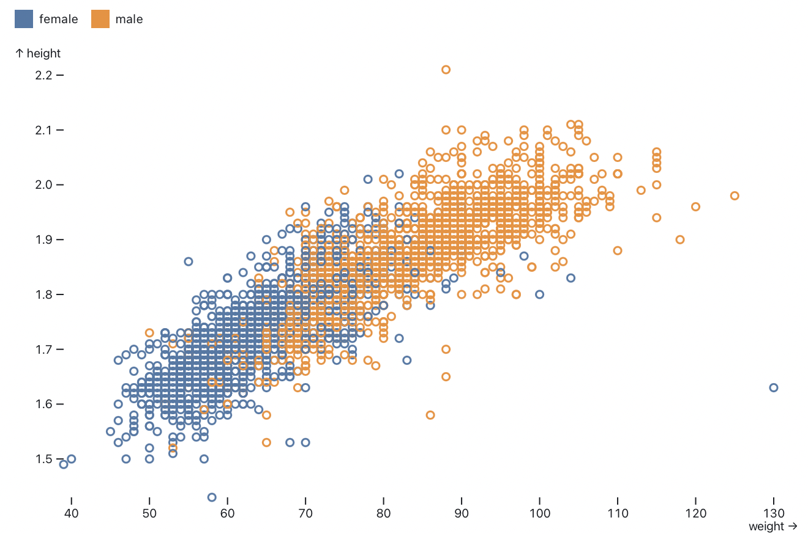

# Observable Plot - Changelog

## 0.3.2

Released December 10, 2021.

The font-variant now only defaults to *tabular-nums* for axis and legend tick labels on non-ordinal scales; on ordinal scales it defaults to *normal*.

If a scale has an implicit label (such as inferred from a channel), the legend will now inherit the label.

## 0.3.1

Released December 10, 2021.

The normalize transform now also supports the *min*, *max*, and *deviation* basis methods.

The generated figure element now resets the max-width style to initial.

Update D3 to 7.2.1.

## 0.3.0

Released December 4, 2021.

Plot can now produce [legends for *color* and *opacity* scales](https://github.com/observablehq/plot/blob/main/README.md#legends)!

[](https://observablehq.com/@observablehq/plot-legends)

```js
Plot.plot({
  color: {
    legend: true
  },
  marks: [
    Plot.dot(athletes, {x: "weight", y: "height", stroke: "sex"})
  ]
})
```

The top-level plot *scale*.**legend** option generates an inline legend for the given *scale* (*color* or *opacity*). Alternatively, the new *plot*.legend(*name*) function returns a legend for the scale with the given *name*. The new standalone Plot.**legend**(*options*) function also allows you to create a legend independently of a chart. Two forms of color legend are provided: *swatches* for ordinal or discrete scales (*e.g.*, threshold color scales), and *ramp* for continuous scales.

The new [Plot.image](https://github.com/observablehq/plot/blob/main/README.md#image) mark centers an image on the given *xy* position.

[](https://observablehq.com/@observablehq/plot-image)

```js
Plot.plot({
  x: {
    label: "Date of first inauguration →"
  },
  y: {
    grid: true,
    label: `↑ Net favorability (%)`,
    percent: true,
    tickFormat: "+f"
  },
  marks: [
    Plot.ruleY([0]),
    Plot.image(favorability, {x: "First Inauguration Date", y: "Net favorability", src: "Portrait URL"})
  ]
})
```

All marks now support a new *opacity* option, either as a constant or a channel bound to the *opacity* scale, which sets the mark’s object opacity. The *strokeOpacity* or *fillOpacity* options should be preferred for performance, but the *opacity* option is needed for some cases (such as images).

All quantitative scales now have a default domain (typically [0, 1]). Ordinal scales now allow a *range* option to be specified in conjunction with a continuous *scheme*; in this case, the *range* should be a subset of the unit interval [0, 1], and the scheme’s interpolator will be truncated accordingly. The *plot*.**scale** method now correctly represents the symmetric transform for diverging scales. The scale definition returned by *plot*.**scale**(*name*) now includes a *scale*.apply function, allowing you to apply the scale’s encoding directly on the given data value. When applicable, a *scale*.invert function is also returned, which can be useful for interaction.

Plot’s stylesheet is now inlined in the generated SVG element rather than injected into the document head. To avoid namespace collisions, we use a randomly-generated class name; use the top-level **className** option to specify a custom class name. The default style now uses font-variant: tabular-nums for a better alignment of numbers.

A new top-level *margin* option allows to set all of marginLeft, marginRight, marginTop, and marginBottom at once. This shorthand notation is also available as a facet option.

Update D3 to 7.2.0.

## 0.2.9

Released October 12, 2021.

Update D3 to 7.1.1.

## 0.2.8

Released October 1, 2021.

The map transform now supports *rank* and *quantile* map methods. These compute the 0-based ordinal rank or the *p*-quantile of the data, respectively.

The bin transform now allows bin options (*domain*, *cumulative*, and *thresholds*) to be specified on the *outputs* object; this avoids ambiguity when composing multiple bin transforms. To facilitate transform composition, the bin and group transforms now consume the *x1* and *x2* channels when *x* is an output, and the *y1* and *y2* channels when *y* is an output. Also, the bin, group, and stack transforms now consume their respective transform options rather than propagating them in the returned options. The bin and group transform no longer use the channel name as the default label for the *count* reducer. The bin transform now automatically coerces values to dates when the *thresholds* are specified as a time interval or an array of dates.

The new shuffle transform randomizes the order of data. It takes an optional *seed* for deterministic order.

Position scales (*x*, *y*, *fx*, and *fy*) now support asymmetric insets via the *scale*.**insetLeft**, *scale*.**insetRight**, *scale*.**insetTop**, and *scale*.**insetBottom** options. Threshold and quantile scales can now be used as position scales without requiring an explicit range.

The radius scale (*r*) now limits the maximum default radius to 30 pixels.

Text marks now default strokeLinejoin to “round” to reduce the effect of miter joins.

## 0.2.7

Released September 27, 2021.

Implement symmetric diverging scales by extending the domain instead of slicing the interpolator.

## 0.2.6

Released September 26, 2021.

Fix the symmetric transform for reversed diverging scales.

## 0.2.5

Released September 26, 2021.

The new *plot*.**scale**(*name*) method exposes scales used by a particular plot. This method on returned plots takes the *name* of a scale and returns an object specifying the options that fully describe the scale’s behavior. The returned object represents the actual options in-use, including *scale*.domain, *scale*.range, *scale*.interpolate, *etc.* The *scale*.label, if any, is also returned; however, note that other axis options are not. The scale object is undefined if the associated plot has no scale with the given *name*, and throws an error if the *name* is invalid (*i.e.*, not one of the known scale names: *x*, *y*, *fx*, *fy*, *r*, *color*, or *opacity*). For example, given a plot:

```js
myplot = Plot.dot(gistemp, {x: "Date", y: "Anomaly", stroke: "Anomaly"}).plot()
```

You can retrieve the color scale like so:

```js
mycolor = myplot.scale("color")
```

The resulting object is:

```js
({
  type: "linear",
  domain: [-0.78, 1.35],
  range: [0, 1],
  interpolate: d3.interpolateTurbo,
  clamp: false,
  label: "Anomaly"
})
```

Inspecting materialized scales is useful for debugging and for generating color legends. (For now, we recommend using the [D3 color legend](https://observablehq.com/@d3/color-legend); in the near future Plot will have built-in support for color legends.) Scales can also now be shared between plots, ensuring consistent encoding. To reuse a scale, pass the scale from one plot into the specification for another:

```js
Plot.plot({…, color: myplot.scale("color")})
```

The new *scale*.**unknown** option provides more control over how unexpected, undefined, or invalid values are displayed. For quantitative and temporal scales, the unknown value is returned whenever the input value is undefined, null, or NaN. For ordinal or categorical scales, the unknown value is returned for any input value outside the domain. For band or point scales, the unknown option has no effect; it is always equal to undefined. If the unknown option is set to undefined (the default), or null or NaN, then affected input values will be considered undefined and filtered from the output. Hence, by setting *scale*.unknown to a defined value, you can ensure that these values are plotted.

Plot now supports piecewise (a.k.a. “polylinear”) scales. If a single-argument *interpolate* function is specified (such as d3.interpolateWarm, or equivalently if you specify a color *scheme* such as *warm*), and the *range* is undefined, and the *domain* has more than two elements, the range [0, 1] will be partitioned into *domain*.length - 1 equal-size segments. The default scale range for *x* and *y* now supports piecewise scales, as does the default axis tick count. Additionally, ordinal color schemes now return the correct number of colors when the natural scheme size is not equal to the desired scheme size; and the *rainbow* and *sinebow* cyclical color schemes, when used with an ordinal color scale, no longer duplicate the first color as the last color.

Plot now automatically detects “reversed” quantitative or temporal scales with descending domains or ranges. Reversed scales are detected by comparing the natural order of the domain and range. This improves the default axis label arrow orientation and the behavior of the *zero* option.

The *interval* option for rect and bar now works with the default identity accessor. Also, the *interval* option is now ignored if the necessary value channel (*e.g.*, *x*) is not defined, rather than throwing an error. For example, you no longer have to define *x* as the identity function here:

```js
Plot.barX(d3.utcDays(start, end), {interval: d3.utcDay, fill: d => d})
```

Plot’s default rounding behavior for band and point scales is now slightly smarter. Previously, automatic rounding could introduce substantial empty space on tall or wide plots; now Plot disables default rounding if it would introduce more than 30px of empty space.

The *percent* and *transform* options are now supported on all scales, including diverging scales.

The *center* and *wiggle* stack offsets now center across facets, facilitating comparison.

Internal string coercion now uses *object*.toString instead of *object*.valueOf.

## 0.2.4

Released September 24, 2021.

Update [Observable Hypertext Literal](https://github.com/observablehq/htl) to [0.3.1](https://github.com/observablehq/htl/releases/tag/v0.3.1).

## 0.2.3

Released September 24, 2021.

Rect, bar, and rule marks now accept an *interval* option that allows you to derive *x1* and *x2* from *x*, or *y1* and *y2* from *y*, where appropriate. For example, using d3.utcDay as the interval creates rects that span from UTC midnight to UTC midnight, bounding the associated time instant. The interval is typically specifed as a [D3 time interval](https://github.com/d3/d3-time/blob/main/README.md), but may be any compatible object which implements *interval*.floor and *interval*.offset: *interval*.floor(*x*) returns the start of the interval *x1* for the given *x*, while *interval*.offset(*x*) returns the end of the interval *x2* for the given interval start *x*. If the interval is specified as a number *n*, *x1* and *x2* are the two consecutive multiples of *n* that bracket *x*.

The new Plot.normalize and Plot.window methods return map methods for use in conjunction with Plot.map. This allows greater flexibility; for example, you can apply separate window methods to *y1* and *y2* to produce Bollinger bands.

Update [D3](https://github.com/d3/d3) to [7.0.4](https://github.com/d3/d3/releases/tag/v7.0.4).

## 0.2.2

Released September 19, 2021.

Fix a crash with the scale.tickRotate option when there are no ticks to rotate.

## 0.2.1

Released September 19, 2021.

The constant *dx* and *dy* options have been extended to all marks, allowing to shift the mark by *dx* pixels horizontally and *dy* pixels vertically. Since only text elements accept the dx and dy properties, in all the other marks these are rendered as a transform (2D transformation) property of the mark’s parent, possibly including a 0.5px offset on low-density screens.

Quantitative scales, as well as identity position scales, now coerce channel values to numbers; both null and undefined are coerced to NaN. Similarly, time scales coerce channel values to dates; numbers are assumed to be milliseconds since UNIX epoch, while strings are assumed to be in [ISO 8601 format](https://github.com/mbostock/isoformat/blob/main/README.md#parsedate-fallback).

Bin transform reducers now receive the extent of the current bin as an argument after the data. For example, it allows to create meaningful titles:

```js
Plot.rect(
  athletes,
  Plot.bin(
    {
      fill: "count",
      title: (bin, {x1, x2, y1, y2}) => `${bin.length} athletes weighing between ${x1} and ${x2} and with a height between ${y1} and ${y2}`
    },
    {
      x: "weight",
      y: "height",
      inset: 0
    }
  )
).plot()
```

The *x1* and *x2* outputs now default to undefined if *x* is explicitly defined; similary, the *y1* and *y2* outputs now default to undefined if *y* is explicitly defined.

## 0.2.0

Released August 20, 2021.

[breaking] Plot is now published as an ES module and requires Node 12 or higher. For more, please read [Sindre Sorhus’s FAQ](https://gist.github.com/sindresorhus/a39789f98801d908bbc7ff3ecc99d99c).

[breaking] Plot now depends on [D3 7.0](https://github.com/d3/d3/releases/tag/v7.0.0) or higher.

### Marks

The [*marks* option](https://github.com/observablehq/plot/blob/main/README.md#mark-options) now accepts render functions, null, and undefined as shorthand mark definitions. Nullish marks produce no output and are useful for conditional display (equivalent to the empty array). Render functions are invoked when plotting and may return an SVG element to insert into the plot, such as a legend or annotation.


```js
Plot.marks(
  Plot.line(aapl, {x: "Date", y: "Close"}),
  () => svg`<text x=20% y=20% fill=red>Hello, world!</text>`
).plot()
```

The [Plot.marks(...*marks*)](https://github.com/observablehq/plot/blob/main/README.md#plotmarksmarks) function provides [*mark*.plot](https://github.com/observablehq/plot/blob/main/README.md#plotplotoptions) shorthand for array marks. This is useful for composite marks, such as [boxes](https://github.com/observablehq/plot/blob/8fef4fa52a4cca4135f5f964e3c328ef8f18f672/test/plots/morley-boxplot.js#L18-L23).

All marks now support the [shapeRendering](https://developer.mozilla.org/en-US/docs/Web/SVG/Attribute/shape-rendering)  option. (This is a constant; it may not vary across marks.) All marks now allow strokeWidth to be specified as a channel. (The strokeWidth channel is unscaled; values are specified in literal pixels.) Text marks now also allow stroke and strokeOpacity to be specified as channels. If its fill is not *none*, a line’s default stroke is now *none* rather than *currentColor*, making it consistent with dot and other marks. When a fill or fillOpacity channel is used with a link, or when a stroke or strokeOpacity channel is used with a rule, undefined values will now be filtered. The text mark now uses attributes instead of styles for font rendering properties, improving compatibility with Firefox.


```js
Plot.dotX(d3.range(41), {strokeWidth: d => (1 + d) / 15}).plot()
```

Marks that represent continuous intervals (rect, bar, and rule) now handle collapsed domains during rendering. A domain is considered collapsed when it contains only a single value. A collapsed domain can occur when all input values to the bin transform are equal (*e.g.*, [1, 1, 1, …] produces a domain of [1, 1]). Previously a collapsed domain would result in an invisible zero-width mark; now the mark spans the full extent of the chart.


```js
Plot.rectY([1, 1, 1], Plot.binX()).plot()
```

The link mark now supports *x* or *y* shorthand for one-dimensional links, equivalent to rule. The rect mark now supports one-dimensional (and zero-dimensional) rects: the *x1*, *x2*, *y1* and *y2* channels are now optional.

### Scales

The new [*sort* options](https://github.com/observablehq/plot/blob/main/README.md#sort-options) allow convenient control over the order of ordinal domains, including the *fx* and *fy* facet domains. The aggregation method can be controlled via the *reduce* option, which defaults to *max*. The *reverse* and *limit* options are also supported. For example, a bar chart can be sorted by descending value like so:


```js
Plot.barY(alphabet, {x: "letter", y: "frequency", sort: {x: "y", reverse: true}})
```

Color scales now support the *threshold* scale type, allowing you to specify a set of *n* - 1 discrete (typically numeric) thresholds to produce *n* discrete colors. The new *quantile* color scale type will automatically compute *n* - 1 thresholds for *n* quantiles based on the data.


```js
Plot.plot({
  y: {
    percent: true
  },
  color: {
    type: "threshold",
    domain: [270]
  },
  marks: [
    Plot.ruleX(data, {x: "dem_electoral_votes", y: "probability", stroke: "dem_electoral_votes", strokeWidth: 1.5}),
    Plot.ruleX([270])
  ]
})
```

Diverging scales now support a *symmetric* option, which defaults to true, to ensure that differences above and below the pivot are equally apparent. For example, the choropleth below gives equal visual weight to West Virginia’s population decline of −3% and Alaska’s gain of +3%. If *symmetric* is false, as before, then −3% is mapped to the darkest purple. (Diverging scales should always use balanced interpolators where the negative and positive extremes have equal weight; this is true of Plot’s built-in diverging color schemes from ColorBrewer.)


Diverging color scales now also support transformations via four new scale types: *diverging-sqrt*, *diverging-pow*, *diverging-log*, and *diverging-symlog*, corresponding to the *sqrt*, *pow*, *log*, and *symlog* quantitative scale types respectively. (The above choropleth uses a *diverging-log* scale to show relative change.)

The new axis *line* option, which defaults to false, can be used to show a continuous line along the *x* or *y* axis to denote the extent. This is most useful when the opposite axis is ordinal and thus a rule cannot annotate a meaningful value such as zero; if the opposite axis is quantitative, a rule is generally preferred. If set at the top level, applies to both *x* and *y*.


```js
Plot.plot({
  grid: true,
  inset: 6,
  x: {
    domain: "ABCDEFGH"
  },
  y: {
    line: true,
    domain: [0, 1]
  }
})
```

The *axis* and *label* options (along with *grid*) can now be set as a top-level option, or a facet-level option, and inherited by *x* and *y* or *fx* and *fy*. This is most often useful for turning off all default axes or labels by setting the respective option to null.

### Facets

The mark *facet* option can be used to control whether or not a mark is faceted. The supported values are *auto*, *include*, *exclude*, and null. True is an alias for *include* and false is an alias for null. The default is *auto*, which facets a mark if and only if its data is strictly equal to the facet data. The *include* facet mode allows a mark with different data to be faceted; however, it requires that the mark’s data be parallel with the facet data (*i.e.*, have the same length and order). The *exclude* facet mode shows all data that are not present in the current facet; this can provide shared context across facets without overdrawing. The null mode disables faceting, replicating the mark across all facets.


```js
Plot.plot({
  facet: {
    data: penguins,
    x: "sex",
    y: "species",
    marginRight: 80
  },
  marks: [
    Plot.frame(),
    Plot.dot(penguins, {
      facet: "exclude",
      x: "culmen_depth_mm",
      y: "culmen_length_mm",
      r: 2,
      fill: "#ddd"
    }),
    Plot.dot(penguins, {
      x: "culmen_depth_mm",
      y: "culmen_length_mm"
    })
  ]
})
```

Empty facets, which can occur when faceting in both *x* and *y*, or when the specified *fx* or *fy* domain includes values not present in the data, are no longer rendered. When the facet *data* is null, a better error message is thrown.

### Transforms

The bin and group transforms now support new *filter*, *sort* and *reverse* options on the *outputs* object. By setting the *filter* to null, the bin transform will now return all bins, even if empty; this is useful with marks such as lines and areas that require zeroes to be present, rather than interpolating across the missing bins. (The *z*, *fill* or *stroke* channels, when used for grouping, are propagated to empty bins.)


```js
Plot.plot({
  marks: [
    Plot.areaY(cases, Plot.binX({y: "sum", filter: null}, {
      x: "specimen_collection_date",
      y: "case_count",
      filter: d => d.case_disposition === "Death",
      fill: "transmission_category",
      curve: "step",
      thresholds: d3.utcWeek
    })),
    Plot.ruleY([0])
  ]
})
```

The *outputs* argument to the bin and group transforms is now optional; it defaults to the *count* reducer for *y*, *x* and *fill* for Plot.binX, Plot.binY, and Plot.bin respectively, and the same for the group transforms.

The bin and group transforms now support new *distinct*, *mode*, *min-index*, and *max-index* reducers. The *distinct* reducer counts the number of distinct values in each group, while the *mode* reducer returns the most frequent value in each group. The *min-index* and *max-index* reducers are similar to *min* and *max*, except they return the zero-based index of the minimum and maximum value, respectively; for example, this is useful to sort time series by the date of each series’ peak.


```js
Plot.plot({
  height: 900,
  label: null,
  x: {axis: "top"},
  y: {axis: null},
  facet: {
    data: trends,
    y: "search",
    marginLeft: 160
  },
  marks: [
    Plot.areaY(trends, {x: "week", y: "interest", sort: {fy: "y", reduce: "max-index"}})
  ]
})
```

The default *thresholds* option for the bin transforms is now *auto* instead of *scott*. The *auto* option applies a maximum limit of 200 bins to Scott’s rule. This reduces the risk of producing vanishing rects when they are too numerous and thin to be visible. (Note, however, that it is still possible to produce invisible rects if the insets are larger than the width.)

The normalize, window, and stack transforms can now accept a transform *options* argument in addition to an *inputs* argument that specifies the input channels. This allows makes these transforms more consistent with the other transforms, reduces ambiguity, and allows for additional shorthand. For example, you can pass *k* as the first argument to the window transform, here for a 24-month moving average:


```js
Plot.plot({
  y: {
    label: "↑ Temperature anomaly (°C)",
    tickFormat: "+f",
    grid: true
  },
  marks: [
    Plot.ruleY([0]),
    Plot.line(gistemp, Plot.windowY(24, {x: "Date", y: "Anomaly"}))
  ]
})
```

The *offset* stack options have been renamed: *offset* = *expand* is now *offset* = *normalize*, and *offset* = *silhouette* is *offset* = *center*. The *shift* window option has been replaced with the *anchor* option: *shift* = *centered* is now *anchor* = *middle*, *shift* = *leading* is *anchor* = *start*, and *shift* = *trailing* is *anchor* = *end*. The old names are supported for backwards compatibility.

The basic transforms are now available as explicit option transforms: Plot.filter, Plot.sort, and Plot.reverse. These are useful when you wish to control the order of these transforms with respect to other transforms such as Plot.bin and Plot.stack.

The select transforms now throw better error messages when required input channels are missing. When mark *transform* option is null, it is considered equivalent to undefined and no transform is applied instead of throwing an error.

## 0.1.0

Released May 3, 2021.
