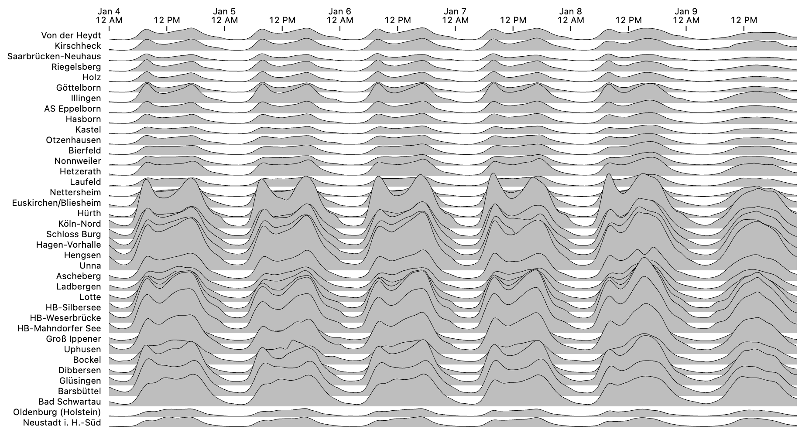
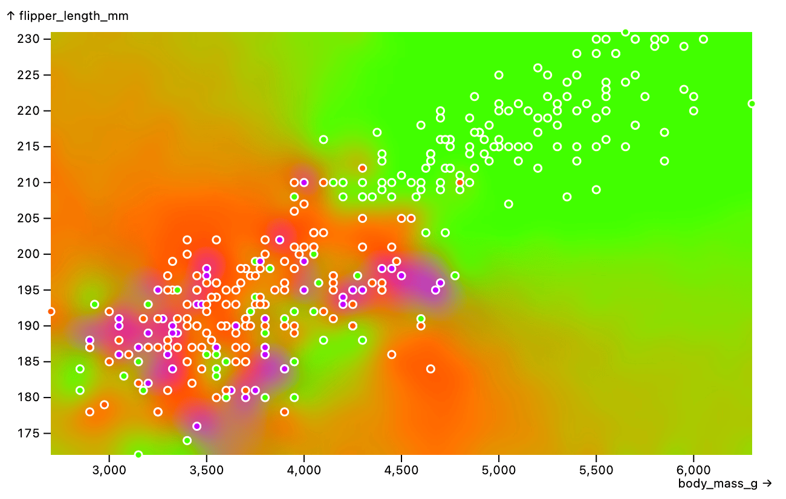
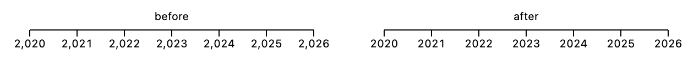

# Observable Plot - Changelog

Year: **Current** · [2025](./CHANGELOG-2025.md) · [2024](./CHANGELOG-2024.md) · [2023](./CHANGELOG-2023.md) · [2022](./CHANGELOG-2022.md) · [2021](./CHANGELOG-2021.md)

## 0.6.18

[Released TK, 2026.](https://github.com/observablehq/plot/releases/tag/v0.6.18)

The [area mark](https://observablehq.com/plot/marks/area) now supports a **line** option: when set to true, a stroked line is drawn on top of the filled area, removing the need for a separate line mark; when line is true, the the fill opacity defaults to 0.3 and the stroke options (`strokeWidth`, etc.) apply only to that line.



```js
Plot.plot({
  height: 300,
  marks: [
    Plot.areaY(traffic, {
      x: "date",
      y: "vehicles",
      fy: "location",
      fill: "#eee",
      line: true,
      fillOpacity: 1,
      curve: "basis"
    })
  ]
})
```

The [raster mark](https://observablehq.com/plot/marks/raster) now supports a **colorSpace** option, allowing interpolation in wide-gamut color spaces such as *display-p3*. For example, this raster plot of penguin body mass vs. flipper length encodes the `island` channel with vivid P3 colors:



```js
Plot.plot({
  color: {range: ["oklch(90% 0.4 135)", "oklch(75% 0.3 55)", "oklch(65% 0.35 305)"]},
  marks: [
    Plot.raster(penguins, {
      x: "body_mass_g",
      y: "flipper_length_mm",
      fill: "island",
      interpolate: "random-walk",
      blur: 8,
      colorSpace: "display-p3"
    })
  ]
})
```

[Pointer tips](https://observablehq.com/plot/interactions/pointer) are now exclusive by default: when multiple pointer-driven marks overlap, only the closest point is shown. This avoids the common issue of multiple marks creating overlapping tips. This behavior is controlled by the new **pool** [mark option](https://observablehq.com/plot/features/marks#mark-options), which defaults to tru for tip marks; set `pool: false` to restore the previous behavior.

The new top-level [**legend** plot option](https://observablehq.com/plot/features/legends) provides a convenient shorthand for requesting a legend, replacing the more verbose `color: {legend: true}` pattern.

```js
Plot.plot({
  legend: true,
  color: {type: "ordinal", domain: "ABCDEFGHIJ"},
  marks: [Plot.cellX("ABCDEFGHIJ")]
})
```

The new [plot.scale("projection")](https://observablehq.com/plot/features/projections) method exposes the plot’s projection, allowing programmatic access after rendering. The returned object supports *apply* and *invert* for converting between geographic and pixel coordinates, and can be passed as the **projection** option of another plot.

```js
const plot = Plot.plot({projection: "mercator", marks: [Plot.graticule()]});
const projection = plot.scale("projection");
projection.apply([-1.55, 47.22]) // [316.7, 224.2]

// reuse in a new plot with different marks but the same projection
Plot.plot({projection, marks: [Plot.geo(countries)]})
```

The [opacity scale](https://observablehq.com/plot/features/scales) and associated legend now support *ordinal* and *threshold* types.

```js
Plot.cellX(d3.range(10), {fill: "red", opacity: Plot.identity}).plot({
  opacity: {type: "threshold", legend: true, domain: [2, 5, 8], range: [0.2, 0.4, 0.6, 0.8]}
})
```

Plot now supports the `light-dark(…)` CSS color syntax, making it easier to define colors that adapt to dark mode. Color and opacity legends also render correctly with `light-dark(…)`, `currentColor`, and display-p3 colors.

```js
Plot.barX(alphabet, {x: "frequency", y: "letter", fill: "light-dark(steelblue, orange)"})
```

This release includes several more bug fixes and improvements:

The [tick format](https://observablehq.com/plot/features/scales) now defaults to a comma-less format when tick values are likely year integers.



The [stack transform](https://observablehq.com/plot/transforms/stack) now preserves NaN values instead of coercing them to zero. The [dodge transform](https://observablehq.com/plot/transforms/dodge) no longer crashes when the radius is negative. The [area mark](https://observablehq.com/plot/marks/area) now respects the **reduce** option when using the [interval transform](https://observablehq.com/plot/transforms/interval).

For line and area marks, the *z* channel now defaults to null when the color channel is redundant with the position channel (*e.g.*, `lineY(data, {y: "value", stroke: "value"})`), preventing the line from being split into single-point series. The default offset in windowless environments (*e.g.* server-side rendering) is now zero, prioritizing high-density displays. The default colors for the [box mark](https://observablehq.com/plot/marks/box) and [tree transform](https://observablehq.com/plot/transforms/tree) now support dark mode.

The [tip mark](https://observablehq.com/plot/marks/tip) no longer crashes when the title channel contains null; it now ignores the contours channel and literal symbols; and the tip arrow is smaller when using a corner anchor. [Markers](https://observablehq.com/plot/features/markers) no longer inherit `strokeDasharray`. The [pointer transform](https://observablehq.com/plot/interactions/pointer) now allows `pointerdown` event propagation.

Various type fixes and documentation improvements; thanks @gka and @jsoref!

---

For earlier changes, continue to the [2025 CHANGELOG](./CHANGELOG-2025.md).
