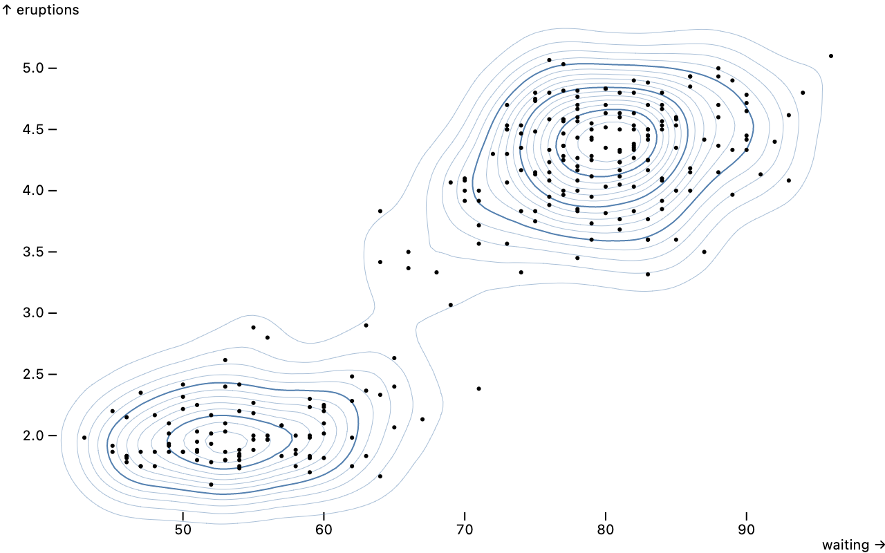
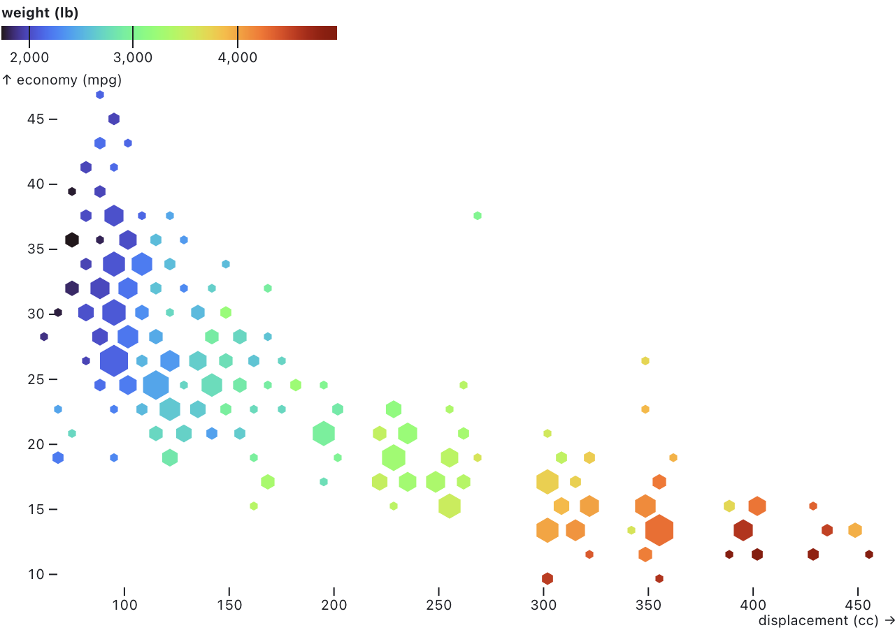
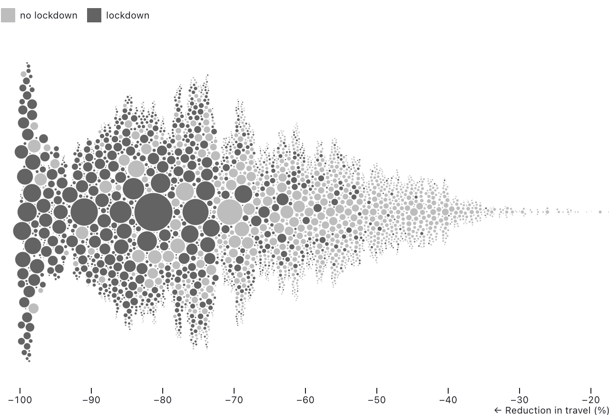
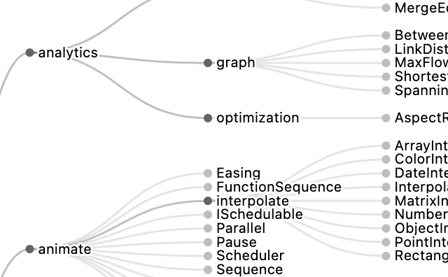

# Observable Plot - Changelog

## 0.6.0

[Released September 7, 2022.](https://github.com/observablehq/plot/releases/tag/v0.6.0)

[](https://observablehq.com/@observablehq/plot-window)

```js
Plot.plot({
  marks: [
    Plot.lineY(aapl, {x: "Date", y: "Close", stroke: "#ccc", strokeWidth: 1}),
    Plot.lineY(aapl, Plot.windowY({k: 20, strict: false}, {x: "Date", y: "Close", stroke: "red"})),
    Plot.lineY(aapl, Plot.windowY({k: 20, strict: true}, {x: "Date", y: "Close"}))
  ]
})
```

[breaking] [Plot.window](./README.md#plotwindowk), [Plot.windowX](./README.md#plotwindowxk-options) and [Plot.windowY](./README.md#plotwindowyk-options) now return an aggregate value even when the window contains undefined values, for example at the beginning or end of a series. Set the new **strict** option to true to instead return undefined if the window contains any undefined values.

Parts of the README have been incorporated throughout the codebase as JSDoc comments. This allows IDEs to display the documentation as tooltips.

## 0.5.2

[Released July 4, 2022.](https://github.com/observablehq/plot/releases/tag/v0.5.2)

Swatches legends are now rendered in SVG, supporting patterns and gradients. Swatches legends now require an *ordinal*, *categorical*, or *threshold* color scale and will throw an error if you attempt to use them with an unsupported color scale type (such as a *linear* or *diverging* scale).

The new top-level **document** option specifies the [document](https://developer.mozilla.org/en-US/docs/Web/API/Document) used to create plot elements. It defaults to window.document, but can be changed to another document, say when using a virtual DOM library for server-side rendering in Node.

Plot now uses D3 7.6.1, using [d3.blur2](https://observablehq.com/@d3/d3-blur) for a faster blur operator supporting fractional bandwidths when computing density contours. Plot now uses a duck test to detect marks (rather than strict instanceof), allowing marks from different versions of Plot to be combined into a single plot. Plot is now partially written in TypeScript. In the future, Plot will be written entirely in TypeScript and will export TypeScript type definition files to assist Plot development.

## 0.5.1

[Released June 27, 2022.](https://github.com/observablehq/plot/releases/tag/v0.5.1)

The new [density mark](./README.md#density) creates contours representing the [estimated density](https://en.wikipedia.org/wiki/Multivariate_kernel_density_estimation) of two-dimensional point clouds. The **bandwidth** and number of **thresholds** are configurable.

[](https://observablehq.com/@observablehq/plot-density)

```js
Plot.plot({
  inset: 20,
  marks: [
    Plot.density(faithful, {x: "waiting", y: "eruptions", stroke: "steelblue", strokeWidth: 0.25}),
    Plot.density(faithful, {x: "waiting", y: "eruptions", stroke: "steelblue", thresholds: 4}),
    Plot.dot(faithful, {x: "waiting", y: "eruptions", fill: "currentColor", r: 1.5})
  ]
})
```

By default, as shown above, the density is represented by contour lines. By setting the **fill** option to *density*, you can draw filled regions with a sequential color encoding instead.

[](https://observablehq.com/@observablehq/plot-density)

```js
Plot.density(diamonds, {x: "carat", y: "price", fill: "density"}).plot({
  height: 500,
  grid: true,
  x: {type: "log"},
  y: {type: "log"},
  color: {scheme: "ylgnbu"}
})
```

The new [linear regression marks](./README.md#linear-regression) produce [linear regressions](https://en.wikipedia.org/wiki/Linear_regression) with [confidence interval](https://en.wikipedia.org/wiki/Confidence_interval) bands, representing the estimated relation of a dependent variable (typically *y*) on an independent variable (typically *x*).

[](https://observablehq.com/@observablehq/plot-linear-regression)

```js
Plot.plot({
  grid: true,
  marks: [
    Plot.dot(penguins, {x: "culmen_length_mm", y: "culmen_depth_mm", fill: "species"}),
    Plot.linearRegressionY(penguins, {x: "culmen_length_mm", y: "culmen_depth_mm", stroke: "species"}),
    Plot.linearRegressionY(penguins, {x: "culmen_length_mm", y: "culmen_depth_mm"})
  ]
})
```

The new [Delaunay and Voronoi marks](./README.md#delaunay) produce Delaunay triangulations and Voronoi tesselations: [Plot.delaunayLink](./README.md#plotdelaunaylinkdata-options) draws links for each edge of the Delaunay triangulation of the given points, [Plot.delaunayMesh](./README.md#plotdelaunaymeshdata-options) draws a mesh of the Delaunay triangulation  of the given points, [Plot.hull](./README.md#plothulldata-options) draws a convex hull around the given points, [Plot.voronoi](./README.md#plotvoronoidata-options) draws polygons for each cell of the Voronoi tesselation of the given points, and [Plot.voronoiMesh](./README.md#plotvoronoimeshdata-options) draws a mesh for the cell boundaries of the Voronoi tesselation of the given points.

[](https://observablehq.com/@observablehq/plot-delaunay)

```js
Plot.plot({
  marks: [
    Plot.voronoi(penguins, {x: "culmen_depth_mm", y: "culmen_length_mm", fill: "species", fillOpacity: 0.2, stroke: "white"}),
    Plot.dot(penguins, {x: "culmen_depth_mm", y: "culmen_length_mm", fill: "species"})
  ]
})
```

For data at regular intervals, such as integer values or daily samples, the new [*scale*.**interval** option](./README.md#scale-options) can be used to enforce uniformity. The specified *interval*—such as d3.utcMonth—sets the default *scale*.transform to the given interval’s *interval*.floor function. In addition, for ordinal scales the default *scale*.**domain** is an array of uniformly-spaced values spanning the extent of the values associated with the scale.

All marks now support the **pointerEvents** option to set the [pointer-events attribute](https://developer.mozilla.org/en-US/docs/Web/CSS/pointer-events). The frame decoration mark now supports the **rx** and **ry** options. The cell mark now respects the **dx** and **dy** options.

Fix a bug where arrow heads would not render correctly when the **strokeWidth** was exactly one. Fix the *scale*.**zero** option when the domain is negative. Fix the **clip** mark option when *x* or *y* is a *band* scale. Fix the fill color of text marks using the **href** option. Fix a crash in the bar and tick mark when the associated band scale is not present, as when these marks are used (erroneously) with the dodge transform. Use *element*.appendChild instead of *element*.append for the benefit of DOM implementations that do not support the full DOM standard.

Improve the error message when the **facet** option is used without **data**. Throw an error if initializers attempt to create position scales. Throw an error if an implicit ordinal position domain has more than 10,000 values.

[breaking] Plot now requires [D3 ^7.5.0](https://github.com/d3/d3/releases/tag/v7.5.0).

## 0.5.0

[Released June 7, 2022.](https://github.com/observablehq/plot/releases/tag/v0.5.0)

Plot now supports [mark initializers](./README.md#initializers) via the **initializer** option. Initializers can transform data, channels, and indexes. Unlike [data transforms](./README.md#transforms) which operate in abstract data space, initializers can operate in screen space such as pixel coordinates and colors. For example, initializers can modify a marks’ positions to avoid occlusion. The new hexbin and dodge transforms are implemented as mark initializers.

The new [hexbin transform](./README.md#hexbin) functions similarly to the bin transform, except it aggregates both *x* and *y* into hexagonal bins before reducing. The size of the hexagons can be specified with the **binWidth** option, which controls the width of the (pointy-topped) hexagons.

[](https://observablehq.com/@observablehq/plot-hexbin)

```js
Plot.plot({
  color: {
    legend: true
  },
  marks: [
    Plot.hexagon(
      cars,
      Plot.hexbin(
        {r: "count", fill: "mean"},
        {x:  "displacement (cc)", y: "economy (mpg)", fill: "weight (lb)"}
      )
    )
  ]
})
```

The new [dodge transform](./README.md#dodge) can be used to produce beeswarm plots. Given an *x* channel representing the desired horizontal position of circles, the dodgeY transform derives a new *y* (vertical position) channel such that the circles do not overlap; the dodgeX transform similarly derives a new *x* channel given a *y* channel.

[](https://observablehq.com/@observablehq/plot-dodge)

```js
Plot.plot({
  height: 320,
  x: {
    domain: [-3, 3]
  },
  marks: [
    Plot.dotX(Array.from({length: 800}, d3.randomNormal()), Plot.dodgeY())
  ]
})
```

If an *r* channel is specified, the circles may have varying radius. By default, the dodge transform sorts the input data by descending radius, such that the largest circles are placed first. The order of placement greatly affects the resulting layout; to change the placement order, use the standard mark **sort** option.

[](https://observablehq.com/@observablehq/plot-dodge)

```js
Plot.plot({
  height: 400,
  x: {
    domain: [-100, -20],
    percent: true,
    label: "← Reduction in travel (%)"
  },
  r: {
    range: [0, 20]
  },
  color: {
    legend: true,
    tickFormat: d => d ? "lockdown" : "no lockdown"
  },
  marks: [
    Plot.dot(lockdown, Plot.dodgeY("middle", {x: "pct_change", r: "pop", fill: "in_lockdown"}))
  ]
})
```

When using the dodgeY transform, you should set the height of your plot explicitly; otherwise dots may be drawn outside the canvas. You can also adjust the **range** of the *r* scale to produce denser beeswarms.

[breaking] Color scales with diverging color schemes now default to the *diverging* scale type instead of the *linear* scale type. This includes the *brbg*, *prgn*, *piyg*, *puor*, *rdbu*, *rdgy*, *rdylbu*, *rdylgn*, *spectral*, *burd*, and *buylrd* schemes. If you want to use a diverging color scheme with a linear color scale, set the scale **type** option to *linear*. Color scales will also default to diverging if the scale **pivot** option is set. (For diverging scales, the pivot defaults to zero.)

The [sort transform](./README.md#plotsortorder-options) now supports sorting on an existing channel, avoiding the need to duplicate the channel definition. For example, to sort dots by ascending radius:

~~~js
Plot.dot(earthquakes, {x: "longitude", y: "latitude", r: "intensity", sort: {channel: "r"}})
~~~

The [dot mark](./README.md#dot) now sorts by descending radius by default to reduce occlusion. The dot mark now supports the *hexagon* symbol type for pointy-topped hexagons. The new [circle](./README.md#plotcircledata-options) and [hexagon](./README.md#plothexagondata-options) marks are convenience shorthand for dot marks with the *circle* and *hexagon* symbol, respectively. The dotX, dotY, textX, and textY marks now support the **interval** option. The rule mark now correctly respects the **dx** and **dy** options. The new [hexgrid decoration mark](./README.md#hexgrid) draws a hexagonal grid; it is intended to be used with the hexbin transform as an alternative to the default horizontal and vertical axis grid.

The **zero** scale option (like the **nice** and **clamp** scale options) may now be specified as a top-level option, applying to all quantitative scales.

Marks can now define a channel hint to set the default range of the *r* scale. This is used by the hexbin transform when producing an *r* output channel.

Improve the performance of internal array operations, including type coercion. Thanks, @yurivish!

Fix a crash when using the [area mark](./README.md#area) shorthand.

[breaking] The return signature of the internal *mark*.initialize method has changed. It now returns a {data, facets, channels} object instead of {index, channels}, and *channels* is now represented as an object with named properties representing channels rather than an iterable of [*name*, *channel*].

## 0.4.3

[Released April 12, 2022.](https://github.com/observablehq/plot/releases/tag/v0.4.3)

The new [tree mark and transforms](./README.md#tree) can generate hierarchical node-link diagrams using D3’s [“tidy” tree](https://observablehq.com/@d3/tree) or [cluster (dendrogram)](https://observablehq.com/@d3/cluster) layout. The tree transform uses [d3.stratify](https://observablehq.com/@d3/d3-stratify) to convert tabular data into a hierarchy by parsing a slash-separated **path** for each row.



```js
Plot.plot({
  axis: null,
  inset: 10,
  insetRight: 120,
  height: 500,
  marks: Plot.tree(plotsrc, {markerEnd: "arrow"})
})
```

The [line](./README.md#line) and [area](./README.md#area) marks (specifically lineX, lineY, areaX, and areaY) now support an implicit [bin transform](./README.md#bin) with the **interval** option. This can be used to “regularize” time series data, say to show gaps or default to zero when data is missing, rather than interpolating across missing data. This is also useful for stacking time series data that is sampled at irregular intervals or with missing samples.


```js
Plot.plot({
  marks: [
    Plot.lineY(downloads, {x: "date", y: "downloads", interval: d3.utcDay, curve: "step"}),
    Plot.areaY(downloads, {x: "date", y: "downloads", interval: d3.utcDay, fill: "#eee", curve: "step"}),
    Plot.ruleY([0])
  ]
})
```

The default **reduce** is *first*, picking the first value in each interval. If there is no data for a given interval, the value is undefined, resulting in a visible gap in the line or area. By using *sum* instead, you can default to zero when data is missing (and sum values if the data contains more than one observation per time interval).


```js
Plot.plot({
  marks: [
    Plot.lineY(downloads, {x: "date", y: "downloads", interval: d3.utcDay, reduce: "sum", curve: "step"}),
    Plot.areaY(downloads, {x: "date", y: "downloads", interval: d3.utcDay, reduce: "sum", fill: "#eee", curve: "step"}),
    Plot.ruleY([0])
  ]
})
```

The [stack transform](./README.md#stack) now allows the **offset** option to be specified as a function. For example, this can be used to visualize Likert survey results with a neutral category as a [diverging stacked bar chart](https://observablehq.com/@observablehq/plot-diverging-stacked-bar).


```js
function Likert(
  responses = [
    ["Strongly Disagree", -1],
    ["Disagree", -1],
    ["Neutral", 0],
    ["Agree", 1],
    ["Strongly Agree", 1]
  ]
) {
  const map = new Map(responses);
  return {
    order: Array.from(map.keys()),
    offset(facetstacks, X1, X2, Z) {
      for (const stacks of facetstacks) {
        for (const stack of stacks) {
          const k = d3.sum(stack, i => (X2[i] - X1[i]) * (1 - map.get(Z[i]))) / 2;
          for (const i of stack) {
            X1[i] -= k;
            X2[i] -= k;
          }
        }
      }
    }
  };
}
```

The new [_quantize_ scale type](./README.md#color-options) transforms a continuous domain into discrete, evenly-spaced thresholds. The _threshold_ scale type now supports domains in descending order (in addition to ascending order), such as [20, 10, 5, 0] instead of [0, 5, 10, 20].


```js
Plot.plot({
  grid: true,
  color: {
    type: "quantize",
    legend: true
  },
  marks: [
    Plot.ruleY([0]),
    Plot.dot(simpsons, {x: "imdb_rating", y: "us_viewers_in_millions", fill: "season"})
  ]
})
```

The [bin transform](./README.md#bin) now coerces the input channel (the quantity being binned) to numbers as necessary. In addition, the bin transform now correctly handles typed array input channels representing temporal data. The [rect mark](./README.md#rect) now promotes the _x_ channel to _x1_ and _x2_ if the latter two are not specified, and likewise the _y_ channel to _y1_ and _y2_.

Fix a crash when **text** or **title** channels contain heterogenous types; each value is now independently formatted in a type-appropriate default formatter. Fix a rendering bug with one-dimensional rects whose opposite dimension is a band scale. Fix a rendering bug with swoopy arrows. Improve error messages to give more context.

New helpers make it easier to implement custom transforms. [Plot.column](./README.md#plotcolumnsource) constructs lazily-evaluated columns for derived channels, and [Plot.transform](./README.md#plottransformoptions-transform) composes a [custom data transform](./README.md#custom-transforms) with any of Plot’s built-in [basic transforms](./README.md#transforms).

## 0.4.2

[Released February 26, 2022.](https://github.com/observablehq/plot/releases/tag/v0.4.2)

The new [box mark](./README.md#box) generates a horizontal or vertical boxplot suitable for visualizing one-dimensional distributions. It is a convenience mark that composites a rule, bar, tick, and dot.


```js
Plot.boxX(morley, {x: "Speed", y: "Expt"}).plot({x: {grid: true, inset: 6}})
```

[Plot’s shorthand syntax](https://observablehq.com/@observablehq/plot-shorthand) has been expanded. The [bar mark](./README.md#bar) now supports one-dimensional shorthand: if no *options* are specified, then Plot.barX and Plot.barY can be used to visualize an array of numbers. This shorthand also now applies to the [rect mark](./README.md#rect) and the [vector mark](./README.md#vector). The [area mark](./README.md#area) now supports two-dimensional shorthand: if no *options* are specified, then Plot.area can be used to visualize an array of *xy*-tuples, similar to Plot.line.


```js
Plot.barY(d3.range(20).map(Math.random)).plot()
```

The mark [sort options](./README.md#sort-options) now support implicit “width” and “height” channels, defined as |*x2* - *x1*| and |*y2* - *y1*| respectively. These channels are useful for sorting rects and bars by length. The *reverse* option defaults to true when sorting by these channels. When sorting by *y* and no *y* channel is available, sorting will now fallback to *y2* if available; the same fallback logic applies to *x* and *x2*. (This behavior was previously supported on marks that support implicit stacking but now applies universally to all marks.)


```js
Plot.rectY(energy, {x: "Year", interval: 1, y: "Value", fill: "Description", sort: {color: "height"}})
```

The [bin transform](./README.md#bin) now supports *x* and *y* reducers which represent the midpoint of the bin: (*x1* + *x2*) / 2 and (*y1* + *y2*) / 2 respectively. The [bin](./README.md#bin), [group](./README.md#group), and [window](./README.md#window) transforms now support percentile reducers of the form *pXX* where *XX* is a number in [00, 99]; for example *p25* represents the first quartile and *p75* represents the third quartile.

The error message when attempting to create a standalone legend without a valid scale definition has been improved. The high cardinality warning for the implicit *z* channel has been relaxed; it is now only triggered if more than half of the values are distinct. When the axis *ticks* option is specified as null, no ticks are generated. When the axis *tickFormat* option is specified as null, no tick labels are generated.

## 0.4.1

[Released February 17, 2022.](https://github.com/observablehq/plot/releases/tag/v0.4.1)

The [area](./README.md#area) and [line marks](./README.md#line) now support varying fill, stroke, title, and other channels within series. For example, this chart of unemployment rates by metro area highlights increases in red and decreases in blue using a window transform with the *difference* reducer.


```js
Plot.line(bls, Plot.map({stroke: Plot.window({k: 2, reduce: "difference"})}, {x: "date", y: "unemployment", z: "division", stroke: "unemployment"}))
```

The new *clip* mark option enables clipping to the plot frame. For example, this can be used to clip overlapping areas and produce a horizon chart of hourly traffic patterns.


```js
d3.ticks(0, max, bands).map(t => Plot.areaY(traffic, {x: "date", y: d => d.value - t, fill: t, clip: true}))
```

Plot can now generate helpful warnings for common mistakes. Warnings ⚠️ are indicated in the top-right corner of the plot; open your browser’s developer console to read the warnings. For example, if you use data with date strings resulting in an *ordinal* scale rather than the desired *utc* scale, Plot will advise you to parse strings to dates.


```js
Plot.line(aapl, {x: "Date", y: "Close"}) // 🌶 Oops, Date is a string!
```

> Warning: some data associated with the x scale are strings that appear to be dates (e.g., YYYY-MM-DD). If these strings represent dates, you should parse them to Date objects. Dates are typically associated with a "utc" or "time" scale rather than a "point" scale. If you are using a bar mark, you probably want a rect mark with the interval option instead; if you are using a group transform, you probably want a bin transform instead. If you want to treat this data as ordinal, you can suppress this warning by setting the type of the x scale to "point".

We will add [more warnings](https://github.com/observablehq/plot/issues/755) in the future. If Plot did something you didn’t expect, please [let us know](https://github.com/observablehq/plot/discussions); perhaps it will inspire a new warning that will help other users.

The [text mark](./README.md#text) now supports automatic wrapping for easier annotation. The new **lineWidth** option specifies the desired length of a line in ems. The line breaking, wrapping, and text metrics implementations are all rudimentary, but they should be acceptable for text that is mostly ASCII. (For more control, you can hard-wrap text manually.) The **monospace** option now provides convenient defaults for monospaced text.


```js
Plot.text([mobydick], {dx: 6, dy: 6, fontSize: 12, lineWidth: 80, lineHeight: 1.2, frameAnchor: "top-left", monospace: true})
```

The line and link marks now support [marker options](./README.md#markers) for drawing a shape such as a dot or arrowhead on each vertex. Circle and arrow markers are provided, or you can implement a custom marker function that returns an SVG marker element. Markers automatically inherit the stroke color of the associated mark.


```js
Plot.lineY(crimea, {x: "date", y: "deaths", stroke: "cause", marker: "circle"})
```

The *fill* and *stroke* mark options can now be expressed as patterns or gradients using funciri color definitions, *e.g.* “url(#pattern)”. Colors can now also be expressed as CSS variables, *e.g.*, “var(--blue)”. All marks now support the *strokeDashoffset* option (for use with *strokeDasharray*).


```js
Plot.barY(alphabet, {x: "letter", y: "frequency", fill: "url(#gradient)"})
```

The bin transform now supports the *interval* option, allowing numeric intervals such as integer binning with a nice default domain that aligns with interval boundaries. (The bin transform already supported time intervals as the *thresholds* option; time intervals can now also be specified as the *interval* option.) For example, if you want to bin by hour of the day, use an *interval* of 1:


```js
Plot.rectY(traffic, Plot.binX({y: "mean"}, {x: d => d.date.getUTCHours(), interval: 1, y: "value"}))
```

Plot now supports ARIA attributes for improved accessibility: aria-label, aria-description, aria-hidden. The top-level **ariaLabel** and **ariaDescription** options apply to the root SVG element. The new **ariaLabel** and **ariaDescription** scale options apply to axes; the label defaults to *e.g.* “y-axis” and the description defaults to the scale’s label (*e.g.*, “↑ temperature”). Marks define a group-level aria-label (*e.g.*, “dot”). There is also an optional **ariaLabel** channel for labeling data (*e.g.*, “E 12.7%”), and a group-level **ariaDescription** option for a human-readable description. The **ariaHidden** mark option allows the hiding of decorative elements from the accessibility tree.

The new **paintOrder** mark option controls the [paint order](https://developer.mozilla.org/en-US/docs/Web/CSS/paint-order). The text mark’s paint order now defaults to *stroke*, with a stroke width of 3px and a stroke linejoin of *round*, making it easier to create a halo for separating labels from a busy background, improving legibility.

Fix a crash in default tuple accessors for *x* and *y* when data is undefined. Fix a bug where “none” with surrounding whitespace or capital letters would not be recognized as a valid color. When a channel is specified as a boolean value (*e.g.*, `fill: true`), it is now considered a constant value rather than undefined. Fix a bug where an identity color legend would be rendered as the text “undefined” instead of showing nothing. If scale options are declared, but the scale has no defined type, domain, or data, a scale is no longer constructed rather than a default linear scale. The vector mark now respects the *frameAnchor* option. The default boolean color schemes have been adjusted slightly so that the false value is slightly darker, improving contrast against a white background. The returned scale object now exposes *bandwidth* and *step* values for *band* and *point* scales.

## 0.4.0

[Released January 20, 2022.](https://github.com/observablehq/plot/releases/tag/v0.4.0)

The new [arrow mark](./README.md#arrow) draws arrows between pairs of points. It is similar to the [link mark](./README.md#link), except it is suitable for directed edges (say for representing change over time) and supports a configurable arrowhead. It also supports “swoopy” arrows with the *bend* option, and insets for arrows to shorten the arrow’s start or end.

[](https://observablehq.com/@observablehq/plot-arrow)

```js
Plot.arrow(data, {
  x1: "POP_1980",
  y1: "R90_10_1980",
  x2: "POP_2015",
  y2: "R90_10_2015",
  bend: true,
  stroke: d => d.R90_10_2015 - d.R90_10_1980
})
```

The new [vector mark](./README.md#vector) similarly draws arrows at the given position (*x* and *y*) with the given magnitude (*length*) and direction (*rotate*). It is intended to visualize vector fields, such as a map of wind speed and direction.

[](https://observablehq.com/@observablehq/plot-vector)

```js
Plot.vector((T => d3.cross(T, T))(d3.ticks(0, 2 * Math.PI, 20)), {
  length: ([x, y]) => (x + y) * 2 + 2,
  rotate: ([x, y]) => (Math.sin(x) - Math.sin(y)) * 60
})
```

The [dot mark](./README.md#dot) now supports a *symbol* option to control the displayed shape, which defaults to *circle*. The *symbol* channel (and associated *symbol* scale) can also be used as an categorical encoding. The default symbol set is based on whether symbols are stroked or filled, improving differentiability and giving uniform weight. Plot supports all of D3’s built-in symbol types: *circle*, *cross*, *diamond*, *square*, *star*, *triangle*, and *wye* (for fill) and *circle*, *plus*, *times*, *triangle2*, *asterisk*, *square2*, and *diamond2* (for stroke, based on [Heman Robinson’s research](https://www.tandfonline.com/doi/abs/10.1080/10618600.2019.1637746)); you can also implement a [custom symbol type](https://github.com/d3/d3-shape/blob/main/README.md#custom-symbol-types).

[](https://observablehq.com/@observablehq/plot-dot)

```js
Plot.dot(penguins, {x: "body_mass_g", y: "flipper_length_mm", stroke: "species", symbol: "species"})
```

The [text mark](./README.md#text) now supports multiline text! When a text value contains `\r`, `\r\n`, or `\n`, it will be split into multiple lines using tspan elements. The new *lineAnchor* and *lineHeight* options control how the lines are positioned relative to the given *xy* position. The text, dot, and image marks now also support a *frameAnchor* option for positioning relative to the frame rather than according to data. This is particularly useful for annotations.

[](https://observablehq.com/@observablehq/plot-text)

```js
Plot.plot({
  height: 200,
  marks: [
    Plot.frame(),
    Plot.text([`This Is Just To Say\nWilliam Carlos Williams, …`], {frameAnchor: "middle"})
  ]
})
```

When a text mark’s *text* channel, or the *title* channel on any mark, is specified as numbers or dates, the values are now automatically formatted (in the U.S. English locale) to improve readability. For the *text* channel, the default *fontVariant* option additionally changes to tabular-nums. The text mark now also allows *fontSize* to be specified as a CSS length (*e.g.*, “12pt”), keyword (*e.g.*, “x-large”), or percentage.

All marks now support the new standard *href* channel and *target* option, turning the mark into a clickable link.

```js
Plot.barY(alphabet, {x: "letter", y: "frequency", href: d => `https://en.wikipedia.org/wiki/${d.letter}`})
```

The [bin](./README.md#bin) and [group](./README.md#group) transforms now propagate the *title* and *href* channels, if present, by default. The default reducer for the *title* channel automatically selects the top five distinct title values by count, making it easier to inspect the contents of a given bin or group.

[](https://observablehq.com/@observablehq/plot-bin)

```js
Plot.rectY(data, Plot.binX({y: "count"}, {x: "body_mass_g", fill: "species", title: d => `${d.species} ${d.sex}`}))
```

The bin transform now supports shorthand reducers for the bin extent: *x1*, *x2*, *y1*, and *y2*. The window transform now supports the *first* and *last* reducers to select the first or last element of the window, respectively.

The new generalized [select transform](./README.md#select) can now call a custom selector function, or the shorthand *min* and *max*, to select the points to display. The selector function is passed two arguments: the index of the current group (*e.g.*, [0, 1, 2, …]) and the given channel’s values. For example, to select the dot with the greatest *fill* value:

```js
Plot.dotX(data, Plot.select({fill: "max"}, {x: "letter", fill: "frequency", stroke: "black"})
```

The *color* scale now defaults to an *identity* scale if all associated defined values are valid CSS colors, rather than defaulting to the tableau10 categorical color scheme. The new *symbol* scale similarly defaults to *identity* if all associated defined values are valid symbol names (or symbol type objects).

[](https://observablehq.com/@observablehq/plot-bar)

```js
Plot.barY(alphabet, {x: "letter", y: "frequency", fill: d => /[AEIOU]/.test(d.letter) ? "red" : "black"})
```

The *color* scale now has a special default range for boolean data, encoding false as light gray and true as dark gray. If you’d prefer more color, specify a sequential scheme such as *reds* or *blues*. (You can opt-out of the special boolean range by setting the scale type to *categorical* or by specifying an explicit *range*.)

[](https://observablehq.com/@observablehq/plot-bar)

```js
Plot.barY(alphabet, {x: "letter", y: "frequency", fill: d => /[AEIOU]/.test(d.letter)})
```

The new [Plot.scale](./README.md#scale-options) method allows you to construct a standalone scale for use independent of any chart, or across charts. The returned object has the same form as *plot*.scale(*name*), allowing you to inspect the scale options and invoke the scale programmatically with *scale*.apply (and *scale*.invert, where applicable).

```js
const scale = Plot.scale({color: {type: "linear"}});
console.log(scale.domain); // [0, 1]
console.log(scale.apply(0.5)); // "rgb(149, 251, 81)"
```

This release includes various minor new features and bug fixes. The new top-level *clamp* option applies to all scales. When margins or insets would result in a scale’s range being inverted, Plot now collapses the range instead of producing confusing output. When the *buylrd* color scheme is applied to a (discrete) ordinal scale, it now has the expected colors (not *rdgy*). Plot now ignores non-finite values when inferring the default domain for quantitative scales. The *swatches* legend now wraps correctly in narrow windows. When the *tickFormat* option is null, ticks will now be unlabeled (rather than using the default format). Plot no longer crashes when you try to display a legend on an identity color scale.

To improve compatibility with popular bundlers such as webpack and Rollup, Plot no longer uses circular ES module imports and thereby avoids the dreaded temporal dead zone. 😱 Plot now uses [vite](https://vitejs.dev) for local development instead of [Snowpack](https://snowpack.dev).

[breaking] For consistency with other marks, the text mark now requires the *dx* and *dy* to be specified as numbers in pixels rather than typographic units such as ems; in addition, the *dx* and *dy* translation now happens prior to rotation (if any). To affect the typographic layout, use the new *lineAnchor* and *lineHeight* options.

[breaking] Plot now requires [D3 ^7.3.0](https://github.com/d3/d3/releases/tag/v7.3.0).

## 0.3.2

[Released December 10, 2021.](https://github.com/observablehq/plot/releases/tag/v0.3.2)

The font-variant now only defaults to *tabular-nums* for axis and legend tick labels on non-ordinal scales; on ordinal scales it defaults to *normal*.

If a scale has an implicit label (such as inferred from a channel), the legend will now inherit the label.

## 0.3.1

[Released December 10, 2021.](https://github.com/observablehq/plot/releases/tag/v0.3.1)

The normalize transform now also supports the *min*, *max*, and *deviation* basis methods.

The generated figure element now resets the max-width style to initial.

Update D3 to 7.2.1.

## 0.3.0

[Released December 4, 2021.](https://github.com/observablehq/plot/releases/tag/v0.3.0)

Plot can now produce [legends for *color* and *opacity* scales](./README.md#legends)!

[](https://observablehq.com/@observablehq/plot-legends)

```js
Plot.plot({
  color: {
    legend: true
  },
  marks: [
    Plot.dot(athletes, {x: "weight", y: "height", stroke: "sex"})
  ]
})
```

The top-level plot *scale*.**legend** option generates an inline legend for the given *scale* (*color* or *opacity*). Alternatively, the new *plot*.legend(*name*) function returns a legend for the scale with the given *name*. The new standalone Plot.**legend**(*options*) function also allows you to create a legend independently of a chart. Two forms of color legend are provided: *swatches* for ordinal or discrete scales (*e.g.*, threshold color scales), and *ramp* for continuous scales.

The new [Plot.image](./README.md#image) mark centers an image on the given *xy* position.

[](https://observablehq.com/@observablehq/plot-image)

```js
Plot.plot({
  x: {
    label: "Date of first inauguration →"
  },
  y: {
    grid: true,
    label: `↑ Net favorability (%)`,
    percent: true,
    tickFormat: "+f"
  },
  marks: [
    Plot.ruleY([0]),
    Plot.image(favorability, {x: "First Inauguration Date", y: "Net favorability", src: "Portrait URL"})
  ]
})
```

All marks now support a new *opacity* option, either as a constant or a channel bound to the *opacity* scale, which sets the mark’s object opacity. The *strokeOpacity* or *fillOpacity* options should be preferred for performance, but the *opacity* option is needed for some cases (such as images).

All quantitative scales now have a default domain (typically [0, 1]). Ordinal scales now allow a *range* option to be specified in conjunction with a continuous *scheme*; in this case, the *range* should be a subset of the unit interval [0, 1], and the scheme’s interpolator will be truncated accordingly. The *plot*.**scale** method now correctly represents the symmetric transform for diverging scales. The scale definition returned by *plot*.**scale**(*name*) now includes a *scale*.apply function, allowing you to apply the scale’s encoding directly on the given data value. When applicable, a *scale*.invert function is also returned, which can be useful for interaction.

Plot’s stylesheet is now inlined in the generated SVG element rather than injected into the document head. To avoid namespace collisions, we use a randomly-generated class name; use the top-level **className** option to specify a custom class name. The default style now uses font-variant: tabular-nums for a better alignment of numbers.

A new top-level *margin* option allows to set all of marginLeft, marginRight, marginTop, and marginBottom at once. This shorthand notation is also available as a facet option.

Update D3 to 7.2.0.

## 0.2.9

[Released October 12, 2021.](https://github.com/observablehq/plot/releases/tag/v0.2.9)

Update D3 to 7.1.1.

## 0.2.8

[Released October 1, 2021.](https://github.com/observablehq/plot/releases/tag/v0.2.8)

The map transform now supports *rank* and *quantile* map methods. These compute the 0-based ordinal rank or the *p*-quantile of the data, respectively.

The bin transform now allows bin options (*domain*, *cumulative*, and *thresholds*) to be specified on the *outputs* object; this avoids ambiguity when composing multiple bin transforms. To facilitate transform composition, the bin and group transforms now consume the *x1* and *x2* channels when *x* is an output, and the *y1* and *y2* channels when *y* is an output. Also, the bin, group, and stack transforms now consume their respective transform options rather than propagating them in the returned options. The bin and group transform no longer use the channel name as the default label for the *count* reducer. The bin transform now automatically coerces values to dates when the *thresholds* are specified as a time interval or an array of dates.

The new shuffle transform randomizes the order of data. It takes an optional *seed* for deterministic order.

Position scales (*x*, *y*, *fx*, and *fy*) now support asymmetric insets via the *scale*.**insetLeft**, *scale*.**insetRight**, *scale*.**insetTop**, and *scale*.**insetBottom** options. Threshold and quantile scales can now be used as position scales without requiring an explicit range.

The radius scale (*r*) now limits the maximum default radius to 30 pixels.

Text marks now default strokeLinejoin to “round” to reduce the effect of miter joins.

## 0.2.7

[Released September 27, 2021.](https://github.com/observablehq/plot/releases/tag/v0.2.7)

Implement symmetric diverging scales by extending the domain instead of slicing the interpolator.

## 0.2.6

[Released September 26, 2021.](https://github.com/observablehq/plot/releases/tag/v0.2.6)

Fix the symmetric transform for reversed diverging scales.

## 0.2.5

[Released September 26, 2021.](https://github.com/observablehq/plot/releases/tag/v0.2.5)

The new *plot*.**scale**(*name*) method exposes scales used by a particular plot. This method on returned plots takes the *name* of a scale and returns an object specifying the options that fully describe the scale’s behavior. The returned object represents the actual options in-use, including *scale*.domain, *scale*.range, *scale*.interpolate, *etc.* The *scale*.label, if any, is also returned; however, note that other axis options are not. The scale object is undefined if the associated plot has no scale with the given *name*, and throws an error if the *name* is invalid (*i.e.*, not one of the known scale names: *x*, *y*, *fx*, *fy*, *r*, *color*, or *opacity*). For example, given a plot:

```js
myplot = Plot.dot(gistemp, {x: "Date", y: "Anomaly", stroke: "Anomaly"}).plot()
```

You can retrieve the color scale like so:

```js
mycolor = myplot.scale("color")
```

The resulting object is:

```js
({
  type: "linear",
  domain: [-0.78, 1.35],
  range: [0, 1],
  interpolate: d3.interpolateTurbo,
  clamp: false,
  label: "Anomaly"
})
```

Inspecting materialized scales is useful for debugging and for generating color legends. (For now, we recommend using the [D3 color legend](https://observablehq.com/@d3/color-legend); in the near future Plot will have built-in support for color legends.) Scales can also now be shared between plots, ensuring consistent encoding. To reuse a scale, pass the scale from one plot into the specification for another:

```js
Plot.plot({…, color: myplot.scale("color")})
```

The new *scale*.**unknown** option provides more control over how unexpected, undefined, or invalid values are displayed. For quantitative and temporal scales, the unknown value is returned whenever the input value is undefined, null, or NaN. For ordinal or categorical scales, the unknown value is returned for any input value outside the domain. For band or point scales, the unknown option has no effect; it is always equal to undefined. If the unknown option is set to undefined (the default), or null or NaN, then affected input values will be considered undefined and filtered from the output. Hence, by setting *scale*.unknown to a defined value, you can ensure that these values are plotted.

Plot now supports piecewise (a.k.a. “polylinear”) scales. If a single-argument *interpolate* function is specified (such as d3.interpolateWarm, or equivalently if you specify a color *scheme* such as *warm*), and the *range* is undefined, and the *domain* has more than two elements, the range [0, 1] will be partitioned into *domain*.length - 1 equal-size segments. The default scale range for *x* and *y* now supports piecewise scales, as does the default axis tick count. Additionally, ordinal color schemes now return the correct number of colors when the natural scheme size is not equal to the desired scheme size; and the *rainbow* and *sinebow* cyclical color schemes, when used with an ordinal color scale, no longer duplicate the first color as the last color.

Plot now automatically detects “reversed” quantitative or temporal scales with descending domains or ranges. Reversed scales are detected by comparing the natural order of the domain and range. This improves the default axis label arrow orientation and the behavior of the *zero* option.

The *interval* option for rect and bar now works with the default identity accessor. Also, the *interval* option is now ignored if the necessary value channel (*e.g.*, *x*) is not defined, rather than throwing an error. For example, you no longer have to define *x* as the identity function here:

```js
Plot.barX(d3.utcDays(start, end), {interval: d3.utcDay, fill: d => d})
```

Plot’s default rounding behavior for band and point scales is now slightly smarter. Previously, automatic rounding could introduce substantial empty space on tall or wide plots; now Plot disables default rounding if it would introduce more than 30px of empty space.

The *percent* and *transform* options are now supported on all scales, including diverging scales.

The *center* and *wiggle* stack offsets now center across facets, facilitating comparison.

Internal string coercion now uses *object*.toString instead of *object*.valueOf.

## 0.2.4

[Released September 24, 2021.](https://github.com/observablehq/plot/releases/tag/v0.2.4)

Update [Observable Hypertext Literal](https://github.com/observablehq/htl) to [0.3.1](https://github.com/observablehq/htl/releases/tag/v0.3.1).

## 0.2.3

[Released September 24, 2021.](https://github.com/observablehq/plot/releases/tag/v0.2.3)

Rect, bar, and rule marks now accept an *interval* option that allows you to derive *x1* and *x2* from *x*, or *y1* and *y2* from *y*, where appropriate. For example, using d3.utcDay as the interval creates rects that span from UTC midnight to UTC midnight, bounding the associated time instant. The interval is typically specifed as a [D3 time interval](https://github.com/d3/d3-time/blob/main/README.md), but may be any compatible object which implements *interval*.floor and *interval*.offset: *interval*.floor(*x*) returns the start of the interval *x1* for the given *x*, while *interval*.offset(*x*) returns the end of the interval *x2* for the given interval start *x*. If the interval is specified as a number *n*, *x1* and *x2* are the two consecutive multiples of *n* that bracket *x*.

The new Plot.normalize and Plot.window methods return map methods for use in conjunction with Plot.map. This allows greater flexibility; for example, you can apply separate window methods to *y1* and *y2* to produce Bollinger bands.

Update [D3](https://github.com/d3/d3) to [7.0.4](https://github.com/d3/d3/releases/tag/v7.0.4).

## 0.2.2

[Released September 19, 2021.](https://github.com/observablehq/plot/releases/tag/v0.2.2)

Fix a crash with the scale.tickRotate option when there are no ticks to rotate.

## 0.2.1

[Released September 19, 2021.](https://github.com/observablehq/plot/releases/tag/v0.2.1)

The constant *dx* and *dy* options have been extended to all marks, allowing to shift the mark by *dx* pixels horizontally and *dy* pixels vertically. Since only text elements accept the dx and dy properties, in all the other marks these are rendered as a transform (2D transformation) property of the mark’s parent, possibly including a 0.5px offset on low-density screens.

Quantitative scales, as well as identity position scales, now coerce channel values to numbers; both null and undefined are coerced to NaN. Similarly, time scales coerce channel values to dates; numbers are assumed to be milliseconds since UNIX epoch, while strings are assumed to be in [ISO 8601 format](https://github.com/mbostock/isoformat/blob/main/README.md#parsedate-fallback).

Bin transform reducers now receive the extent of the current bin as an argument after the data. For example, it allows to create meaningful titles:

```js
Plot.rect(
  athletes,
  Plot.bin(
    {
      fill: "count",
      title: (bin, {x1, x2, y1, y2}) => `${bin.length} athletes weighing between ${x1} and ${x2} and with a height between ${y1} and ${y2}`
    },
    {
      x: "weight",
      y: "height",
      inset: 0
    }
  )
).plot()
```

The *x1* and *x2* outputs now default to undefined if *x* is explicitly defined; similary, the *y1* and *y2* outputs now default to undefined if *y* is explicitly defined.

## 0.2.0

[Released August 20, 2021.](https://github.com/observablehq/plot/releases/tag/v0.2.0)

[breaking] Plot is now published as an ES module and requires Node 12 or higher. For more, please read [Sindre Sorhus’s FAQ](https://gist.github.com/sindresorhus/a39789f98801d908bbc7ff3ecc99d99c).

[breaking] Plot now depends on [D3 7.0](https://github.com/d3/d3/releases/tag/v7.0.0) or higher.

### Marks

The [*marks* option](./README.md#mark-options) now accepts render functions, null, and undefined as shorthand mark definitions. Nullish marks produce no output and are useful for conditional display (equivalent to the empty array). Render functions are invoked when plotting and may return an SVG element to insert into the plot, such as a legend or annotation.


```js
Plot.marks(
  Plot.line(aapl, {x: "Date", y: "Close"}),
  () => svg`<text x=20% y=20% fill=red>Hello, world!</text>`
).plot()
```

The [Plot.marks(...*marks*)](./README.md#plotmarksmarks) function provides [*mark*.plot](./README.md#plotplotoptions) shorthand for array marks. This is useful for composite marks, such as [boxes](https://github.com/observablehq/plot/blob/8fef4fa52a4cca4135f5f964e3c328ef8f18f672/test/plots/morley-boxplot.js#L18-L23).

All marks now support the [shapeRendering](https://developer.mozilla.org/en-US/docs/Web/SVG/Attribute/shape-rendering)  option. (This is a constant; it may not vary across marks.) All marks now allow strokeWidth to be specified as a channel. (The strokeWidth channel is unscaled; values are specified in literal pixels.) Text marks now also allow stroke and strokeOpacity to be specified as channels. If its fill is not *none*, a line’s default stroke is now *none* rather than *currentColor*, making it consistent with dot and other marks. When a fill or fillOpacity channel is used with a link, or when a stroke or strokeOpacity channel is used with a rule, undefined values will now be filtered. The text mark now uses attributes instead of styles for font rendering properties, improving compatibility with Firefox.


```js
Plot.dotX(d3.range(41), {strokeWidth: d => (1 + d) / 15}).plot()
```

Marks that represent continuous intervals (rect, bar, and rule) now handle collapsed domains during rendering. A domain is considered collapsed when it contains only a single value. A collapsed domain can occur when all input values to the bin transform are equal (*e.g.*, [1, 1, 1, …] produces a domain of [1, 1]). Previously a collapsed domain would result in an invisible zero-width mark; now the mark spans the full extent of the chart.


```js
Plot.rectY([1, 1, 1], Plot.binX()).plot()
```

The link mark now supports *x* or *y* shorthand for one-dimensional links, equivalent to rule. The rect mark now supports one-dimensional (and zero-dimensional) rects: the *x1*, *x2*, *y1* and *y2* channels are now optional.

### Scales

The new [*sort* options](./README.md#sort-options) allow convenient control over the order of ordinal domains, including the *fx* and *fy* facet domains. The aggregation method can be controlled via the *reduce* option, which defaults to *max*. The *reverse* and *limit* options are also supported. For example, a bar chart can be sorted by descending value like so:


```js
Plot.barY(alphabet, {x: "letter", y: "frequency", sort: {x: "y", reverse: true}})
```

Color scales now support the *threshold* scale type, allowing you to specify a set of *n* - 1 discrete (typically numeric) thresholds to produce *n* discrete colors. The new *quantile* color scale type will automatically compute *n* - 1 thresholds for *n* quantiles based on the data.


```js
Plot.plot({
  y: {
    percent: true
  },
  color: {
    type: "threshold",
    domain: [270]
  },
  marks: [
    Plot.ruleX(data, {x: "dem_electoral_votes", y: "probability", stroke: "dem_electoral_votes", strokeWidth: 1.5}),
    Plot.ruleX([270])
  ]
})
```

Diverging scales now support a *symmetric* option, which defaults to true, to ensure that differences above and below the pivot are equally apparent. For example, the choropleth below gives equal visual weight to West Virginia’s population decline of −3% and Alaska’s gain of +3%. If *symmetric* is false, as before, then −3% is mapped to the darkest purple. (Diverging scales should always use balanced interpolators where the negative and positive extremes have equal weight; this is true of Plot’s built-in diverging color schemes from ColorBrewer.)


Diverging color scales now also support transformations via four new scale types: *diverging-sqrt*, *diverging-pow*, *diverging-log*, and *diverging-symlog*, corresponding to the *sqrt*, *pow*, *log*, and *symlog* quantitative scale types respectively. (The above choropleth uses a *diverging-log* scale to show relative change.)

The new axis *line* option, which defaults to false, can be used to show a continuous line along the *x* or *y* axis to denote the extent. This is most useful when the opposite axis is ordinal and thus a rule cannot annotate a meaningful value such as zero; if the opposite axis is quantitative, a rule is generally preferred. If set at the top level, applies to both *x* and *y*.


```js
Plot.plot({
  grid: true,
  inset: 6,
  x: {
    domain: "ABCDEFGH"
  },
  y: {
    line: true,
    domain: [0, 1]
  }
})
```

The *axis* and *label* options (along with *grid*) can now be set as a top-level option, or a facet-level option, and inherited by *x* and *y* or *fx* and *fy*. This is most often useful for turning off all default axes or labels by setting the respective option to null.

### Facets

The mark *facet* option can be used to control whether or not a mark is faceted. The supported values are *auto*, *include*, *exclude*, and null. True is an alias for *include* and false is an alias for null. The default is *auto*, which facets a mark if and only if its data is strictly equal to the facet data. The *include* facet mode allows a mark with different data to be faceted; however, it requires that the mark’s data be parallel with the facet data (*i.e.*, have the same length and order). The *exclude* facet mode shows all data that are not present in the current facet; this can provide shared context across facets without overdrawing. The null mode disables faceting, replicating the mark across all facets.


```js
Plot.plot({
  facet: {
    data: penguins,
    x: "sex",
    y: "species",
    marginRight: 80
  },
  marks: [
    Plot.frame(),
    Plot.dot(penguins, {
      facet: "exclude",
      x: "culmen_depth_mm",
      y: "culmen_length_mm",
      r: 2,
      fill: "#ddd"
    }),
    Plot.dot(penguins, {
      x: "culmen_depth_mm",
      y: "culmen_length_mm"
    })
  ]
})
```

Empty facets, which can occur when faceting in both *x* and *y*, or when the specified *fx* or *fy* domain includes values not present in the data, are no longer rendered. When the facet *data* is null, a better error message is thrown.

### Transforms

The bin and group transforms now support new *filter*, *sort* and *reverse* options on the *outputs* object. By setting the *filter* to null, the bin transform will now return all bins, even if empty; this is useful with marks such as lines and areas that require zeroes to be present, rather than interpolating across the missing bins. (The *z*, *fill* or *stroke* channels, when used for grouping, are propagated to empty bins.)


```js
Plot.plot({
  marks: [
    Plot.areaY(cases, Plot.binX({y: "sum", filter: null}, {
      x: "specimen_collection_date",
      y: "case_count",
      filter: d => d.case_disposition === "Death",
      fill: "transmission_category",
      curve: "step",
      thresholds: d3.utcWeek
    })),
    Plot.ruleY([0])
  ]
})
```

The *outputs* argument to the bin and group transforms is now optional; it defaults to the *count* reducer for *y*, *x* and *fill* for Plot.binX, Plot.binY, and Plot.bin respectively, and the same for the group transforms.

The bin and group transforms now support new *distinct*, *mode*, *min-index*, and *max-index* reducers. The *distinct* reducer counts the number of distinct values in each group, while the *mode* reducer returns the most frequent value in each group. The *min-index* and *max-index* reducers are similar to *min* and *max*, except they return the zero-based index of the minimum and maximum value, respectively; for example, this is useful to sort time series by the date of each series’ peak.


```js
Plot.plot({
  height: 900,
  label: null,
  x: {axis: "top"},
  y: {axis: null},
  facet: {
    data: trends,
    y: "search",
    marginLeft: 160
  },
  marks: [
    Plot.areaY(trends, {x: "week", y: "interest", sort: {fy: "y", reduce: "max-index"}})
  ]
})
```

The default *thresholds* option for the bin transforms is now *auto* instead of *scott*. The *auto* option applies a maximum limit of 200 bins to Scott’s rule. This reduces the risk of producing vanishing rects when they are too numerous and thin to be visible. (Note, however, that it is still possible to produce invisible rects if the insets are larger than the width.)

The normalize, window, and stack transforms can now accept a transform *options* argument in addition to an *inputs* argument that specifies the input channels. This allows makes these transforms more consistent with the other transforms, reduces ambiguity, and allows for additional shorthand. For example, you can pass *k* as the first argument to the window transform, here for a 24-month moving average:


```js
Plot.plot({
  y: {
    label: "↑ Temperature anomaly (°C)",
    tickFormat: "+f",
    grid: true
  },
  marks: [
    Plot.ruleY([0]),
    Plot.line(gistemp, Plot.windowY(24, {x: "Date", y: "Anomaly"}))
  ]
})
```

The *offset* stack options have been renamed: *offset* = *expand* is now *offset* = *normalize*, and *offset* = *silhouette* is *offset* = *center*. The *shift* window option has been replaced with the *anchor* option: *shift* = *centered* is now *anchor* = *middle*, *shift* = *leading* is *anchor* = *start*, and *shift* = *trailing* is *anchor* = *end*. The old names are supported for backwards compatibility.

The basic transforms are now available as explicit option transforms: Plot.filter, Plot.sort, and Plot.reverse. These are useful when you wish to control the order of these transforms with respect to other transforms such as Plot.bin and Plot.stack.

The select transforms now throw better error messages when required input channels are missing. When mark *transform* option is null, it is considered equivalent to undefined and no transform is applied instead of throwing an error.

## 0.1.0

[Released May 3, 2021.](https://github.com/observablehq/plot/releases/tag/v0.1.0)
