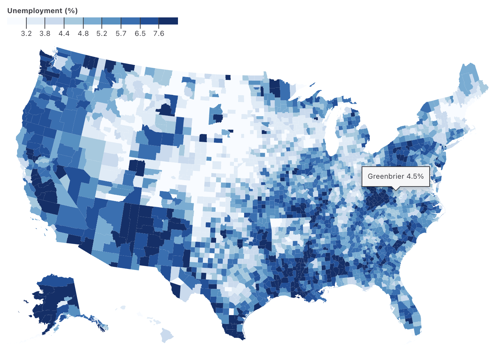
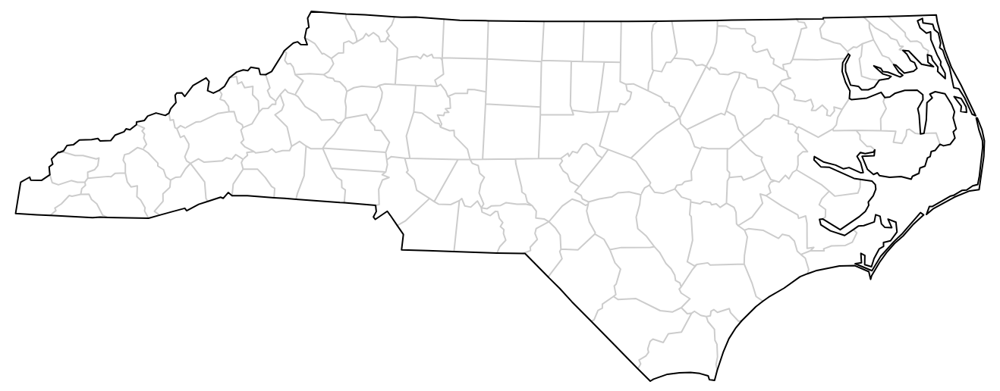

# Observable Plot - Changelog

Year: **Current (2024)** · [2023](./CHANGELOG-2023.md) · [2022](./CHANGELOG-2022.md) · [2021](./CHANGELOG-2021.md)

## 0.6.16

[Released August TK, 2024.](https://github.com/observablehq/plot/releases/tag/v0.6.16)

Add waffle mark. 🧇

[](https://observablehq.com/plot/marks/waffle)

```js
Plot.plot({
  fx: {interval: 10},
  color: {legend: true},
  marks: [Plot.waffleY(olympians, Plot.groupZ({y: "count"}, {fill: "sex", sort: "sex", fx: "weight", unit: 10}))]
})
```

Add support for Apache Arrow as native data, improving performance and shorthand. Fix detection of date columns with Apache Arrow data.

```js
Plot.dot(gistemp, {x: "Date", y: "Anomaly"}).plot() // gistemp is an Arrow Table!
```

Add support for GeoJSON data and GeoJSON property shorthand to all marks. Add support for the tip option to the geo mark (via an implicit centroid transform)

[](https://observablehq.com/plot/marks/geo)

```js
Plot.plot({
  projection: "albers-usa",
  color: {
    type: "quantile",
    n: 9,
    scheme: "blues",
    label: "Unemployment (%)",
    legend: true
  },
  marks: [
    Plot.geo(counties, {
      fill: "unemployment",
      title: (d) => `${d.properties.name} ${d.properties.unemployment}%`,
      tip: true
    })
  ]
})
```

Add per-side and per-corner rounding options (r, rx1, ry1, etc.) to rect-like marks.

[](https://observablehq.com/plot/marks/rect)

```js
Plot.plot({
  color: {legend: true},
  marks: [
    Plot.rectY(olympians, Plot.binX({y: "count"}, {x: "weight", fill: "sex", ry2: 4, ry1: -4, clip: "frame"})),
    Plot.ruleY([0])
  ]
})
```

Improve the default plot height when a projection domain is set. For example previously the map below would use a default square aspect ratio, regardless of the specified **domain**; but now the map is perfectly sized for North Carolina.



```js
Plot.plot({
  projection: {.
    type: "conic-conformal",
    parallels: [34 + 20 / 60, 36 + 10 / 60],
    rotate: [79, 0],
    domain: state
  },
  marks: [
    Plot.geo(counties, {strokeOpacity: 0.2}),
    Plot.geo(state)
  ]
})
```

Fix marker options on lines with variable aesthetics.


```js
Plot.plot({
  inset: 40,
  axis: null,
  marks: [
    Plot.line(d3.range(400), {
      x: (i) => i * Math.sin(i / 100 + ((i % 5) * 2 * Math.PI) / 5),
      y: (i) => i * Math.cos(i / 100 + ((i % 5) * 2 * Math.PI) / 5),
      z: (i) => i % 5,
      stroke: (i) => -i,
      strokeWidth: (i) => i ** 1.1 / 100,
      markerEnd: "arrow"
    })
  ]
})
```

## 0.6.15

[Released June 11, 2024.](https://github.com/observablehq/plot/releases/tag/v0.6.15)

## 0.6.14

[Released March 12, 2024.](https://github.com/observablehq/plot/releases/tag/v0.6.14)

Changes the default categorical color scheme to *Observable10*.

The group transform now preserves the input order of groups by default, making it easier to sort groups by using the **sort** option. The group and bin transforms now support the *z* reducer.

Improves the accessibility of axes by hidding tick marks and grid lines from the accessibility tree.

Upgrades D3 to 7.9.0.

---

For earlier changes, continue to the [2023 CHANGELOG](./CHANGELOG-2023.md).
