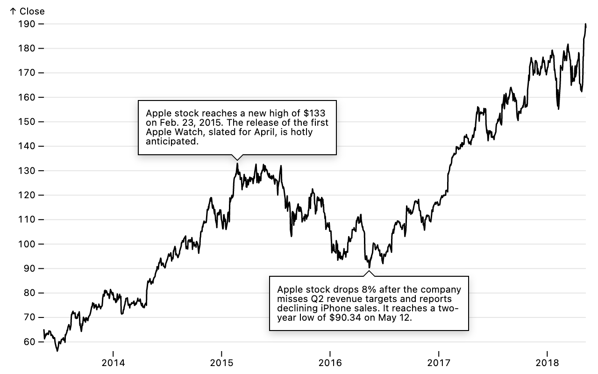
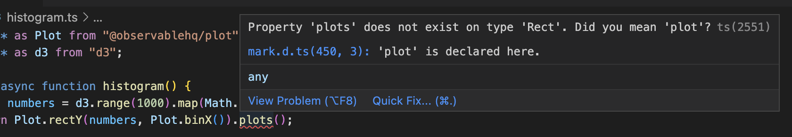

# Observable Plot - Changelog

Year: **Current (2023)** · [2022](./CHANGELOG-2022.md) · [2021](./CHANGELOG-2021.md)

## 0.6.8

[Released June 2, 2023.](https://github.com/observablehq/plot/releases/tag/v0.6.8)

The *x* and *y* scale default domains now incorporate geometry. This allows arbitrary polygonal geometry to be defined in abstract coordinates using the [geo mark](https://observablehq.com/plot/marks/geo) and then displayed using scales.


```js
Plot.geo({type: "LineString", coordinates: aapl.map((d) => [d.Date, d.Close])}).plot()
```

The stack transform’s **order** option now supports *-order* descending shorthand or a two-argument comparator. For example, you can use *-appearance* to sort by descending appearance. Below, a custom comparator is used to sort by ascending *group* and then descending *revenue*.


```js
Plot.plot({
  y: {
    grid: true,
    label: "Annual revenue (billions, adj.)",
    transform: (d) => d / 1000
  },
  marks: [
    Plot.areaY(
      riaa,
      Plot.stackY({
        x: "year",
        y: "revenue",
        z: "format",
        order: (a, b) => d3.ascending(a.group, b.group) || d3.descending(a.revenue, b.revenue),
        fill: "group",
        stroke: "white"
      })
    ),
    Plot.ruleY([0])
  ]
})
```

Fix the default **stroke** with the hexbin transform when used with the tip mark. Fix spurious high-cardinality warning with an odd number of elements when using varying aesthetics with the area or line mark.

Fix *color* legends when the **domain** and **range** have different lengths: extra elements in the range are now ignored by the color legend, and a warning is issued.

Fix duplicate application of scale transforms with the **tip** mark option. Fix erroneous implicit **title** channel with the **tip** mark option.

## 0.6.7

[Released May 24, 2023.](https://github.com/observablehq/plot/releases/tag/v0.6.7)

The new [tip mark](https://observablehq.com/plot/marks/tip) displays text, or name-value pairs derived from channels, in a floating box anchored to a given position in **x** and **y**. The tip mark is often paired with the new [pointer interaction](https://observablehq.com/plot/interactions/pointer) such that only the point closest to the pointer is rendered, allowing the tip mark to reveal details interactively by hovering the chart.


```js
Plot.lineY(aapl, {x: "Date", y: "Close", tip: true}).plot()
```

The new **tip** mark option adds an implicit tip mark with pointer interaction derived from the current mark. The line chart above can be written more explicitly as:

```js
Plot.plot({
  marks: [
    Plot.lineY(aapl, {x: "Date", y: "Close"}),
    Plot.tip(aapl, Plot.pointerX({x: "Date", y: "Close"}))
  ]
})
```

The tip mark can be also used to draw attention to points of interest and add commentary. When used with the **title** channel, the tip mark supports text wrapping and multi-line text.



```js
Plot.plot({
  y: {grid: true},
  marks: [
    Plot.lineY(aapl, {x: "Date", y: "Close"}),
    Plot.tip(
      [`Apple stock reaches a new high of $133 on Feb. 23, 2015. The release of the first Apple Watch, slated for April, is hotly anticipated.`],
      {x: new Date("2015-02-23"), y: 133, dy: -3, anchor: "bottom"}
    ),
    Plot.tip(
      [`Apple stock drops 8% after the company misses Q2 revenue targets and reports declining iPhone sales. It reaches a two-year low of $90.34 on May 12.`],
      {x: new Date("2016-05-12"), y: 90.34, dy: 3, anchor: "top"}
    )
  ]
})
```

The pointer interaction can be paired with any mark, not just a tip: a red dot, say, to emphasize the focused point, or a rule to highlight its *x* or *y* position, or text to show a value. You can independently control the target position from the display using the **px** and **py** channels, say to show the currently-focused point’s value in the top-left corner.


```js
Plot.plot({
  height: 160,
  y: {axis: "right", grid: true, nice: true},
  marks: [
    Plot.lineY(aapl, {x: "Date", y: "Close"}),
    Plot.ruleX(aapl, Plot.pointerX({x: "Date", py: "Close", stroke: "red"})),
    Plot.dot(aapl, Plot.pointerX({x: "Date", y: "Close", stroke: "red"})),
    Plot.text(aapl, Plot.pointerX({px: "Date", py: "Close", dy: -17, frameAnchor: "top-left", fontVariant: "tabular-nums", text: (d) => [`Date ${Plot.formatIsoDate(d.Date)}`, `Close ${d.Close.toFixed(2)}`].join("   ")}))
  ]
})
```

The pointer interaction supports both two-dimensional (pointer) and one-dimensional (pointerX and pointerY) pointing modes. Above, one-dimensional pointing is used for a time-series chart to find the closest *x*-value; below, two-dimensional pointing is used for a scatterplot to find the closest point in *x* and *y*.

The pointer interaction also powers the new [crosshair mark](https://observablehq.com/plot/interactions/crosshair) which shows the *x* (horizontal↔︎ position) and *y* (vertical↕︎ position) value of the point closest to the pointer on the bottom and left sides of the frame, respectively.


```js
Plot.plot({
  marks: [
    Plot.dot(penguins, {x: "culmen_length_mm", y: "culmen_depth_mm", stroke: "sex"}),
    Plot.crosshair(penguins, {x: "culmen_length_mm", y: "culmen_depth_mm"})
  ]
})
```

The pointer interaction (and by extension the crosshair mark and **tip** mark option) supports “click-to-stick”: if you click on the chart, the currently-focused point will remain locked until you click again. By temporarily locking the pointer, you can select text from the tip for copy and paste.

The pointer interaction also emits an [input event](https://developer.mozilla.org/en-US/docs/Web/API/HTMLElement/input_event) when the focused point changes, and assigns the generated plot’s value to the corresponding data. This allows event listeners to react to pointing, and supports [Observable views](https://observablehq.com/@observablehq/views).

In addition to these exciting new interaction features, Plot 0.6.7 includes a variety of improvements and bug fixes.

The **sort** mark option now supports *-channel* descending shorthand for [imputed scales domains](https://observablehq.com/plot/features/scales#sort-mark-option) and the [sort transform](https://observablehq.com/plot/transforms/sort). For example, sorting *x* by *-y* orders a bar chart by descending value:


```js
Plot.barY(alphabet, {x: "letter", y: "frequency", sort: {x: "-y"}}).plot()
```

This is equivalent to:

```js
Plot.barY(alphabet, {x: "letter", y: "frequency", sort: {x: "y", order: "descending"}}).plot()
```

The **sort** option for imputed channel domains now also takes an **order** option which can be *ascending*, *descending*, a custom comparator, or null. (This more closely matches the **order** option for the sort transform.) The **reverse** option now reverses the order rather than using descending natural order, placing nulls first instead of last.

Previously setting the scale **label** option would disable Plot’s automatic directional arrow in axis labels (↑, →, ↓, or ←); now Plot implicitly adds an arrow to the label you provide, unless the label already has an arrow or you set the **labelArrow** option to *none* or false. You can also force an arrow by setting this option to true, or *up*, *right*, *down*, or *left*. In Plot’s code base, we were able to remove 161 Unicode arrows thanks to this change! 😌

Color scales now default to a *categorical* scale when a categorical color scheme is specified. For example, this no longer throws a “unknown quantitative scheme” error:


```js
Plot.cellX(d3.range(10)).plot({color: {scheme: "Tableau10"}})
```

Time intervals can now be specified as integer multiples of a base time interval, such as *3 months* or *10 years*. Ordinal scales are now smarter about choosing a default time format when the **interval** option is a yearly interval: the four-digit year is (YYYY) shown instead of year, month, and day (YYYY-01-01).

Mark transforms are now passed the plot’s *options* as a third argument; this allows the group, bin, and stack transforms (and other transforms) to check if the scale has a declared **interval** option, and if so, apply that interval before grouping. For example, to count athletes by age at 5-year intervals:


```js
Plot.barY(olympians, Plot.groupX({y: "count"}, {x: "date_of_birth"})).plot({x: {interval: "5 years"}})
```

The new **imageFilter** mark option applies a [CSS filter effect](https://developer.mozilla.org/en-US/docs/Web/CSS/filter) to the mark, such as a drop shadow or blur. The [rule](https://observablehq.com/plot/marks/rule) and [tick](https://observablehq.com/plot/marks/tick) marks now support **marker** options.

The [normalize](https://observablehq.com/plot/transforms/normalize) and [window](https://observablehq.com/plot/transforms/window) transforms now accept two-argument “index-aware” reducers; the [map](https://observablehq.com/plot/transforms/map) transform now also accepts a two-argument index-aware map method. The mapX transform now defaults **x** to identity if none of **x**, **x1**, and **x2** are specified; the mapY transform does the same for **y**.

When faceting, the plot dimensions now includes **facet**.**width** and **facet**.**height** for the plot’s outer dimensions. The plot context now includes the ownerSVGElement.

Fix a bug where the *opacity* channel didn’t automatically opt-out of the *opacity* scale when all values are in the interval [0,1].

Fix a bug where the frame mark would crash if a channel-eligible option such as **fill** were specified as an invalid CSS color string, such as *bleu*. The frame mark now supports channel-eligible options to be specified as abstract values, in which case the abstract values will be encoded using a scale; for example, setting **fill** to *Biscoe* would apply an *ordinal* *color* scale.

Fix a bug where the position defaults for the rectX, rectY, barX, and barY marks were only applied if the *options* object was strictly undefined; now the position defaults apply if the relevant position options are undefined.

Fix a bug when filtering facets and computing facet anchors with non-primitive facet domains, such as dates. Fix *z*-order across facets: each mark now draws atop all earlier marks across facets. Fix *z*-order of facet axes, which should be drawn below rather than above other marks, as other axes do.

Fix the auto mark to choose the rect mark instead of rectX or rectY when appropriate, and likewise choose correctly between line, lineX, and lineY, and areaX and areaY. Also, the autoSpec method now returns the name of the explicit mark and transform implementations as **markImpl** and **transformImpl** respectively, along with the **markOptions** and **transformOptions** needed to instantiate them.

<!-- The text mark now positions multi-line text using the *dy* attribute instead of the *y* attribute. -->

<!-- The new **render** transform mark option. -->

<!-- Derived channels can now declare **source** and **hint** options which are used by the tip mark. -->

## 0.6.6

[Released April 26, 2023.](https://github.com/observablehq/plot/releases/tag/v0.6.6)

**Plot has a new documentation website!**

👉 https://observablehq.com/plot 👈

The [image mark](./README.md#image) can now generate circular images with the **r** channel, and rotate images with the **rotate** channel.

The [axis mark](./README.md#axis) now properly respects the **margin** shorthand option, changing the default for **marginTop**, **marginRight**, **marginBottom**, and **marginLeft**. The axis mark now correctly renders the axis label when the **href** option is used, or any other option that may be interpreted as a channel.

Facet scale domains are now imputed correctly when the **sort** mark option is used with a **limit**, or otherwise causing the facet domain to be truncated. Plot no longer generates a spurious warning when faceting and using non-array data, such as an Arquero table. The **interval** scale option, when expressed as a fractional number such as 0.2, now has better floating point precision.

The [Plot.indexOf](./README.md#plotindexof) channel transform, used internally by some mark shorthand, is now exported.

Plot has a few improvements for server-side rendering. Plot now assumes a high pixel density display when headless. The default class name for plots is now deterministically generated (`plot-d6a7b5`) rather than randomly generated; this makes it easier to apply overrides to Plot’s default styles with an external stylesheet. (The default class name will change if Plot’s default styles change in a future release.) The **className** plot option is now inherited by a plot’s legends, if any. The density mark now respects the Plot’s **document** option, and the **caption** option now uses a duck test instead of testing against the global Node.

## 0.6.5

[Released April 1, 2023.](https://github.com/observablehq/plot/releases/tag/v0.6.5)

**TypeScript!** The feature you asked for most is here. 🎉 Plot now exports TypeScript type declarations (.d.ts) with precise types and documentation for all of Plot’s public API. This allows code editors such as VS Code to offer better suggestions, complete with inline documentation. For example, if you type “Plot.g”, Plot.geo is now suggested:


Function calls also have hints, showing their expected arguments.


Types are especially useful for suggesting well-known names, such as projections, scale types, and color schemes.


TypeScript also helps for reading code; hover any symbol and immediately see the relevant documentation.


Lastly, if you’re using Plot in a TypeScript project, you can now benefit from additional static type checking to find errors.



If you have suggestions or clarifications on how to improve the documentation, please open an issue or discussion, or send us a pull request.

The **strokeOpacity**, **fillOpacity**, and **opacity** channels now opt-out of the *opacity* scale by default when all values are numbers in the range [0, 1]; to opt-in to the *opacity* scale, specify the channel as {value, scale: true}. The raster mark now also supports scale overrides.

The scale **nice** option now accepts named time intervals such as *day* and *week*. The new *quarter* and *half* time intervals represent quarters (three months) and half-years (six months). The quantile scale now supports the **unknown** option. BigInt channels are now supported; values are coerced to numbers. Color legends now support the **opacity** option.

The text mark no longer crashes when a NaN tick value is specified for an axis. The **className** option now allows mixed-case class names. Channel-derived scale domains now correctly handle non-orderable values, duplicate values, and mark transforms. Plot.auto now renders correctly when a non-zero **reduce** is used in conjunction with the *bar* **mark**, and in some cases when the **zero** option is specified. The **zero** option no longer changes the default mark type, and Plot.autoSpec now materializes the **zero** option.

The interfaces for reduce and map implementations have changed. To better disambiguate from arrays, reduce implementations now have a *reduceIndex* method instead of a *reduce* method, and map implementations now have a *mapIndex* method instead of a *map* method. The old interfaces are still supported, but now deprecated.

## 0.6.4

[Released February 28, 2023.](https://github.com/observablehq/plot/releases/tag/v0.6.4)

The new top-level [**aspectRatio** option](./README.md#layout-options) changes the default plot **height** such that, assuming both *x* and *y* are *linear* scales, a scaled unit distance in *x* divided by a scaled unit distance in *y* is the given aspect ratio. For example, if *x* and *y* represent the same units (say, degrees Fahrenheit), and if the **aspectRatio** is one, then scaled distances in *x* and *y* will be equivalent.


```js
Plot.plot({
  aspectRatio: 1,
  grid: true,
  x: {label: "Daily low temperature (°F) →", tickSpacing: 40},
  y: {label: "↑ Daily temperature variation (Δ°F)", tickSpacing: 40},
  color: {scheme: "rainbow", nice: true, legend: true, tickFormat: "%b"},
  marks: [
    Plot.ruleY([0]),
    Plot.dot(weather, {
      x: (d) => d.temp_min,
      y: (d) => d.temp_max - d.temp_min,
      fill: (d) => (d = new Date(d.date), d.setUTCFullYear(2020), d)
    })
  ]
})
```

The new **textOverflow** option for the [text mark](./README.md#text) allows text to be truncated when a line of text is longer than the specified **lineWidth**. Overflowing characters can either be clipped (*clip*) or replaced with an ellipsis (*ellipsis*), either at the start, middle, or end of each line.


When wrapping or truncating, the text mark now more accurately estimates the width of ellipses and emojis, and no longer separates combining marks or emoji character sequences such as 👨‍👩‍👧‍👦.

The [link mark](./README.md#link) now respects the current [**projection**](./README.md#projection-options), if any, given the default [**curve**](./README.md#curves) of *auto*. This matches the behavior of the line mark. To opt-out of the projection and draw a straight line, set the **curve** to *linear*.

The [image mark](./README.md#image) now supports the **imageRendering** option. (Note: Safari currently ignores the SVG image-rendering attribute.)

You can now override the scale for a given [mark channel](./README.md#mark-options) by specifying the corresponding option as a {value, scale} object. For example, to force the **stroke** channel to be unscaled, interpreting the associated values as literal color strings:

```js
Plot.dot(data, {stroke: {value: "foo", scale: null}})
```

To instead force the **stroke** channel to be bound to the *color* scale regardless of the provided values, say:

```js
Plot.dot(data, {stroke: {value: "foo", scale: "color"}})
```

Color channels (**fill** and **stroke**) are bound to the *color* scale by default, unless the provided values are all valid CSS color strings or nullish, in which case the values are interpreted literally and unscaled. Likewise, if the dot mark’s **symbol** channel values are all symbols, symbol names, or nullish, values are interpreted literally and unscaled; otherwise, the channel is bound to the *symbol* scale. (If some color channels are literal values while other color channels are not, the channels with literal values will now automatically opt-out of the color scale; the same goes for symbol channels. This deviates from the previous behavior, where *all* channels associated with a scale were required to be literal values in order to have the scale default to an *identity* scale.)

The mark [**facetAnchor** option](./README.md#facet-options) can now be set to *empty* such that a mark is only rendered on empty facets. This is typically used for annotation.

The new Plot.autoSpec method takes *data* and *options* suitable for [Plot.auto](./README.md#aut) and returns a corresponding *options* object with default options realized. While intended primarily as an internal helper, Plot.autoSpec may be useful for debugging by letting you inspect which mark and reducers are chosen by Plot.auto.

Fix Plot.auto to only default to the *bar* mark if *x* or *y* is zeroed. Fix Plot.auto’s support for the *area* mark. Fix Plot.auto’s use of the *bar* mark with possibly ordinal reducers. Fix a bug where arrays of values could be erroneously interpreted as reducers. Fix a crash when the mark **facet** option is set to *exclude*, but the mark is not faceted; the option is now ignored. Fix a crash coercing BigInt values to numbers.

## 0.6.3

[Released February 6, 2023.](https://github.com/observablehq/plot/releases/tag/v0.6.3)

The new [auto mark](./README.md#auto) ([Plot.auto](./README.md#plotautodata-options)) automatically selects a mark type that best represents the given dimensions of data according to some simple heuristics. For example,

[](https://observablehq.com/@observablehq/plot-auto)

```js
Plot.auto(olympians, {x: "height", y: "weight"}).plot()
```

makes a scatterplot (equivalent to [dot](./README.md#plotdotdata-options)); adding **color** as

[](https://observablehq.com/@observablehq/plot-auto)

```js
Plot.auto(olympians, {x: "height", y: "weight", color: "count"}).plot()
```

makes a heatmap (equivalent to [rect](./README.md#plotrectdata-options) and [bin](./README.md#plotbinoutputs-options); chosen since _height_ and _weight_ are quantitative); switching to

[](https://observablehq.com/@observablehq/plot-auto)

```js
Plot.auto(aapl, {x: "Date", y: "Close"}).plot()
```

makes a line chart (equivalent to [lineY](./README.md#plotlineydata-options); chosen because the selected *x* dimension *Date* is temporal and monotonic, _i.e._, the data is in chronological order);

[](https://observablehq.com/@observablehq/plot-auto)

```js
Plot.auto(penguins, {x: "body_mass_g"}).plot()
```

makes a histogram (equivalent to [rectY](./README.md#plotrectydata-options) and [binX](./README.md#plotbinxoutputs-options); chosen because the _body_mass_g_ column is quantitative); and

[](https://observablehq.com/@observablehq/plot-auto)

```js
Plot.auto(penguins, {x: "island"}).plot()
```

makes a bar chart (equivalent to [barY](./README.md#plotbarydata-options) and [groupX](./README.md#plotgroupxoutputs-options); chosen because the _island_ column is categorical). The auto mark is intended to support fast exploratory analysis where the goal is to get a useful plot as quickly as possible. It’s also great if you’re new to Plot, since you can get started with a minimal API.

Plot’s new [axis](./README.md#axis) and [grid](./README.md#axis) marks allow customization and styling of axes. This has been one of our most asked-for features, closing more than a dozen feature requests (see [#1197](https://github.com/observablehq/plot/pull/1197))! The new axis mark composes a [vector](./README.md#vector) for tick marks and a [text](./README.md#text) for tick and axis labels. As such, you can use the rich capabilities of these marks, such the **lineWidth** option to wrap long text labels.

[](https://observablehq.com/@observablehq/plot-auto)

```js
Plot.plot({
  y: {percent: true},
  marks: [
    Plot.axisX({label: null, lineWidth: 8, marginBottom: 40}),
    Plot.axisY({label: "↑ Responses (%)"}),
    Plot.barY(responses, {x: "name", y: "value"}),
    Plot.ruleY([0])
  ]
})
```

And since axes and grids are now proper marks, you can interleave them with other marks, for example to produce ggplot2-style axes with a gray background and white grid lines.

[](https://observablehq.com/@observablehq/plot-auto)

```js
Plot.plot({
  inset: 10,
  marks: [
    Plot.frame({fill: "#eaeaea"}),
    Plot.gridY({stroke: "#fff", strokeOpacity: 1}),
    Plot.gridX({stroke: "#fff", strokeOpacity: 1}),
    Plot.line(aapl, {x: "Date", y: "Close"})
  ]
})
```

The *x* and *y* axes are now automatically repeated in empty facets, improving readability by reducing eye travel to read tick values. Below, note that the *x* axis for culmen depth (with ticks at 15 and 20 mm) is rendered below the Adelie/null-sex facet in the top-right.

[](https://observablehq.com/@observablehq/plot-axes)

```js
Plot.plot({
  facet: {marginRight: 80},
  marks: [
    Plot.dot(penguins, {x: "culmen_depth_mm", y: "culmen_length_mm", stroke: "#ddd"}),
    Plot.frame(),
    Plot.gridX(),
    Plot.gridY(),
    Plot.dot(penguins, {x: "culmen_depth_mm", y: "culmen_length_mm", fx: "sex", fy: "species"})
  ]
})
```

See [Plot: Axes](https://observablehq.com/@observablehq/plot-axes) for more examples, including the new _both_ **axis** option to repeat axes on both sides of the plot, dashed grid lines via the **strokeDasharray** option, data-driven tick placement, and layering axes to show hierarchical time intervals (years, months, weeks).

Marks can now declare default margins via the **marginTop**, **marginRight**, **marginBottom**, and **marginLeft** options, and the **margin** shorthand. For each side, the maximum corresponding margin across marks becomes the plot’s default. While most marks default to zero margins (because they are drawn inside the chart area), Plot‘s axis mark provides default margins depending on their anchor. The facet margin options (*e.g.*, facet.**marginRight**) now correctly affect the positioning of the *x* and *y* axis labels.

The new [*mark*.**facetAnchor**](#facetanchor) mark option controls the facets in which the mark will appear when faceting. It defaults to null for all marks except for axis marks, where it defaults to *top-empty* if the axis anchor is *top*, *right-empty* if anchor is *right*, *bottom-empty* if anchor is *bottom*, and *left-empty* if anchor is *left*. This ensures the proper positioning of the axes with respect to empty facets.

The [frame mark](./README.md#frame)’s new **anchor** option allows you to draw a line on one side of the frame (as opposed to the default behavior where a rect is drawn around all four sides); this feature is now used by the *scale*.**line** option for *x* and *y* scales. The [text mark](./README.md#text) now supports soft hyphens (`\xad`); lines are now eligible to break at soft hyphens, in which case a hyphen (-) will appear at the end of the line before the break. The [raster mark](./README.md#raster) no longer crashes with an _identity_ color scale. The [voronoi mark](./README.md#plotvoronoidata-options) now correctly respects the **target**, **mixBlendMode**, and **opacity** options.

## 0.6.2

[Released January 18, 2023.](https://github.com/observablehq/plot/releases/tag/v0.6.2)

The new [raster mark](./README.md#raster) and [contour mark](./README.md#contour) generate a raster image and smooth contours, respectively, from spatial samples. For example, the plot below shows a gridded digital elevation model of Maungawhau (R’s [`volcano` dataset](./test/data/volcano.json)) with contours every 10 meters:

[](https://observablehq.com/@observablehq/plot-raster)

```js
Plot.plot({
  color: {legend: true, label: "Height (m)"},
  marks: [
    Plot.raster(volcano.values, {width: volcano.width, height: volcano.height}),
    Plot.contour(volcano.values, {width: volcano.width, height: volcano.height, interval: 10})
  ]
})
```

For non-gridded or sparse data, the raster and contour marks implement a variety of [spatial interpolation methods](./README.md#spatial-interpolation) to populate the raster grid. The *barycentric* interpolation method, shown below with data from the [Great Britain aeromagnetic survey](https://www.bgs.ac.uk/datasets/gb-aeromagnetic-survey/), uses barycentric coordinates from a Delaunay triangulation of the samples (small black dots).

[](https://observablehq.com/@observablehq/plot-raster)

```js
Plot.plot({
  width: 640,
  height: 484,
  inset: 4,
  x: {tickFormat: "s"},
  y: {tickFormat: "s", ticks: 5},
  color: {type: "diverging", legend: true},
  marks: [
    Plot.raster(ca55, {x: "LONGITUDE", y: "LATITUDE", fill: "MAG_IGRF90", interpolate: "barycentric"}),
    Plot.dot(ca55, {x: "LONGITUDE", y: "LATITUDE", r: 0.75, fill: "currentColor"})
  ]
})
```

The same data, with a smidge of blur, as filled contours in projected coordinates:

[](https://observablehq.com/@observablehq/plot-contour)

```js
Plot.plot({
  width: 640,
  height: 484,
  color: {type: "diverging", legend: true},
  projection: {type: "reflect-y", domain: {type: "MultiPoint", coordinates: ca55.map((d) => [d.GRID_EAST, d.GRID_NORTH])}},
  marks: [Plot.contour(ca55, {x: "GRID_EAST", y: "GRID_NORTH", fill: "MAG_IGRF90", stroke: "currentColor", blur: 2})]
})
```

Naturally, the raster and contour mark are compatible with Plot’s [projection system](./README.md#projection-options), allowing spatial samples to be shown in any geographic projection and in conjunction with other geographic data. The *equirectangular* projection is the natural choice for this gridded global water vapor dataset from [NASA Earth Observations](https://neo.gsfc.nasa.gov/view.php?datasetId=MYDAL2_M_SKY_WV&date=2022-11-01).

[](https://observablehq.com/@observablehq/plot-raster)

```js
Plot.plot({
  projection: "equirectangular",
  color: {
    scheme: "ylgnbu",
    unknown: "#ccc",
    legend: true,
    label: "Water vapor (cm)"
  },
  marks: [
    Plot.raster(vapor, {
      x1: -180,
      y1: 90,
      x2: 180,
      y2: -90,
      width: 720,
      height: 360
    }),
    Plot.graticule(),
    Plot.frame()
  ]
})
```

The raster and contour mark also support sampling continuous spatial functions *f*(*x*, *y*). For example, here is the famous Mandelbrot set, with color encoding the number of iterations before the point escapes:

[](https://observablehq.com/@observablehq/plot-raster)

```js
Plot.plot({
  height: 500,
  marks: [
    Plot.raster({
      fill: (x, y) => {
        for (let n = 0, zr = 0, zi = 0; n < 80; ++n) {
          [zr, zi] = [zr * zr - zi * zi + x, 2 * zr * zi + y];
          if (zr * zr + zi * zi > 4) return n;
        }
      },
      x1: -2,
      y1: -1.164,
      x2: 1,
      y2: 1.164,
      pixelSize: 0.5
    })
  ]
})
```

The [vector mark](./README.md#vector) now supports the **shape** constant option; the built-in shapes are *arrow* (default) and *spike*. A custom shape can also be implemented, returning the corresponding SVG path data for the desired shape. The new [spike convenience constructor](./README.md#plotspikedata-options) creates a vector suitable for spike maps. The vector mark also now supports an **r** constant option to set the shape radius.

[](https://observablehq.com/@observablehq/plot-spike)

```js
Plot.plot({
  width: 960,
  height: 600,
  projection: "albers-usa",
  length: {
    range: [0, 200]
  },
  marks: [
    Plot.geo(nation, {fill: "#e0e0e0"}),
    Plot.geo(statemesh, {stroke: "white"}),
    Plot.spike(counties.features, Plot.geoCentroid({stroke: "red", length: (d) => population.get(d.id)}))
  ]
});
```

The new [geoCentroid transform](./README.md#plotgeocentroidoptions) and [centroid initializer](./README.md#plotcentroidoptions) compute the spherical and projected planar centroids of geometry, respectively. The new [identity](./README.md#plotidentity) channel helper returns a source array as-is, avoiding an extra copy.

The **interval** option now supports named time intervals such as “sunday” and “hour”, equivalent to the corresponding d3-time interval (_e.g._, d3.utcSunday and d3.utcHour). The [bin transform](./README.md#bin) is now many times faster, especially when there are many bins and when binning temporal data.

Diverging scales now correctly handle descending domains. When the stack **order** option is used without a *z* channel, a helpful error message is now thrown. The **clip** option *frame* now correctly handles band scales. Using D3 7.8, generated SVG path data is now rounded to three decimal points to reduce output size. Fix a crash when a facet scale’s domain includes a value for which there is no corresponding facet data. The bin, group, and hexbin transforms now correctly ignore undefined outputs. Upgrade D3 to 7.8.2.

---

For earlier changes, continue to the [2022 CHANGELOG](./CHANGELOG-2022.md).
