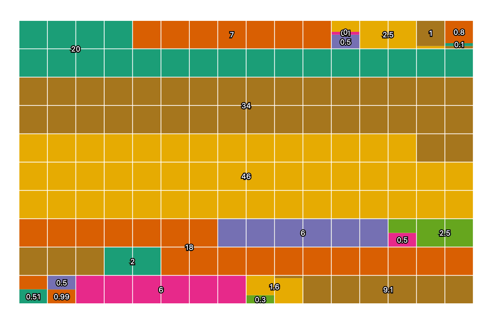

# Observable Plot - Changelog

Year: **Current (2025)** · [2024](./CHANGELOG-2024.md) · [2023](./CHANGELOG-2023.md) · [2022](./CHANGELOG-2022.md) · [2021](./CHANGELOG-2021.md)

## 0.6.17

[Released February 14, 2025.](https://github.com/observablehq/plot/releases/tag/v0.6.17)

The [**clip** mark option](https://observablehq.com/plot/features/marks#clip) now supports GeoJSON objects 🌎 in addition to the named *frame* and *sphere* clipping methods, allowing the visual extent of marks to be limited to arbitrary polygons. For instance, this Voronoi mesh of world airports is clipped to land boundaries:

[](https://observablehq.com/@observablehq/plot-world-airports)

```js
Plot.plot({
  projection: {type: "orthographic", rotate: [110, -50]},
  marks: [
    Plot.dot(airports, {x: "longitude", y: "latitude", fill: "red", r: 1}),
    Plot.voronoiMesh(airports, {x: "longitude", y: "latitude", clip: land}),
    Plot.sphere(),
    Plot.geo(land)
  ]
})
```

The GeoJSON object passed to the **clip** option is rendered as a [`clipPath` element](https://developer.mozilla.org/en-US/docs/Web/SVG/Element/clipPath) using the same path data that a [geo mark](https://observablehq.com/plot/marks/geo) would produce, respecting the plot’s top-level **projection** option, if any. For performance, `clipPath` elements are shared by marks clipped with the same GeoJSON object. For example, the [raster mark](https://observablehq.com/plot/marks/raster) and [contour mark](https://observablehq.com/plot/marks/contour) below show atmospheric water vapor measurements across the United States from [NASA Earth Observations](https://neo.gsfc.nasa.gov/view.php?datasetId=MYDAL2_M_SKY_WV); both marks are clipped to the nation’s boundary, censoring the (absurd) values that would otherwise be interpolated between Alaska, Southern California, and Hawai’i.

[](https://observablehq.com/@observablehq/plot-us-water-vapor)

```js
Plot.raster(vapor, {
  fill: Plot.identity,
  width: 360,
  height: 180,
  x1: -180, y1: 90, x2: 180, y2: -90,
  interpolate: "barycentric",
  blur: 10,
  clip: nation
}).plot()
```

[The code for the map above is too long to reproduce here in its entirety; click the image above for the complete code.]

The **clip** mark option can also be used to clip against arbitrary polygons, not just geographic boundaries. For example, to show the value of [Math.atan2](https://developer.mozilla.org/en-US/docs/Web/JavaScript/Reference/Global_Objects/Math/atan2) over the unit circle:

[](https://observablehq.com/@observablehq/plot-color-angle)

```js
Plot.raster({
  x1: -1, x2: 1, y1: -1, y2: 1,
  fill: (x, y) => Math.atan2(y, x),
  clip: {
    type: "Polygon",
    coordinates: [
      d3.range(0, 2 * Math.PI, 0.1).map((angle) => [Math.cos(angle), Math.sin(angle)])
    ]
  }
}).plot({width: 300, aspectRatio: 1})
```

The interactive **tip** associated with a [waffle mark](https://observablehq.com/plot/marks/waffle) is now anchored to the “center” of the visual representation of the associated datum. That center depends on the shape that is referenced. For fun, here’s a chart from our unit tests showing these anchoring points for various amounts of waffling. Baffling!



---

For earlier changes, continue to the [2024 CHANGELOG](./CHANGELOG-2024.md).
