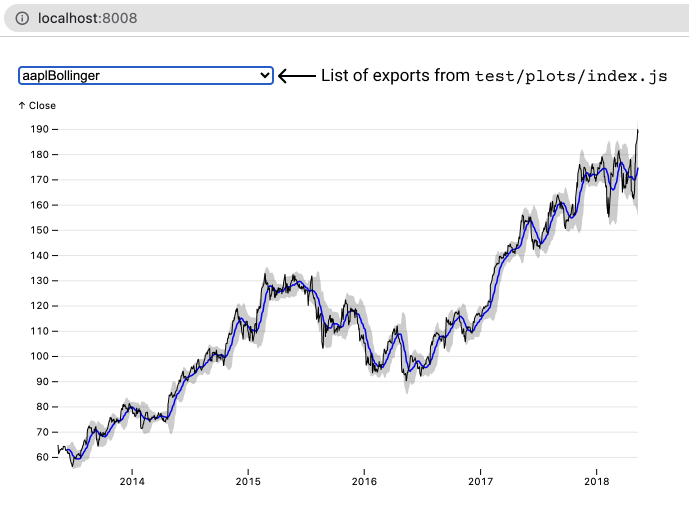

# Observable Plot - Contributing

Observable Plot is open source and released under the [ISC license](./LICENSE). You are welcome to [send us pull requests](https://docs.github.com/en/pull-requests/collaborating-with-pull-requests/proposing-changes-to-your-work-with-pull-requests/about-pull-requests) to contribute bug fixes or new features. We also invite you to participate in [issues](https://github.com/observablehq/plot/issues) and [discussions](https://github.com/observablehq/plot/discussions). We use issues to track and diagnose bugs, as well as to debate and design enhancements to Plot. Discussions are intended for you to ask for help using Plot, or to share something cool you’ve built with Plot. (You can also ask for help on the [Observable Forum](https://talk.observablehq.com).)

We request that you abide by our [code of conduct](https://observablehq.com/@observablehq/code-of-conduct) when contributing and participating in discussions.

## Development

To contribute to Observable Plot, you’ll need a local development environment to make and test changes to Plot’s source code. To get started, follow GitHub’s tutorial on [forking (and cloning) a repository](https://docs.github.com/en/get-started/quickstart/fork-a-repo). Once you’ve cloned your fork of the Plot repository, open a terminal and `cd` in your forked repository. Then run Yarn to install dependencies:

```bash
yarn
```

## Testing

After making changes to Plot’s source code, run Plot’s test suite to verify that your code is doing what you expect and that you haven’t introduced any other unexpected changes in behavior. Plot has two types of tests: **unit tests** and **snapshot tests**. Tests are run automatically on pull requests (via GitHub Actions), but you’ll want to run them locally to verify your changes before opening a pull request. To run the tests, use Yarn:

```bash
yarn test
```

This will also run ESLint on Plot’s source to help catch simple mistakes, such as unused imports.

### Unit tests

Unit tests live in `test` and have the `-test.js` file extension; see [`test/marks/area-test.js`](./test/marks/area-test.js) for example. Generally speaking, unit tests make specific, low-level assertions about the behavior of Plot’s API, including internals and helper methods. If you add a new feature, or change the behavior of an existing feature, please update the unit tests so that we can more easily maintain your contribution into the future. For example, here’s a unit test that tests how Plot formats months:

```js
it("formatMonth(locale, format) does the right thing", () => {
  assert.strictEqual(Plot.formatMonth("en", "long")(0), "January");
  assert.strictEqual(Plot.formatMonth("en", "short")(0), "Jan");
  assert.strictEqual(Plot.formatMonth("en", "narrow")(0), "J");
});
```

Plot’s unit tests are written with [Mocha](https://mochajs.org).

### Snapshot tests

Snapshot tests live in `test/plots`; see [`test/plots/aapl-bollinger.js`](./test/plots/aapl-bollinger.js) for example. Unlike unit tests which only test individual methods, snapshot tests actually visualize data—they’re more representative of how we expect people will use Plot. Snapshot tests can also serve as examples of how to use the Plot API, though note that some of the examples intentionally test edge case of the API and may not embody best practices. Each snapshot test defines a plot by exporting a default async function. For example, here’s a line chart using BLS unemployment data:

```js
import * as Plot from "@observablehq/plot";
import * as d3 from "d3";

export default async function() {
  const bls = await d3.csv("data/bls-metro-unemployment.csv", d3.autoType);
  return Plot.plot({
    marks: [
      Plot.line(bls, {x: "date", y: "unemployment", z: "division"}),
      Plot.ruleY([0])
    ]
  });
}
```

When a snapshot test is run, its output is compared against the SVG or HTML snapshot saved in the `test/output` folder. This makes it easier to review the effect of code changes and to catch unintended changes. Snapshot tests must have deterministic, reproducible behavior; they should not depend on live data, external servers, the current time, the weather, etc. To use randomness in a test, use a seeded random number generator such as [d3.randomLcg](https://github.com/d3/d3-random/blob/master/README.md#randomLcg).

To add a new snapshot test, create a new JavaScript file in the `test/plots` folder, copying the pattern shown above. Then register your test in the test registry, `test/plots/index.js`, by exporting the snapshot test function. For example:

```js
export {default as mobyDick} from "./moby-dick.js";
```

The best thing about snapshot tests is that you can see the live result in your browser as you make changes to Plot’s source code! This lets you immediately assess visually what Plot is doing. Once it “looks right” in a snapshot test, you can codify the expected behavior more formally in a unit test. To preview snapshot tests during development, Plot uses [Vite](https://vitejs.dev). To start Vite:

```bash
yarn dev
```

This will open http://localhost:8008/ in your browser where you can choose a test plot registered in `test/plots/index.js`. As you edit the source, the currently-selected test plot will update live in your browser as you save changes. You can change the selected test from the drop-down menu. If the drop-down menu is focused, the left and right arrow keys will cycle between tests.



When previewing snapshot tests, consider using your browser’s debugger or element inspector to assist development.

Running Plot’s snapshot tests will automatically generate any missing snapshots in `test/output`. You should `git add` these before committing your changes. (If you forget, your PR will fail in CI, and you’ll get a reminder.) Changed snapshots are saved alongside the originals with a `-changed` suffix for visual inspection. If your code intentionally changes some of the existing snapshots, simply blow away the existing snapshots and run the tests again. You can then review what’s changed using `git diff`.

```
rm -rf test/output
yarn test
```

## Documentation

When submitting a pull request, please remember to update Plot’s [README.md](./README.md) to reflect changes to the public API. You are also welcome to edit Plot’s [CHANGELOG.md](./CHANGELOG.md) to assist with writing future release notes. In addition, please reference any related [issues](https://github.com/observablehq/plot/issues) (or discussions) in your pull request description.

If you’d like to share a live demonstration or motivating example of your change to Plot, you can regenerate Plot’s release bundle using Yarn:

```bash
yarn prepublishOnly
```

The generated bundle `dist/plot.umd.js` can then be loaded like so:

```html
<script src="https://cdn.jsdelivr.net/npm/d3@7"></script>
<script src="plot.umd.js"></script>
```

Alternatively, you can attach the `dist/plot.umd.js` file to an [Observable notebook](https://observablehq.com), and then load it like so:

```js
Plot = require(await FileAttachment("plot.umd.js").url())
```
