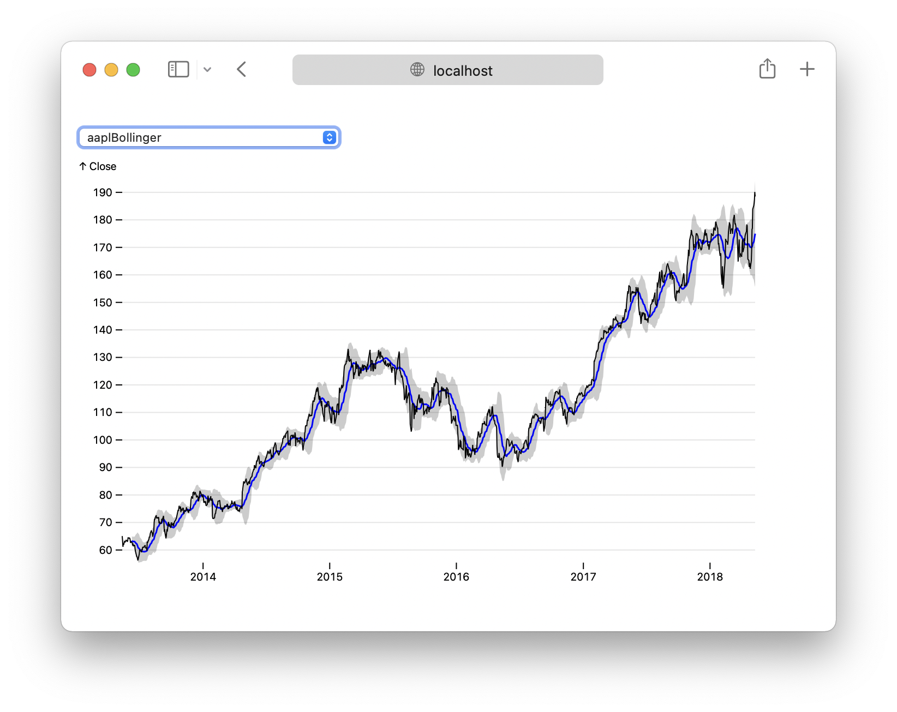

# Observable Plot - Contributing

Observable Plot is released under the ISC license. You are welcome to [fork this repository](https://docs.github.com/en/get-started/quickstart/fork-a-repo) and to [send us pull requests](https://docs.github.com/en/pull-requests/collaborating-with-pull-requests/proposing-changes-to-your-work-with-pull-requests/about-pull-requests) to contribute bug fixes or new features.

## Set up

To set up your local development environment for Plot, follow these steps on your terminal:

```bash
# 1. Clone your fork of the repository
git clone https://github.com/USER-NAME/plot.git
cd plot

# 2. Install dependencies listed in the package.json file
yarn
```

## Development

Plot is written in ES modules and uses [Vite](https://vitejs.dev/) for development; this means that you can edit the Plot source code, and the test plots will update live in your browser as you save changes. To start Vite:

```
yarn dev
```

This should open http://localhost:8008/ in your browser where you can see the tests plots defined in `test/plots`.



If you’d like to create a new test plot as part of your development, see the instructions below for *snapshot tests*.

## Testing

Plot has both unit tests and snapshot tests.

**Unit tests** live in `test` and have the `-test.js` extension. These tests are written using [Mocha](https://mochajs.org). Generally speaking, unit tests make specific assertions about the behavior of Plot’s internals and helper methods.

**Snapshot tests** live in `test/plots`; these also serve as examples of how to use the Plot API. Each snapshot test defines a plot by exporting a default async function. For example, here’s a line chart using BLS unemployment data:

```js
import * as Plot from "@observablehq/plot";
import * as d3 from "d3";

export default async function() {
  const data = await d3.csv("data/bls-metro-unemployment.csv", d3.autoType);
  return Plot.plot({
    marks: [
      Plot.line(data, {x: "date", y: "unemployment", z: "division"}),
      Plot.ruleY([0])
    ]
  });
}
```

When a snapshot test is run, its output is compared against the SVG or HTML snapshot saved in the `test/output` folder. This makes it easier to see the effect of code changes and to catch unintended changes.

To add a new snapshot test, create a new JavaScript file in the `test/plots` folder. Then register your test in the test registry, `test/plots/index.js`. Once you’ve registered your test, it will also appear automatically in the test browser (http://localhost:8008), where you can inspect and debug the output. (Snapshot tests must have deterministic, reproducible behavior; they should not depend on live data, external servers, the current time, the weather, etc. To use randomness in a test, use a seeded random number generator such as [d3.randomLcg](https://github.com/d3/d3-random/blob/master/README.md#randomLcg).)

To run the tests:

```
yarn test
```

This will automatically generate any missing snapshots in `test/output`, which you should remember to `git add` before committing your changes. (If you forget, your PR will fail in CI, and you’ll get a reminder.) Changed snapshots are saved alongside the originals with a -changed suffix, for visual inspection. These should never be commited.

If your code intentionally changes some of the existing snapshots, simply blow away the existing snapshots and run the tests again. You can then review what’s changed using `git diff`.

```
rm -rf test/output
yarn test
```

## Documentation

Please update the [README.md](./README.md) to reflect any changes to Plot’s public API, and reference any related [issues](https://github.com/observablehq/plot/issues).

If you’d like to share a motivating example in an Observable notebook, you can bundle your changes into a single file:

```bash
# Compile into the file `dist/plot.umd.js`
yarn prepublishOnly
```

You can then attach the `dist/plot.umd.js` file to your notebook using a [File Attachment](https://observablehq.com/@observablehq/file-attachments), and load it into your notebook:

```js
// Load your copy into Observable
Plot = require(await FileAttachment("plot.umd.js").url())
```
