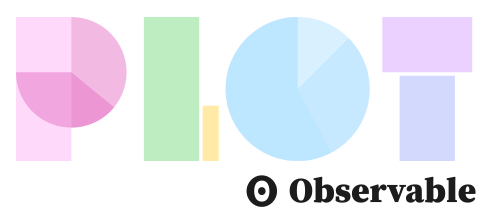

# Observable Plot

[**Observable Plot**](https://observablehq.com/plot/) is a free, [open-source](./LICENSE), JavaScript library for visualizing tabular data, focused on accelerating exploratory data analysis. It has a concise, memorable, yet expressive API, featuring [scales](https://observablehq.com/plot/features/scales) and [layered marks](https://observablehq.com/plot/features/marks) in the *grammar of graphics* style.

## Documentation 📚

https://observablehq.com/plot/

## Examples 🖼️

https://observablehq.com/@observablehq/plot-gallery

## Releases 🚀

See our [CHANGELOG](https://github.com/observablehq/plot/blob/main/CHANGELOG.md) and summary [release notes](https://github.com/observablehq/plot/releases).

## Getting help 🏠

See our [community guide](https://observablehq.com/plot/community).

## Contributing 🙏

See [CONTRIBUTING.md](./CONTRIBUTING.md).
