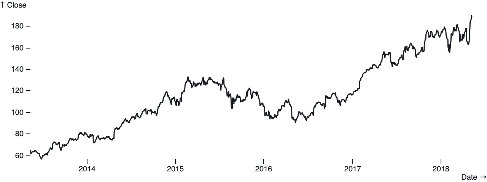
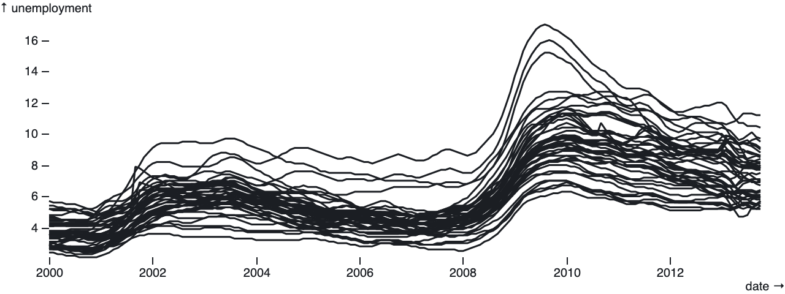
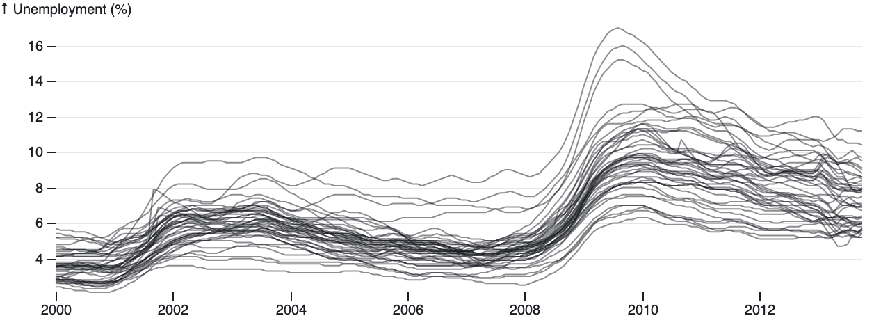

# Observable Plot

**Observable Plot** is a JavaScript library for exploratory data visualization.

## Principles

Observable Plot tries to be **concise and memorable** for common tasks. This makes Plot easier to learn, easier to remember, and faster for exploring data. For example, given a tabular dataset *AAPL* loaded from a CSV file with columns *Date* and *Close*, here’s a line chart of Apple’s stock price:



```js
Plot.Line(AAPL, "Date", "Close")
```

And here’s a line chart of unemployment rates across metropolitan area:



```js
Plot.Line(unemployment, "date", "unemployment", "division")
```

A chart created by Plot is simply a DOM element that you can put anywhere on the page.

```js
const chart = Plot.Line(AAPL, "Date", "Close");
document.body.appendChild(chart);
```

Data in the wild — and in JavaScript! — comes in all shapes, so Plot is **flexible regarding input data**: Data can be an array of objects with named properties (rows, as above), parallel “flat” arrays or iterables of values (columns), or even functions to compute values on-the-fly.

```js
// As rows…
Plot.Line(AAPL, "Date", "Close"); // named fields
Plot.Line(AAPL, d => d.Date, d => d.Close); // accessor functions
```

```js
// As columns…
Plot.Line(null, dates, closes); // explicit values
Plot.Line({length}, (_, i) => dates[i], (_, i) => closes[i]); // accessor functions
Plot.Line(index, i => dates[i], i => closes[i]); // as function of index
```

Above, the columns might be computed from rows as:

```js
const length = AAPL.length;
const dates = AAPL.map(d => d.Date);
const closes = AAPL.map(d => d.Close);
const index = AAPL.map((d, i) => i);
```

For example, here’s a line chart of random *y*-values where *x* encodes the index of the input data:


```js
Plot.Line({length: 500}, Math.random)
```

And similarly here’s a line chart of a random walk using [d3.cumsum](https://github.com/d3/d3-array/blob/master/README.md#cumsum) and [d3.randomNormal](https://github.com/d3/d3-random/blob/master/README.md#randomNormal):


```js
Plot.Line(d3.cumsum({length: 500}, d3.randomNormal()))
```

If you don’t specify a scale type explicitly, Plot will try to infer a suitable one based on the input values. For example, a UTC (temporal) scale is used for Date instances, a point (ordinal) scale is used for strings, and a linear (quantitative) scale is used for numbers.

The charts above use shorthand, but Plot charts are **highly configurable**. Here’s a more longhand representation of the unemployment chart above, with a dash of customization:



```js
Plot.Line(unemployment, {
  x: d => d.date,
  y: {
    value: d => d.unemployment,
    label: "↑ Unemployment (%)", // custom y-axis label
    rule: 0, // add a rule at y=0
    grid: true // show grid lines
  },
  z: d => d.division,
  line: {
    strokeWidth: 1, // thinner stroke
    strokeOpacity: 0.5 // allow blending
  }
})
```

With Plot, **all charts are interactive inputs**. A Plot chart element exposes a *value* property that represents the currently-selected data, and emits an *input* even whenever the selection changes in response to user interaction. This makes it easy to pipe the selection from one chart into another chart (or table) for coordinated views, and it works beautifully with [Observable’s reactive views](https://observablehq.com/@observablehq/introduction-to-views).

In vanilla JavaScript:

```js
const chart = Plot.Line(AAPL, "Date", "Close");
chart.oninput = () => console.log(chart.value);
```

In Observable:

```js
viewof selection = Plot.Line(AAPL, "Date", "Close")
```
```js
Table(selection)
```

Lastly, Plot provides **an extensible foundation** for visualization. While Plot includes a variety of standard chart types out of the box, it also includes lower-level APIs: Plot.Frame and Plot.Plot. These can be used directly to create one-off custom charts, or to implement new reusable mark and chart types. Plot can be extended over time by the community to make a wide variety of visualization techniques more accessible.
