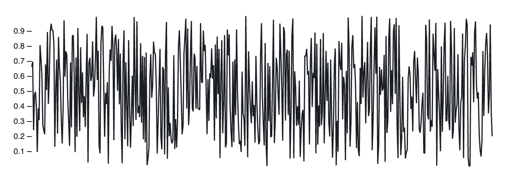
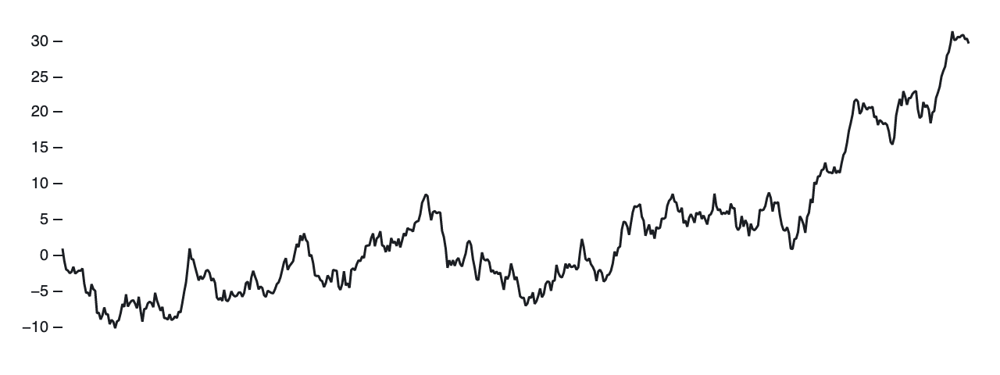
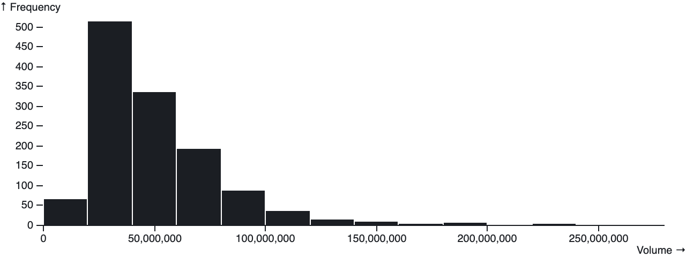

# Observable Plot

**Observable Plot** is a JavaScript library for exploratory data visualization.

* [Introduction](#introduction)
* Reference (TODO)
* [Development](./DEVELOPMENT.md)

## Introduction

Observable Plot adheres to several principles:

* Be concise and memorable for common tasks.
* Be flexible regarding input data.
* Provide good defaults, but allow configuration.
* Support faceting (small multiples) in all charts.
* Support interaction (selection) in all charts.
* Provide an open, extensible foundation for visualization.

Plot tries to be **concise and memorable** for common tasks. This makes Plot easier to learn, easier to remember, and faster for exploring data. For example, given a tabular dataset *AAPL* loaded from a CSV file with columns *Date* and *Close*, here’s a line chart of Apple’s stock price:


```js
Plot.plot({
  height: 240,
  marks: [
    Plot.line(AAPL, {x: "Date", y: "Close"})
  ]
})
```

And here’s a line chart of unemployment rates across metropolitan area:


```js
Plot.plot({
  height: 240,
  marks: [
    Plot.line(data, {x: "date", y: "unemployment", z: "division"})
  ]
})
```

A chart created by Plot is simply an SVG element that you can put anywhere on the page.

```js
const chart = Plot.plot(…); // create the plot
document.body.appendChild(chart); // add it to the DOM
```

Data in the wild comes in all shapes, so Plot is **flexible regarding input data**: data can be an array of objects with named properties (rows, as above), parallel “flat” arrays or iterables of values (columns), or even functions to compute values on-the-fly.

```js
// As rows…
Plot.line(AAPL, {x: "Date", y: "Close"}) // named fields
Plot.line(AAPL, {x: d => d.Date, y: d => d.Close}) // accessor functions
```

```js
// As columns…
Plot.line(null, {x: dates, y: closes}) // explicit values
Plot.line({length}, {x: (_, i) => dates[i], y: (_, i) => closes[i]}) // accessor functions
Plot.line(index, {x: i => dates[i], y: i => closes[i]}) // as function of index
```

Above, the columns might be computed from rows as:

```js
const length = AAPL.length;
const dates = AAPL.map(d => d.Date);
const closes = AAPL.map(d => d.Close);
const index = AAPL.map((d, i) => i);
```

For example, here’s a line chart of random *y*-values where *x* encodes the index of the input data:



```js
Plot.plot({
  height: 240,
  marks: [
    Plot.lineY({length: 500}, {y: Math.random})
  ]
})
```

And similarly here’s a line chart of a random walk using [d3.cumsum](https://github.com/d3/d3-array/blob/master/README.md#cumsum) and [d3.randomNormal](https://github.com/d3/d3-random/blob/master/README.md#randomNormal):



```js
Plot.plot({
  height: 240,
  marks: [
    Plot.lineY(d3.cumsum({length: 500}, d3.randomNormal()))
  ]
})
```

If you don’t specify a scale type explicitly, Plot will try to infer a suitable one based on the input values. For example, a UTC (temporal) scale is used for Date instances, a point (ordinal) scale is used for strings, and a linear (quantitative) scale is used for numbers.

It’s not just line charts, of course. Here’s another useful chart type, the histogram:



```js
Plot.plot({
  height: 240,
  marks: [
    Plot.binX(data, {x: "Volume"})
  ]
})
```

While the charts above use shorthand defaults, Plot charts are **highly configurable**. Here’s a more longhand representation of the unemployment chart above, with a dash of customization:


```js
Plot.plot({
  height: 240,
  x: {
    label: null // hide the x-axis label
  },
  y: {
    grid: true, // show grid lines
    label: "↑ Unemployment (%)" // custom y-axis label
  },
  marks: [
    Plot.line(data, {
      x: "date",
      y: "unemployment",
      z: "division",
      strokeWidth: 1, // thinner stroke
      strokeOpacity: 0.5 // allow blending
    }),
    Plot.ruleY([0]) // add a rule at y = 0
  ]
})
```

(TODO) With Plot, **all charts are interactive inputs**. A Plot chart element exposes a *value* property that represents the currently-selected data, and emits an *input* event whenever the selection changes in response to user interaction. This makes it easy to pipe the selection from one chart into another chart (or table) for coordinated views, and it works beautifully with [Observable’s reactive views](https://observablehq.com/@observablehq/introduction-to-views).

```js
const chart = Plot.plot(…);
chart.oninput = () => console.log(chart.value);
```

Lastly, Plot provides **an open, extensible foundation** for visualization. While Plot includes a variety of standard mark types out of the box, it is designed to be extended. New mark types can be used to create one-off custom charts, or for reuse, without needing to fork Plot’s internals. Plot can be extended over time by the community to make a wide variety of visualization techniques more accessible.
