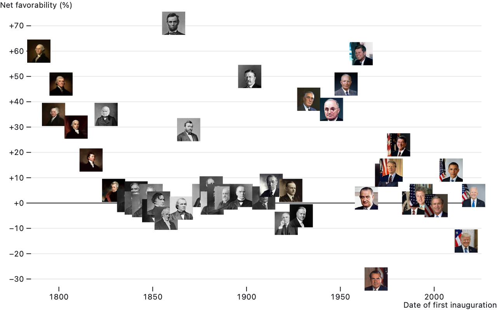

# Observable Plot

**Observable Plot** is a JavaScript library for exploratory data visualization. If you are new to Plot, we highly recommend first reading these notebooks to introduce Plot’s core concepts such as *marks* and *scales*:

* [Introduction](https://observablehq.com/@observablehq/plot?collection=@observablehq/plot) - a quick tour, and Plot’s motivations
* [Marks and Channels](https://observablehq.com/@observablehq/plot-marks?collection=@observablehq/plot) - drawing data-driven shapes with Plot
* [Scales](https://observablehq.com/@observablehq/plot-scales?collection=@observablehq/plot) - visual encodings for abstract data
* [Transforms](https://observablehq.com/@observablehq/plot-transforms?collection=@observablehq/plot) - deriving data
* [Facets](https://observablehq.com/@observablehq/plot-facets?collection=@observablehq/plot) - small multiples
* [Legends](https://observablehq.com/@observablehq/plot-legends?collection=@observablehq/plot) - documenting visual encodings
* [Mapping](https://observablehq.com/@observablehq/plot-mapping?collection=@observablehq/plot) - creating maps with geometries and projections

This README is intended as a technical reference for Plot’s API. For more, please see:

* [Cheatsheets](https://observablehq.com/@observablehq/plot-cheatsheets) - a handy, interactive guide
* [Changelog](./CHANGELOG.md) - release notes
* [Contributing](./CONTRIBUTING.md) - if you’d like to help build Plot
* [Discussions](https://github.com/observablehq/plot/discussions) - if you’d like help
* [Forum](https://talk.observablehq.com/c/help/6) - another place to ask for help
* [Issues](https://github.com/observablehq/plot/issues) - to file a bug or request a new feature

## Installing

In Observable notebooks, Plot and D3 are available by default as part of the [standard library](https://observablehq.com/@observablehq/recommended-libraries).

For use with Webpack, Rollup, or other Node-based bundlers, Plot is typically installed via a package manager such as Yarn or npm. (Plot is distributed as an ES module; see [Sindre Sorhus’s guide](https://gist.github.com/sindresorhus/a39789f98801d908bbc7ff3ecc99d99c) for help upgrading.)

```bash
yarn add @observablehq/plot
```

Plot can then be imported as a namespace:

```js
import * as Plot from "@observablehq/plot";
```

In vanilla HTML, Plot can be imported as an ES module, say from jsDelivr:

```html
<script type="module">

import * as Plot from "https://cdn.jsdelivr.net/npm/@observablehq/plot@0.6/+esm";

document.body.append(Plot.plot(options));

</script>
```

Plot is also available as a UMD bundle for legacy browsers.

```html
<script src="https://cdn.jsdelivr.net/npm/d3@7"></script>
<script src="https://cdn.jsdelivr.net/npm/@observablehq/plot@0.6"></script>
<script>

document.body.append(Plot.plot(options));

</script>
```

See also our [Plot + React example](https://github.com/observablehq/plot-create-react-app-example/blob/main/src/App.js).

## Plot.plot(*options*)

<!-- jsdoc plot -->

Renders a new plot given the specified *options* and returns the corresponding SVG or HTML figure element. All *options* are optional.

### Mark options

The **marks** option specifies an array of [marks](#marks) to render. Each mark has its own data and options; see the respective mark type (*e.g.*, [bar](#bar) or [dot](#dot)) for which mark options are supported. Each mark may be a nested array of marks, allowing composition. Marks may also be a function which returns an SVG element, if you wish to insert some arbitrary content into your plot. And marks may be null or undefined, which produce no output; this is useful for showing marks conditionally (*e.g.*, when a box is checked). Marks are drawn in *z* order, last on top. For example, here a single rule at *y* = 0 is drawn on top of blue bars for the [*alphabet* dataset](./test/data/alphabet.csv).

```js
Plot.plot({
  marks: [
    Plot.barY(alphabet, {x: "letter", y: "frequency", fill: "steelblue"}),
    Plot.ruleY([0])
  ]
})
```

### Layout options

These options determine the overall layout of the plot; all are specified as numbers in pixels:

* **marginTop** - the top margin
* **marginRight** - the right margin
* **marginBottom** - the bottom margin
* **marginLeft** - the left margin
* **margin** - shorthand for the four margins
* **width** - the outer width of the plot (including margins)
* **height** - the outer height of the plot (including margins)

The default **width** is 640. On Observable, the width can be set to the [standard width](https://github.com/observablehq/stdlib/blob/main/README.md#width) to make responsive plots. The default **height** is chosen automatically based on the plot’s associated scales; for example, if *y* is linear and there is no *fy* scale, it might be 396.

The default margins depend on the plot’s axes: for example, **marginTop** and **marginBottom** are at least 30 if there is a corresponding top or bottom *x* axis, and **marginLeft** and **marginRight** are at least 40 if there is a corresponding left or right *y* axis. For simplicity’s sake and for consistent layout across plots, margins are not automatically sized to make room for tick labels; instead, shorten your tick labels or increase the margins as needed. (In the future, margins may be specified indirectly via a scale property to make it easier to reorient axes without adjusting margins; see [#210](https://github.com/observablehq/plot/issues/210).)

The **style** option allows custom styles to override Plot’s defaults. It may be specified either as a string of inline styles (*e.g.*, `"color: red;"`, in the same fashion as assigning [*element*.style](https://developer.mozilla.org/en-US/docs/Web/API/HTMLElement/style)) or an object of properties (*e.g.*, `{color: "red"}`, in the same fashion as assigning [*element*.style properties](https://developer.mozilla.org/en-US/docs/Web/API/CSSStyleDeclaration)). Note that unitless numbers ([quirky lengths](https://www.w3.org/TR/css-values-4/#deprecated-quirky-length)) such as `{padding: 20}` may not supported by some browsers; you should instead specify a string with units such as `{padding: "20px"}`. By default, the returned plot has a white background, a max-width of 100%, and the system-ui font. Plot’s marks and axes default to [currentColor](https://developer.mozilla.org/en-US/docs/Web/CSS/color_value#currentcolor_keyword), meaning that they will inherit the surrounding content’s color. For example, a dark theme:

```js
Plot.plot({
  marks: …,
  style: {
    background: "black",
    color: "white"
  }
})
```

If a **caption** is specified, Plot.plot wraps the generated SVG element in an HTML figure element with a figcaption, returning the figure. To specify an HTML caption, consider using the [`html` tagged template literal](http://github.com/observablehq/htl); otherwise, the specified string represents text that will be escaped as needed.

```js
Plot.plot({
  marks: …,
  caption: html`Figure 1. This chart has a <i>fancy</i> caption.`
})
```

The generated SVG element has a random class name which applies a default stylesheet. Use the top-level **className** option to specify that class name.

The **document** option specifies the [document](https://developer.mozilla.org/en-US/docs/Web/API/Document) used to create plot elements. It defaults to window.document, but can be changed to another document, say when using a virtual DOM library for server-side rendering in Node.

### Scale options

Plot passes data through [scales](https://observablehq.com/@observablehq/plot-scales) as needed before rendering marks. A scale maps abstract values such as time or temperature to visual values such as position or color. Within a given plot, marks share scales. For example, if a plot has two Plot.line marks, both share the same *x* and *y* scales for a consistent representation of data. (Plot does not currently support dual-axis charts, which are [not advised](https://blog.datawrapper.de/dualaxis/).)

```js
Plot.plot({
  marks: [
    Plot.line(aapl, {x: "Date", y: "Close"}),
    Plot.line(goog, {x: "Date", y: "Close"})
  ]
})
```

Each scale’s options are specified as a nested options object with the corresponding scale name within the top-level plot *options*:

* **x** - horizontal position
* **y** - vertical position
* **r** - radius (size)
* **color** - fill or stroke
* **opacity** - fill or stroke opacity
* **length** - linear length (for [vectors](#vector))
* **symbol** - categorical symbol (for [dots](#dot))

For example, to set the domain for the *x* and *y* scales:

```js
Plot.plot({
  x: {
    domain: [new Date("1880-01-01"), new Date("2016-11-01")]
  },
  y: {
    domain: [-0.78, 1.35]
  }
})
```

Plot supports many scale types. Some scale types are for quantitative data: values that can be added or subtracted, such as temperature or time. Other scale types are for ordinal or categorical data: unquantifiable values that can only be ordered, such as t-shirt sizes, or values with no inherent order that can only be tested for equality, such as types of fruit. Some scale types are further intended for specific visual encodings: for example, as [position](#position-options) or [color](#color-options).

You can set the scale type explicitly via the *scale*.**type** option, though typically the scale type is inferred automatically. Some marks mandate a particular scale type: for example, [Plot.barY](#plotbarydata-options) requires that the *x* scale is a *band* scale. Some scales have a default type: for example, the *radius* scale defaults to *sqrt* and the *opacity* scale defaults to *linear*. Most often, the scale type is inferred from associated data, pulled either from the domain (if specified) or from associated channels. A *color* scale defaults to *identity* if no range or scheme is specified and all associated defined values are valid CSS color strings. Otherwise, strings and booleans imply an ordinal scale; dates imply a UTC scale; and anything else is linear. Unless they represent text, we recommend explicitly converting strings to more specific types when loading data (*e.g.*, with d3.autoType or Observable’s FileAttachment). For simplicity’s sake, Plot assumes that data is consistently typed; type inference is based solely on the first non-null, non-undefined value.

For quantitative data (*i.e.* numbers), a mathematical transform may be applied to the data by changing the scale type:

* *linear* (default) - linear transform (translate and scale)
* *pow* - power (exponential) transform
* *sqrt* - square-root transform (*pow* transform with exponent = 0.5)
* *log* - logarithmic transform
* *symlog* - bi-symmetric logarithmic transform per [Webber *et al.*](https://www.researchgate.net/publication/233967063_A_bi-symmetric_log_transformation_for_wide-range_data)

The appropriate transform depends on the data’s distribution and what you wish to know. A *sqrt* transform exaggerates differences between small values at the expense of large values; it is a special case of the *pow* transform which has a configurable *scale*.**exponent** (0.5 for *sqrt*). A *log* transform is suitable for comparing orders of magnitude and can only be used when the domain does not include zero. The base defaults to 10 and can be specified with the *scale*.**base** option; note that this only affects the axis ticks and not the scale’s behavior. A *symlog* transform is more elaborate, but works well with wide-range values that include zero; it can be configured with the *scale*.**constant** option (default 1).

For temporal data (*i.e.* dates), two variants of a *linear* scale are also supported:

* *utc* (default, recommended) - UTC time
* *time* - local time

UTC is recommended over local time as charts in UTC time are guaranteed to appear consistently to all viewers whereas charts in local time will depend on the viewer’s time zone. Due to limitations in JavaScript’s Date class, Plot does not yet support an explicit time zone other than UTC.

For ordinal data (*e.g.*, strings), use the *ordinal* scale type or the *point* or *band* [position scale types](#position-options). The *categorical* scale type is also supported; it is equivalent to *ordinal* except as a [color scale](#color-options), where it provides a different default color scheme. (Since position is inherently ordinal or even quantitative, categorical data must be assigned an effective order when represented as position, and hence *categorical* and *ordinal* may be considered synonymous in context.)

You can opt-out of a scale using the *identity* scale type. This is useful if you wish to specify literal colors or pixel positions within a mark channel rather than relying on the scale to convert abstract values into visual values. For position scales (*x* and *y*), an *identity* scale is still quantitative and may produce an axis, yet unlike a *linear* scale the domain and range are fixed based on the plot layout.

Quantitative scales, as well as identity position scales, coerce channel values to numbers; both null and undefined are coerced to NaN. Similarly, time scales coerce channel values to dates; numbers are assumed to be milliseconds since UNIX epoch, while strings are assumed to be in [ISO 8601 format](https://github.com/mbostock/isoformat/blob/main/README.md#parsedate-fallback).

A scale’s domain (the extent of its inputs, abstract values) and range (the extent of its outputs, visual values) are typically inferred automatically. You can set them explicitly using these options:

* *scale*.**domain** - typically [*min*, *max*], or an array of ordinal or categorical values
* *scale*.**range** - typically [*min*, *max*], or an array of ordinal or categorical values
* *scale*.**unknown** - the desired output value (defaults to undefined) for invalid input values
* *scale*.**reverse** - reverses the domain (or in somes cases, the range), say to flip the chart along *x* or *y*
* *scale*.**interval** - an interval or time interval (for interval data; see below)

For most quantitative scales, the default domain is the [*min*, *max*] of all values associated with the scale. For the *radius* and *opacity* scales, the default domain is [0, *max*] to ensure a meaningful value encoding. For ordinal scales, the default domain is the set of all distinct values associated with the scale in natural ascending order; for a different order, set the domain explicitly or add a [sort option](#sort-options) to an associated mark. For threshold scales, the default domain is [0] to separate negative and non-negative values. For quantile scales, the default domain is the set of all defined values associated with the scale. If a scale is reversed, it is equivalent to setting the domain as [*max*, *min*] instead of [*min*, *max*].

The default range depends on the scale: for [position scales](#position-options) (*x*, *y*, *fx*, and *fy*), the default range depends on the plot’s [size and margins](#layout-options). For [color scales](#color-options), there are default color schemes for quantitative, ordinal, and categorical data. For opacity, the default range is [0, 1]. And for radius, the default range is designed to produce dots of “reasonable” size assuming a *sqrt* scale type for accurate area representation: zero maps to zero, the first quartile maps to a radius of three pixels, and other values are extrapolated. This convention for radius ensures that if the scale’s data values are all equal, dots have the default constant radius of three pixels, while if the data varies, dots will tend to be larger.

The behavior of the *scale*.**unknown** option depends on the scale type. For quantitative and temporal scales, the unknown value is used whenever the input value is undefined, null, or NaN. For ordinal or categorical scales, the unknown value is returned for any input value outside the domain. For band or point scales, the unknown option has no effect; it is effectively always equal to undefined. If the unknown option is set to undefined (the default), or null or NaN, then the affected input values will be considered undefined and filtered from the output.

For data at regular intervals, such as integer values or daily samples, the *scale*.**interval** option can be used to enforce uniformity. The specified *interval*—such as d3.utcMonth—must expose an *interval*.floor(*value*), *interval*.offset(*value*), and *interval*.range(*start*, *stop*) functions. The option can also be specified as a number, in which case it will be promoted to a numeric interval with the given step. This option sets the default *scale*.transform to the given interval’s *interval*.floor function. In addition, the default *scale*.domain is an array of uniformly-spaced values spanning the extent of the values associated with the scale.

Quantitative scales can be further customized with additional options:

* *scale*.**clamp** - if true, clamp input values to the scale’s domain
* *scale*.**nice** - if true (or a tick count), extend the domain to nice round values
* *scale*.**zero** - if true, extend the domain to include zero if needed
* *scale*.**percent** - if true, transform proportions in [0, 1] to percentages in [0, 100]

Clamping is typically used in conjunction with setting an explicit domain since if the domain is inferred, no values will be outside the domain. Clamping is useful for focusing on a subset of the data while ensuring that extreme values remain visible, but use caution: clamped values may need an annotation to avoid misinterpretation. Top-level **clamp**, **nice**, and **zero** options are supported as shorthand for setting the respective option on all scales.

The *scale*.**transform** option allows you to apply a function to all values before they are passed through the scale. This is convenient for transforming a scale’s data, say to convert to thousands or between temperature units.

```js
Plot.plot({
  y: {
    label: "↑ Temperature (°F)",
    transform: f => f * 9 / 5 + 32 // convert Celsius to Fahrenheit
  },
  marks: …
})
```

<!-- jsdocEnd plot -->

#### *plot*.scale(*scaleName*)

Scale definitions can be exposed through the *plot*.**scale**(*scaleName*) function of a returned plot. The *scaleName* must be one of the known scale names: `"x"`, `"y"`, `"fx"`, `"fy"`, `"r"`, `"color"`, `"opacity"`, `"symbol"`, or `"length"`. If the associated *plot* has no scale with the given *scaleName*, returns undefined.

```js
const plot = Plot.plot(…); // render a plot
const color = plot.scale("color"); // retrieve the color scale object
console.log(color.range); // inspect the color scale’s range, ["red", "blue"]
```

#### Plot.scale(*options*)

<!-- jsdoc scale -->

You can also create a standalone scale with Plot.**scale**(*options*). The *options* object must define at least one scale; see [Scale options](#scale-options) for how to define a scale. For example, here is a linear color scale with the default domain of [0, 1] and default scheme *turbo*:

```js
const color = Plot.scale({color: {type: "linear"}});
```

#### Scale objects

Both [*plot*.scale](#plotscalescalename) and [Plot.scale](#plotscaleoptions) return scale objects. These objects represent the actual (or “materialized”) scale options used by Plot, including the domain, range, interpolate function, *etc.* The scale’s label, if any, is also returned; however, note that other axis properties are not currently exposed. Point and band scales also expose their materialized bandwidth and step.

To reuse a scale across plots, pass the corresponding scale object into another plot specification:

```js
const plot1 = Plot.plot(…);
const plot2 = Plot.plot({…, color: plot1.scale("color")});
```

For convenience, scale objects expose a *scale*.**apply**(*input*) method which returns the scale’s output for the given *input* value. When applicable, scale objects also expose a *scale*.**invert**(*output*) method which returns the corresponding input value from the scale’s domain for the given *output* value.

<!-- jsdocEnd scale -->

### Position options

The position scales (*x*, *y*, *fx*, and *fy*) support additional options:

* *scale*.**inset** - inset the default range by the specified amount in pixels
* *scale*.**round** - round the output value to the nearest integer (whole pixel)

The *x* and *fx* scales support asymmetric insets for more precision. Replace inset by:

* *scale*.**insetLeft** - insets the start of the default range by the specified number of pixels
* *scale*.**insetRight** - insets the end of the default range by the specified number of pixels

Similarly, the *y* and *fy* scales support asymmetric insets with:

* *scale*.**insetTop** - insets the top of the default range by the specified number of pixels
* *scale*.**insetBottom** - insets the bottom of the default range by the specified number of pixels

The inset scale options can provide “breathing room” to separate marks from axes or the plot’s edge. For example, in a scatterplot with a Plot.dot with the default 3-pixel radius and 1.5-pixel stroke width, an inset of 5 pixels prevents dots from overlapping with the axes. The *scale*.round option is useful for crisp edges by rounding to the nearest pixel boundary.

In addition to the generic *ordinal* scale type, which requires an explicit output range value for each input domain value, Plot supports special *point* and *band* scale types for encoding ordinal data as position. These scale types accept a [*min*, *max*] range similar to quantitative scales, and divide this continuous interval into discrete points or bands based on the number of distinct values in the domain (*i.e.*, the domain’s cardinality). If the associated marks have no effective width along the ordinal dimension—such as a dot, rule, or tick—then use a *point* scale; otherwise, say for a bar, use a *band* scale. In the image below, the top *x* scale is a *point* scale while the bottom *x* scale is a *band* scale; see [Plot: Scales](https://observablehq.com/@observablehq/plot-scales) for an interactive version.


Ordinal position scales support additional options, all specified as proportions in [0, 1]:

* *scale*.**padding** - how much of the range to reserve to inset first and last point or band
* *scale*.**align** - where to distribute points or bands (0 = at start, 0.5 = at middle, 1 = at end)

For a *band* scale, you can further fine-tune padding:

* *scale*.**paddingInner** - how much of the range to reserve to separate adjacent bands
* *scale*.**paddingOuter** - how much of the range to reserve to inset first and last band

Align defaults to 0.5 (centered). Band scale padding defaults to 0.1 (10% of available space reserved for separating bands), while point scale padding defaults to 0.5 (the gap between the first point and the edge is half the distance of the gap between points, and likewise for the gap between the last point and the opposite edge). Note that rounding and mark insets (e.g., for bars and rects) also affect separation between adjacent marks.

Plot automatically generates axes for position scales. You can configure these axes with the following options:

* *scale*.**axis** - the orientation: *top* or *bottom* for *x*; *left* or *right* for *y*; null to suppress
* *scale*.**ticks** - the approximate number of ticks to generate
* *scale*.**tickSize** - the size of each tick (in pixels; default 6)
* *scale*.**tickPadding** - the separation between the tick and its label (in pixels; default 3)
* *scale*.**tickFormat** - to format tick values, either a function or format specifier string; see [Formats](#formats)
* *scale*.**tickRotate** - whether to rotate tick labels (an angle in degrees clockwise; default 0)
* *scale*.**grid** - if true, draw grid lines across the plot for each tick
* *scale*.**line** - if true, draw the axis line
* *scale*.**label** - a string to label the axis
* *scale*.**labelAnchor** - the label anchor: *top*, *right*, *bottom*, *left*, or *center*
* *scale*.**labelOffset** - the label position offset (in pixels; default 0, typically for facet axes)
* *scale*.**fontVariant** - the font-variant attribute for axis ticks; defaults to tabular-nums for quantitative axes
* *scale*.**ariaLabel** - a short label representing the axis in the accessibility tree
* *scale*.**ariaDescription** - a textual description for the axis

Top-level options are also supported as shorthand: **grid** (for *x* and *y* only; see [facet.grid](#facet-options)), **label**, **axis**, **inset**, **round**, **align**, and **padding**.

### Projection options

The top-level **projection** option applies a two-dimensional (often geographic) projection in place of *x* and *y* scales. It is typically used in conjunction with a [geo mark](#geo) to produce a map, but can be used with any mark that supports *x* and *y* channels, such as [dot](#dot), [text](#text), [arrow](#arrow), and [rect](#rect). For marks that use *x1*, *y1*, *x2*, and *y2* channels, the two projected points are ⟨*x1*, *y1*⟩ and ⟨*x2*, *y2*⟩; otherwise, the projected point is ⟨*x*, *y*⟩. The following built-in named projections are supported:

* *equirectangular* - the equirectangular, or *plate carrée*, projection
* *orthographic* - the orthographic projection
* *stereographic* - the stereographic projection
* *mercator* - the Mercator projection
* *equal-earth* - the [Equal Earth projection](https://en.wikipedia.org/wiki/Equal_Earth_projection) by Šavrič *et al.*
* *azimuthal-equal-area* - the azimuthal equal-area projection
* *azimuthal-equidistant* - the azimuthal equidistant projection
* *conic-conformal* - the conic conformal projection
* *conic-equal-area* - the conic equal-area projection
* *conic-equidistant* - the conic equidistant projection
* *gnomonic* - the gnomonic projection
* *transverse-mercator* - the transverse Mercator projection
* *albers* - the Albers’ conic equal-area projection
* *albers-usa* - a composite Albers conic equal-area projection suitable for the United States
* *identity* - the identity projection for planar geometry
* *reflect-y* - like the identity projection, but *y* points up
* null (default) - the null projection for pre-projected geometry in screen coordinates

In addition to these named projections, the **projection** option may be specified as a [D3 projection](https://github.com/d3/d3-geo/blob/main/README.md#projections), or any custom projection that implements [*projection*.stream](https://github.com/d3/d3-geo/blob/main/README.md#projection_stream), or a function that receives a configuration object ({width, height, ...options}) and returns such a projection. In the last case, the width and height represent the frame dimensions minus any insets.

If the **projection** option is specified as an object, the following additional projection options are supported:

* projection.**type** - one of the projection names above
* projection.**parallels** - the [standard parallels](https://github.com/d3/d3-geo/blob/main/README.md#conic_parallels) (for conic projections only)
* projection.**precision** - the [sampling threshold](https://github.com/d3/d3-geo/blob/main/README.md#projection_precision)
* projection.**rotate** - a two- or three- element array of Euler angles to rotate the sphere
* projection.**domain** - a GeoJSON object to fit in the center of the (inset) frame
* projection.**inset** - inset by the given amount in pixels when fitting to the frame (default zero)
* projection.**insetLeft** - inset from the left edge of the frame (defaults to inset)
* projection.**insetRight** - inset from the right edge of the frame (defaults to inset)
* projection.**insetTop** - inset from the top edge of the frame (defaults to inset)
* projection.**insetBottom** - inset from the bottom edge of the frame (defaults to inset)
* projection.**clip** - the projection clipping method

The following projection clipping methods are supported for projection.**clip**:

* *frame* or true (default) - clip to the extent of the frame (including margins but not insets)
* a number - clip to a great circle of the given radius in degrees centered around the origin
* null or false - do not clip

Whereas the mark.**clip** option is implemented using SVG clipping, the projection.**clip** option affects the generated geometry and typically produces smaller SVG output.

### Color options

The normal scale types—*linear*, *sqrt*, *pow*, *log*, *symlog*, and *ordinal*—can be used to encode color. In addition, Plot supports special scale types for color:

* *categorical* - equivalent to *ordinal*, but defaults to the *tableau10* scheme
* *sequential* - equivalent to *linear*
* *cyclical* - equivalent to *linear*, but defaults to the *rainbow* scheme
* *threshold* - encodes based on the specified discrete thresholds; defaults to the *rdylbu* scheme
* *quantile* - encodes based on the computed quantile thresholds; defaults to the *rdylbu* scheme
* *quantize* - transforms a continuous domain into quantized thresholds; defaults to the *rdylbu* scheme
* *diverging* - like *linear*, but with a pivot; defaults to the *rdbu* scheme
* *diverging-log* - like *log*, but with a pivot that defaults to 1; defaults to the *rdbu* scheme
* *diverging-pow* - like *pow*, but with a pivot; defaults to the *rdbu* scheme
* *diverging-sqrt* - like *sqrt*, but with a pivot; defaults to the *rdbu* scheme
* *diverging-symlog* - like *symlog*, but with a pivot; defaults to the *rdbu* scheme

For a *threshold* scale, the *domain* represents *n* (typically numeric) thresholds which will produce a *range* of *n* + 1 output colors; the *i*th color of the *range* applies to values that are smaller than the *i*th element of the domain and larger or equal to the *i* - 1th element of the domain. For a *quantile* scale, the *domain* represents all input values to the scale, and the *n* option specifies how many quantiles to compute from the *domain*; *n* quantiles will produce *n* - 1 thresholds, and an output range of *n* colors. For a *quantize* scale, the domain will be transformed into approximately *n* quantized values, where *n* is an option that defaults to 5.

By default, all diverging color scales are symmetric around the pivot; set *symmetric* to false if you want to cover the whole extent on both sides.

Color scales support two additional options:

* *scale*.**scheme** - a named color scheme in lieu of a range, such as *reds*
* *scale*.**interpolate** - in conjunction with a range, how to interpolate colors

For quantile and quantize color scales, the *scale*.scheme option is used in conjunction with *scale*.**n**, which determines how many quantiles or quantized values to compute, and thus the number of elements in the scale’s range; it defaults to 5 (for quintiles in the case of a quantile scale).

The following sequential scale schemes are supported for both quantitative and ordinal data:

* <sub></sub> *blues*
* <sub></sub> *greens*
* <sub></sub> *greys*
* <sub></sub> *oranges*
* <sub></sub> *purples*
* <sub></sub> *reds*
* <sub></sub> *bugn*
* <sub></sub> *bupu*
* <sub></sub> *gnbu*
* <sub></sub> *orrd*
* <sub></sub> *pubu*
* <sub></sub> *pubugn*
* <sub></sub> *purd*
* <sub></sub> *rdpu*
* <sub></sub> *ylgn*
* <sub></sub> *ylgnbu*
* <sub></sub> *ylorbr*
* <sub></sub> *ylorrd*
* <sub></sub> *cividis*
* <sub></sub> *inferno*
* <sub></sub> *magma*
* <sub></sub> *plasma*
* <sub></sub> *viridis*
* <sub></sub> *cubehelix*
* <sub></sub> *turbo*
* <sub></sub> *warm*
* <sub></sub> *cool*

The default color scheme, *turbo*, was chosen primarily to ensure high-contrast visibility. Color schemes such as *blues* make low-value marks difficult to see against a white background, for better or for worse. To use a subset of a continuous color scheme (or any single-argument *interpolate* function), set the *scale*.range property to the corresponding subset of [0, 1]; for example, to use the first half of the *rainbow* color scheme, use a range of [0, 0.5]. By default, the full range [0, 1] is used. If you wish to encode a quantitative value without hue, consider using *opacity* rather than *color* (e.g., use Plot.dot’s *strokeOpacity* instead of *stroke*).

The following diverging scale schemes are supported:

* <sub></sub> *brbg*
* <sub></sub> *prgn*
* <sub></sub> *piyg*
* <sub></sub> *puor*
* <sub></sub> *rdbu*
* <sub></sub> *rdgy*
* <sub></sub> *rdylbu*
* <sub></sub> *rdylgn*
* <sub></sub> *spectral*
* <sub></sub> *burd*
* <sub></sub> *buylrd*

Picking a diverging color scheme name defaults the scale type to *diverging*; set the scale type to *linear* to treat the color scheme as sequential instead. Diverging color scales support a *scale*.**pivot** option, which defaults to zero. Values below the pivot will use the lower half of the color scheme (*e.g.*, reds for the *rdgy* scheme), while values above the pivot will use the upper half (grays for *rdgy*).

The following cylical color schemes are supported:

* <sub></sub> *rainbow*
* <sub></sub> *sinebow*

The following categorical color schemes are supported:

* <sub></sub> *accent* (8 colors)
* <sub></sub> *category10* (10 colors)
* <sub></sub> *dark2* (8 colors)
* <sub></sub> *paired* (12 colors)
* <sub></sub> *pastel1* (9 colors)
* <sub></sub> *pastel2* (8 colors)
* <sub></sub> *set1* (9 colors)
* <sub></sub> *set2* (8 colors)
* <sub></sub> *set3* (12 colors)
* <sub></sub> *tableau10* (10 colors)

The following color interpolators are supported:

* *rgb* - RGB (red, green, blue)
* *hsl* - HSL (hue, saturation, lightness)
* *lab* - CIELAB (*a.k.a.* “Lab”)
* *hcl* - CIELCh<sub>ab</sub> (*a.k.a.* “LCh” or “HCL”)

For example, to use CIELCh<sub>ab</sub>:

```js
Plot.plot({
  color: {
    range: ["red", "blue"],
    interpolate: "hcl"
  },
  marks: …
})
```

Or to use gamma-corrected RGB (via [d3-interpolate](https://github.com/d3/d3-interpolate)):

```js
Plot.plot({
  color: {
    range: ["red", "blue"],
    interpolate: d3.interpolateRgb.gamma(2.2)
  },
  marks: …
})
```

### Sort options

If an ordinal scale’s domain is not set, it defaults to natural ascending order; to order the domain by associated values in another dimension, either compute the domain manually (consider [d3.groupSort](https://github.com/d3/d3-array/blob/main/README.md#groupSort)) or use an associated mark’s **sort** option. For example, to sort bars by ascending frequency rather than alphabetically by letter:

```js
Plot.barY(alphabet, {x: "letter", y: "frequency", sort: {x: "y"}})
```

The sort option is an object whose keys are ordinal scale names, such as *x* or *fx*, and whose values are mark channel names, such as *y*, *y1*, or *y2*. By specifying an existing channel rather than a new value, you avoid repeating the order definition and can refer to channels derived by [transforms](#transforms) (such as [stack](#stack) or [bin](#bin)). When sorting on the *x*, if no such channel is defined, the *x2* channel will be used instead if available, and similarly for *y* and *y2*; this is useful for marks that implicitly stack such as [area](#area), [bar](#bar), and [rect](#rect). A sort value may also be specified as *width* or *height*, representing derived channels |*x2* - *x1*| and |*y2* - *y1*| respectively.

Note that there may be multiple associated values in the secondary dimension for a given value in the primary ordinal dimension. The secondary values are therefore grouped for each associated primary value, and each group is then aggregated by applying a reducer. Lastly the primary values are sorted based on the associated reduced value in natural ascending order to produce the domain. The default reducer is *max*, but may be changed by specifying the *reduce* option. The above code is shorthand for:

```js
Plot.barY(alphabet, {x: "letter", y: "frequency", sort: {x: "y", reduce: "max"}})
```

Generally speaking, a reducer only needs to be specified when there are multiple secondary values for a given primary value. See the [group transform](#group) for the list of supported reducers.

For descending rather than ascending order, use the *reverse* option:

```js
Plot.barY(alphabet, {x: "letter", y: "frequency", sort: {x: "y", reverse: true}})
```

An additional *limit* option truncates the domain to the first *n* values after sorting. If *limit* is negative, the last *n* values are used instead. Hence, a positive *limit* with *reverse* = true will return the top *n* values in descending order. If *limit* is an array [*lo*, *hi*], the *i*th values with *lo* ≤ *i* < *hi* will be selected. (Note that like the [basic filter transform](#transforms), limiting the *x* domain here does not affect the computation of the *y* domain, which is computed independently without respect to filtering.)

```js
Plot.barY(alphabet, {x: "letter", y: "frequency", sort: {x: "y", limit: 5}})
```

If different sort options are needed for different ordinal scales, the channel name can be replaced with a *value* object with additional per-scale options.

```js
Plot.barY(alphabet, {x: "letter", y: "frequency", sort: {x: {value: "y", reverse: true}}})
```

If the input channel is *data*, then the reducer is passed groups of the mark’s data; this is typically used in conjunction with a custom reducer function, as when the built-in single-channel reducers are insufficient.

Note: when the value of the sort option is a string or a function, it is interpreted as a [basic sort transform](#transforms). To use both sort options and a sort transform, use [Plot.sort](#plotsortorder-options).

### Facet options

Plot’s [faceting system](https://observablehq.com/@observablehq/plot-facets) produces small multiples by partitioning data in discrete sets and repeating the plot for each set. When faceting, two additional band scales may be configured:

* *fx* - the horizontal position, a *band* scale
* *fy* - the vertical position, a *band* scale

Faceting may either be specified at the top level of the plot or on individual marks. When specified at the top level, the following options indicate which data should be faceted, and how:

* facet.**data** - the data to be faceted
* facet.**x** - the horizontal position; bound to the *fx* scale, which must be *band*
* facet.**y** - the vertical position; bound to the *fy* scale, which must be *band*

With top-level faceting, any mark that uses the specified facet data will be faceted by default, whereas marks that use different data will be repeated across all facets. (See the *mark*.**facet** option below for more). When specified at the mark level, facets can be defined for each mark via the *mark*.**fx** or *mark*.**fy** channel options.

Here is an example of top-level faceting:

```js
Plot.plot({
  facet: {
    data: penguins,
    x: "sex",
    y: "island"
  },
  marks: [
    Plot.dot(penguins, {x: "culmen_length_mm", y: "culmen_depth_mm"})
  ]
})
```

And here is the equivalent mark-level faceting:

```js
Plot.plot({
  marks: [
    Plot.dot(penguins, {x: "culmen_length_mm", y: "culmen_depth_mm", fx: "sex", fy: "island"})
  ]
})
```

Regardless of whether top- or mark-level faceting is used, the *fx* and *fy* channels are strictly ordinal or categorical (*i.e.*, discrete); each distinct channel value defines a facet. Quantitative data must be manually discretized for faceting, say by rounding or binning. (Automatic binning for quantitative data may be added in the future; see [#14](https://github.com/observablehq/plot/issues/14).) When mark-level faceting is used, the *fx* and *fy* channels are computed prior to the [mark’s transform](#transforms), if any (*i.e.*, facet channels are not transformed).

The following top-level facet constant options are also supported:

* facet.**marginTop** - the top margin
* facet.**marginRight** - the right margin
* facet.**marginBottom** - the bottom margin
* facet.**marginLeft** - the left margin
* facet.**margin** - shorthand for the four margins
* facet.**grid** - if true, draw grid lines for each facet
* facet.**label** - if null, disable default facet axis labels

Faceting can be explicitly enabled or disabled on a mark with the *mark*.**facet** option, which accepts the following values:

* *auto* (default) - automatically determine if this mark should be faceted
* *include* (or true) - draw the subset of the mark’s data in the current facet
* *exclude* - draw the subset of the mark’s data *not* in the current facet
* null (or false) - repeat this mark’s data across all facets (i.e., no faceting)

When top-level faceting is used, the default *auto* setting is equivalent to *include* when the mark data is strictly equal to the top-level facet data; otherwise it is equivalent to null. When the *include* or *exclude* facet mode is chosen, the mark data must be parallel to the top-level facet data: the data must have the same length and order. If the data are not parallel, then the wrong data may be shown in each facet. The default *auto* therefore requires strict equality (`===`) for safety, and using the facet data as mark data is recommended when using the *exclude* facet mode. (To construct parallel data safely, consider using [*array*.map](https://developer.mozilla.org/en-US/docs/Web/JavaScript/Reference/Global_Objects/Array/map) on the facet data.)

When mark-level faceting is used, the default *auto* setting is equivalent to *include*: the mark will be faceted if either the *mark*.**fx** or *mark*.**fy** channel option (or both) is specified. The null or false option will disable faceting, while *exclude* draws the subset of the mark’s data *not* in the current facet.

## Legends

Plot can generate legends for *color*, *opacity*, and *symbol* [scales](#scale-options). (An opacity scale is treated as a color scale with varying transparency.) For an inline legend, use the *scale*.**legend** option:

* *scale*.**legend** - if truthy, generate a legend for the given scale

If the *scale*.**legend** option is true, the default legend will be produced for the scale; otherwise, the meaning of the *legend* option depends on the scale. For quantitative color scales, it defaults to *ramp* but may be set to *swatches* for a discrete scale (most commonly for *threshold* color scales); for ordinal color scales and symbol scales, only the *swatches* value is supported.

For example, this scatterplot includes a swatches legend for the ordinal color scale:

```js
Plot.plot({
  color: {
    legend: true
  },
  marks: [
    Plot.dot(athletes, {x: "weight", y: "height", stroke: "sex"})
  ]
})
```

Whereas this scatterplot would render a ramp legend for its diverging color scale:

```js
Plot.plot({
  color: {
    type: "diverging",
    legend: true
  },
  marks: [
    Plot.dot(gistemp, {x: "Date", y: "Anomaly", stroke: "Anomaly"})
  ]
})
```

#### *plot*.legend(*scaleName*, *options*)

Given an existing *plot* returned by [Plot.plot](#plotplotoptions), returns a detached legend for the *plot*’s scale with the given *scaleName*. The *scaleName* must refer to a scale that supports legends: either `"color"`, `"opacity"`, or `"symbol"`. For example:

```js
myplot = Plot.plot(…)
```
```js
mylegend = myplot.legend("color")
```

Or, with additional *options*:

```js
mylegend = myplot.legend("color", {width: 320})
```

If there is no scale with the given *scaleName* on the given *plot*, then *plot*.legend will return undefined.

Categorical and ordinal color legends are rendered as swatches, unless *options*.**legend** is set to *ramp*. The swatches can be configured with the following options:

* *options*.**tickFormat** - a format function for the labels
* *options*.**swatchSize** - the size of the swatch (if square)
* *options*.**swatchWidth** - the swatches’ width
* *options*.**swatchHeight** - the swatches’ height
* *options*.**columns** - the number of swatches per row
* *options*.**marginLeft** - the legend’s left margin
* *options*.**className** - a class name, that defaults to a randomly generated string scoping the styles
* *options*.**width** - the legend’s width (in pixels)

Symbol legends are rendered as swatches and support the options above in addition to the following options:

* *options*.**fill** - the symbol fill color
* *options*.**fillOpacity** - the symbol fill opacity; defaults to 1
* *options*.**stroke** - the symbol stroke color
* *options*.**strokeOpacity** - the symbol stroke opacity; defaults to 1
* *options*.**strokeWidth** - the symbol stroke width; defaults to 1.5
* *options*.**r** - the symbol radius; defaults to 4.5 pixels

The **fill** and **stroke** symbol legend options can be specified as “color” to apply the color scale when the symbol scale is a redundant encoding. The **fill** defaults to none. The **stroke** defaults to currentColor if the fill is none, and to none otherwise. The **fill** and **stroke** options may also be inherited from the corresponding options on an associated dot mark.

Continuous color legends are rendered as a ramp, and can be configured with the following options:

* *options*.**label** - the scale’s label
* *options*.**ticks** - the desired number of ticks, or an array of tick values
* *options*.**tickFormat** - a format function for the legend’s ticks
* *options*.**tickSize** - the tick size
* *options*.**round** - if true (default), round tick positions to pixels
* *options*.**width** - the legend’s width
* *options*.**height** - the legend’s height
* *options*.**marginTop** - the legend’s top margin
* *options*.**marginRight** - the legend’s right margin
* *options*.**marginBottom** - the legend’s bottom margin
* *options*.**marginLeft** - the legend’s left margin

The **style** legend option allows custom styles to override Plot’s defaults; it has the same behavior as in Plot’s top-level [layout options](#layout-options).

#### Plot.legend(*options*)

<!-- jsdoc legend -->

Returns a standalone legend for the scale defined by the given *options* object. The *options* object must define at least one scale; see [Scale options](#scale-options) for how to define a scale. For example, here is a ramp legend of a linear color scale with the default domain of [0, 1] and default scheme *turbo*:

```js
Plot.legend({color: {type: "linear"}})
```

The *options* object may also include any additional legend options described in the previous section. For example, to make the above legend slightly wider:

```js
Plot.legend({
  width: 320,
  color: {
    type: "linear"
  }
})
```

<!-- jsdocEnd legend -->

## Marks

[Marks](https://observablehq.com/@observablehq/plot-marks) visualize data as geometric shapes such as bars, dots, and lines. An single mark can generate multiple shapes: for example, passing a [Plot.barY](#plotbarydata-options) to [Plot.plot](#plotplotoptions) will produce a bar for each element in the associated data. Multiple marks can be layered into [plots](#plotplotoptions).

Mark constructors take two arguments: **data** and **options**. Together these describe a tabular dataset and how to visualize it. Option values that must be the same for all of a mark’s generated shapes are known as *constants*, whereas option values that may vary across a mark’s generated shapes are known as *channels*. Channels are typically bound to [scales](#scale-options) and encode abstract data values, such as time or temperature, as visual values, such as position or color. (Channels can also be used to order ordinal domains; see [sort options](#sort-options).)

A mark’s data is most commonly an array of objects representing a tabular dataset, such as the result of loading a CSV file, while a mark’s options bind channels (such as *x* and *y*) to columns in the data (such as *units* and *fruit*).

```js
sales = [
  {units: 10, fruit: "fig"},
  {units: 20, fruit: "date"},
  {units: 40, fruit: "plum"},
  {units: 30, fruit: "plum"}
]
```
```js
Plot.dot(sales, {x: "units", y: "fruit"}).plot()
```

While a column name such as `"units"` is the most concise way of specifying channel values, values can also be specified as functions for greater flexibility, say to transform data or derive a new column on the fly. Channel functions are invoked for each datum (*d*) in the data and return the corresponding channel value. (This is similar to how D3’s [*selection*.attr](https://github.com/d3/d3-selection/blob/main/README.md#selection_attr) accepts functions, though note that Plot channel functions should return abstract values, not visual values.)

```js
Plot.dot(sales, {x: d => d.units * 1000, y: d => d.fruit}).plot()
```

Plot also supports columnar data for greater efficiency with bigger datasets; for example, data can be specified as any array of the appropriate length (or any iterable or value compatible with [Array.from](https://developer.mozilla.org/en-US/docs/Web/JavaScript/Reference/Global_Objects/Array/from)), and then separate arrays of values can be passed as *options*.

```js
index = [0, 1, 2, 3]
```
```js
units = [10, 20, 40, 30]
```
```js
fruits = ["fig", "date", "plum", "plum"]
```
```js
Plot.dot(index, {x: units, y: fruits}).plot()
```

Channel values can also be specified as numbers for constant values, say for a fixed baseline with an [area](#area).

```js
Plot.area(aapl, {x1: "Date", y1: 0, y2: "Close"}).plot()
```

Missing and invalid data are handled specifically for each mark type and channel. In most cases, if the provided channel value for a given datum is null, undefined, or (strictly) NaN, the mark will implicitly filter the datum and not generate a corresponding output. In some cases, such as the radius (*r*) of a dot, the channel value must additionally be positive. Plot.line and Plot.area will stop the path before any invalid point and start again at the next valid point, thus creating interruptions rather than interpolating between valid points. Titles will only be added if they are non-empty.

All marks support the following style options:

* **fill** - fill color
* **fillOpacity** - fill opacity (a number between 0 and 1)
* **stroke** - stroke color
* **strokeWidth** - stroke width (in pixels)
* **strokeOpacity** - stroke opacity (a number between 0 and 1)
* **strokeLinejoin** - how to join lines (*bevel*, *miter*, *miter-clip*, or *round*)
* **strokeLinecap** - how to cap lines (*butt*, *round*, or *square*)
* **strokeMiterlimit** - to limit the length of *miter* joins
* **strokeDasharray** - a comma-separated list of dash lengths (typically in pixels)
* **strokeDashoffset** - the [stroke dash offset](https://developer.mozilla.org/en-US/docs/Web/SVG/Attribute/stroke-dashoffset) (typically in pixels)
* **opacity** - object opacity (a number between 0 and 1)
* **mixBlendMode** - the [blend mode](https://developer.mozilla.org/en-US/docs/Web/CSS/mix-blend-mode) (*e.g.*, *multiply*)
* **shapeRendering** - the [shape-rendering mode](https://developer.mozilla.org/en-US/docs/Web/SVG/Attribute/shape-rendering) (*e.g.*, *crispEdges*)
* **paintOrder** - the [paint order](https://developer.mozilla.org/en-US/docs/Web/CSS/paint-order) (*e.g.*, *stroke*)
* **dx** - horizontal offset (in pixels; defaults to 0)
* **dy** - vertical offset (in pixels; defaults to 0)
* **target** - link target (e.g., “_blank” for a new window); for use with the **href** channel
* **ariaDescription** - a textual description of the mark’s contents
* **ariaHidden** - if true, hide this content from the accessibility tree
* **pointerEvents** - the [pointer events](https://developer.mozilla.org/en-US/docs/Web/CSS/pointer-events) (*e.g.*, *none*)
* **clip** - whether and how to clip the mark

If the **clip** option is *frame* (or equivalently true), the mark is clipped to the frame’s dimensions; if the **clip** option is null (or equivalently false), the mark is not clipped. If the **clip** option is *sphere*, then a [geographic projection](#projection-options) is required and the mark will be clipped to the projected sphere (_e.g._, the front hemisphere when using the orthographic projection).

For all marks except [text](#plottextdata-options), the **dx** and **dy** options are rendered as a transform property, possibly including a 0.5px offset on low-density screens.

All marks support the following optional channels:

* **fill** - a fill color; bound to the *color* scale
* **fillOpacity** - a fill opacity; bound to the *opacity* scale
* **stroke** - a stroke color; bound to the *color* scale
* **strokeOpacity** - a stroke opacity; bound to the *opacity* scale
* **strokeWidth** - a stroke width (in pixels)
* **opacity** - an object opacity; bound to the *opacity* scale
* **title** - a tooltip (a string of text, possibly with newlines)
* **href** - a URL to link to
* **ariaLabel** - a short label representing the value in the accessibility tree

The **fill**, **fillOpacity**, **stroke**, **strokeWidth**, **strokeOpacity**, and **opacity** options can be specified as either channels or constants. When the fill or stroke is specified as a function or array, it is interpreted as a channel; when the fill or stroke is specified as a string, it is interpreted as a constant if a valid CSS color and otherwise it is interpreted as a column name for a channel. Similarly when the fill opacity, stroke opacity, object opacity, stroke width, or radius is specified as a number, it is interpreted as a constant; otherwise it is interpreted as a channel.

The **title**, **href**, and **ariaLabel** options can *only* be specified as channels. When these options are specified as a string, the string refers to the name of a column in the mark’s associated data. If you’d like every instance of a particular mark to have the same value, specify the option as a function that returns the desired value, *e.g.* `() => "Hello, world!"`.

The rectangular marks ([bar](#bar), [cell](#cell), and [rect](#rect)) support insets and rounded corner constant options:

* **insetTop** - inset the top edge
* **insetRight** - inset the right edge
* **insetBottom** - inset the bottom edge
* **insetLeft** - inset the left edge
* **rx** - the [*x* radius](https://developer.mozilla.org/en-US/docs/Web/SVG/Attribute/rx) for rounded corners
* **ry** - the [*y* radius](https://developer.mozilla.org/en-US/docs/Web/SVG/Attribute/ry) for rounded corners

Insets are specified in pixels. Corner radii are specified in either pixels or percentages (strings). Both default to zero. Insets are typically used to ensure a one-pixel gap between adjacent bars; note that the [bin transform](#bin) provides default insets, and that the [band scale padding](#position-options) defaults to 0.1, which also provides separation.

For marks that support the <a name="frameanchor">**frameAnchor**</a> option, it may be specified as one of the four sides (*top*, *right*, *bottom*, *left*), one of the four corners (*top-left*, *top-right*, *bottom-right*, *bottom-left*), or the *middle* of the frame.

#### *mark*.plot(*options*)

Given a *mark*, such as the result of calling [Plot.barY](#plotbarydata-options), you can call *mark*.plot to render a plot. This is [shorthand](https://observablehq.com/@observablehq/plot-shorthand?collection=@observablehq/plot) for calling [Plot.plot](#plotplotoptions) where the *marks* option specifies this single mark.

```js
const mark = Plot.barY(alphabet, {x: "letter", y: "frequency"});
return mark.plot();
```

More commonly this shorthand is written as a single expression:

```js
Plot.barY(alphabet, {x: "letter", y: "frequency"}).plot()
```

This is equivalent to:

```js
Plot.plot({marks: [Plot.barY(alphabet, {x: "letter", y: "frequency"})]})
```

If needed, you can pass additional *options* to *mark*.plot, which is equivalent to passing *options* to Plot.plot. (If the *marks* option is used, additional marks are concatenated with the shorthand *mark*.)

```js
Plot.barY(alphabet, {x: "letter", y: "frequency"}).plot({width: 1024})
```

#### Plot.marks(...*marks*)

<!-- jsdoc marks -->

A convenience method for composing a mark from a series of other marks. Returns an array of marks that implements the *mark*.plot function. See the [box mark implementation](./src/marks/box.js) for an example.

<!-- jsdocEnd marks -->

### Area

[](https://observablehq.com/@observablehq/plot-area)

[Source](./src/marks/area.js) · [Examples](https://observablehq.com/@observablehq/plot-area) · Draws regions formed by a baseline (*x1*, *y1*) and a topline (*x2*, *y2*) as in an area chart. Often the baseline represents *y* = 0. While not required, typically the *x* and *y* scales are both quantitative.

The following channels are required:

* **x1** - the horizontal position of the baseline; bound to the *x* scale
* **y1** - the vertical position of the baseline; bound to the *y* scale

In addition to the [standard mark options](#marks), the following optional channels are supported:

* **x2** - the horizontal position of the topline; bound to the *x* scale
* **y2** - the vertical position of the topline; bound to the *y* scale
* **z** - a categorical value to group data into series

If **x2** is not specified, it defaults to **x1**. If **y2** is not specified, it defaults to **y1**. These defaults facilitate sharing *x* or *y* coordinates between the baseline and topline. See also the implicit stack transform and shorthand **x** and **y** options supported by [Plot.areaY](#plotareaydata-options) and [Plot.areaX](#plotareaxdata-options).

By default, the data is assumed to represent a single series (a single value that varies over time, *e.g.*). If the **z** channel is specified, data is grouped by *z* to form separate series. Typically *z* is a categorical value such as a series name. If **z** is not specified, it defaults to **fill** if a channel, or **stroke** if a channel.

The **stroke** defaults to none. The **fill** defaults to currentColor if the stroke is none, and to none otherwise. If the fill is defined as a channel, the area will be broken into contiguous overlapping segments when the fill color changes; the fill color will apply to the interval spanning the current data point and the following data point. This behavior also applies to the **fillOpacity**, **stroke**, **strokeOpacity**, **strokeWidth**, **opacity**, **href**, **title**, and **ariaLabel** channels. When any of these channels are used, setting an explicit **z** channel (possibly to null) is strongly recommended. The **strokeLinecap** and **strokeLinejoin** default to *round*, and the **strokeMiterlimit** defaults to 1.

Points along the baseline and topline are connected in input order. Likewise, if there are multiple series via the *z*, *fill*, or *stroke* channel, the series are drawn in input order such that the last series is drawn on top. Typically, the data is already in sorted order, such as chronological for time series; if sorting is needed, consider a [sort transform](#transforms).

The area mark supports [curve options](#curves) to control interpolation between points. If any of the *x1*, *y1*, *x2*, or *y2* values are invalid (undefined, null, or NaN), the baseline and topline will be interrupted, resulting in a break that divides the area shape into multiple segments. (See [d3-shape’s *area*.defined](https://github.com/d3/d3-shape/blob/main/README.md#area_defined) for more.) If an area segment consists of only a single point, it may appear invisible unless rendered with rounded or square line caps. In addition, some curves such as *cardinal-open* only render a visible segment if it contains multiple points.

#### Plot.area(*data*, *options*)

<!-- jsdoc area -->

```js
Plot.area(aapl, {x1: "Date", y1: 0, y2: "Close"})
```

Returns a new area with the given *data* and *options*. Plot.area is rarely used directly; it is only needed when the baseline and topline have neither common *x* nor *y* values. [Plot.areaY](#plotareaydata-options) is used in the common horizontal orientation where the baseline and topline share *x* values, while [Plot.areaX](#plotareaxdata-options) is used in the vertical orientation where the baseline and topline share *y* values.

<!-- jsdocEnd area -->

#### Plot.areaX(*data*, *options*)

<!-- jsdoc areaX -->

```js
Plot.areaX(aapl, {y: "Date", x: "Close"})
```

Returns a new area with the given *data* and *options*. This constructor is used when the baseline and topline share *y* values, as in a time-series area chart where time goes up↑. If neither the **x1** nor **x2** option is specified, the **x** option may be specified as shorthand to apply an implicit [stackX transform](#plotstackxstack-options); this is the typical configuration for an area chart with a baseline at *x* = 0. If the **x** option is not specified, it defaults to the identity function. The **y** option specifies the **y1** channel; and the **y1** and **y2** options are ignored.

If the **interval** option is specified, the [binY transform](#bin) is implicitly applied to the specified *options*. The reducer of the output *x* channel may be specified via the **reduce** option, which defaults to *first*. To default to zero instead of showing gaps in data, as when the observed value represents a quantity, use the *sum* reducer.

```js
Plot.areaX(observations, {y: "date", x: "temperature", interval: d3.utcDay})
```

The **interval** option is recommended to “regularize” sampled data; for example, if your data represents timestamped temperature measurements and you expect one sample per day, use d3.utcDay as the interval.

<!-- jsdocEnd areaX -->

#### Plot.areaY(*data*, *options*)

<!-- jsdoc areaY -->

```js
Plot.areaY(aapl, {x: "Date", y: "Close"})
```

Returns a new area with the given *data* and *options*. This constructor is used when the baseline and topline share *x* values, as in a time-series area chart where time goes right→. If neither the **y1** nor **y2** option is specified, the **y** option may be specified as shorthand to apply an implicit [stackY transform](#plotstackystack-options); this is the typical configuration for an area chart with a baseline at *y* = 0. If the **y** option is not specified, it defaults to the identity function. The **x** option specifies the **x1** channel; and the **x1** and **x2** options are ignored.

If the **interval** option is specified, the [binX transform](#bin) is implicitly applied to the specified *options*. The reducer of the output *y* channel may be specified via the **reduce** option, which defaults to *first*. To default to zero instead of showing gaps in data, as when the observed value represents a quantity, use the *sum* reducer.

```js
Plot.areaY(observations, {x: "date", y: "temperature", interval: d3.utcDay)
```

The **interval** option is recommended to “regularize” sampled data; for example, if your data represents timestamped temperature measurements and you expect one sample per day, use d3.utcDay as the interval.

<!-- jsdocEnd areaY -->

### Arrow

[](https://observablehq.com/@observablehq/plot-arrow)

[Source](./src/marks/arrow.js) · [Examples](https://observablehq.com/@observablehq/plot-arrow) · Draws (possibly swoopy) arrows connecting pairs of points.

The following channels are required:

* **x1** - the starting horizontal position; bound to the *x* scale
* **y1** - the starting vertical position; bound to the *y* scale
* **x2** - the ending horizontal position; bound to the *x* scale
* **y2** - the ending vertical position; bound to the *y* scale

For vertical or horizontal arrows, the **x** option can be specified as shorthand for **x1** and **x2**, and the **y** option can be specified as shorthand for **y1** and **y2**, respectively.

The arrow mark supports the [standard mark options](#marks). The **stroke** defaults to currentColor. The **fill** defaults to none. The **strokeWidth** defaults to 1.5, and the **strokeMiterlimit** defaults to one. The following additional options are supported:

* **bend** - the bend angle, in degrees; defaults to zero
* **headAngle** - the arrowhead angle, in degrees; defaults to 22.5°
* **headLength** - the arrowhead scale; defaults to 8
* **insetEnd** - inset at the end of the arrow (useful if the arrow points to a dot)
* **insetStart** - inset at the start of the arrow
* **inset** - shorthand for the two insets

The **bend** option sets the angle between the straight line between the two points and the outgoing direction of the arrow from the start point. It must be within ±90°. A positive angle will produce a clockwise curve; a negative angle will produce a counterclockwise curve; zero will produce a straight line. The **headAngle** determines how pointy the arrowhead is; it is typically between 0° and 180°. The **headLength** determines the scale of the arrowhead relative to the stroke width. Assuming the default of stroke width 1.5px, the **headLength** is the length of the arrowhead’s side in pixels.

#### Plot.arrow(*data*, *options*)

<!-- jsdoc arrow -->

```js
Plot.arrow(inequality, {x1: "POP_1980", y1: "R90_10_1980", x2: "POP_2015", y2: "R90_10_2015", bend: true})
```

Returns a new arrow with the given *data* and *options*.

<!-- jsdocEnd arrow -->

### Bar

[](https://observablehq.com/@observablehq/plot-bar)

[Source](./src/marks/bar.js) · [Examples](https://observablehq.com/@observablehq/plot-bar) · Draws rectangles where *x* is ordinal and *y* is quantitative ([Plot.barY](#plotbarydata-options)) or *y* is ordinal and *x* is quantitative ([Plot.barX](#plotbarxdata-options)). If one dimension is temporal and the other is quantitative, as in a time-series bar chart, use the [rect mark](#rect) with the *interval* option instead. There is usually one ordinal value associated with each bar, such as a name, and two quantitative values defining a lower and upper bound. The lower bound is often not specified explicitly because it defaults to zero as in a conventional bar chart.

For the required channels, see [Plot.barX](#plotbarxdata-options) and [Plot.barY](#plotbarydata-options). The bar mark supports the [standard mark options](#marks), including insets and rounded corners. The **stroke** defaults to none. The **fill** defaults to currentColor if the stroke is none, and to none otherwise.

#### Plot.barX(*data*, *options*)

<!-- jsdoc barX -->

```js
Plot.barX(alphabet, {y: "letter", x: "frequency"})
```

Returns a new horizontal bar↔︎ with the given *data* and *options*. The following channels are required:

* **x1** - the starting horizontal position; bound to the *x* scale
* **x2** - the ending horizontal position; bound to the *x* scale

If neither the **x1** nor **x2** option is specified, the **x** option may be specified as shorthand to apply an implicit [stackX transform](#plotstackxstack-options); this is the typical configuration for a horizontal bar chart with bars aligned at *x* = 0. If the **x** option is not specified, it defaults to the identity function. If *options* is undefined, then it defaults to **x2** as the identity function and **y** as the index of data; this allows an array of numbers to be passed to Plot.barX to make a quick sequential bar chart.

If an **interval** is specified, such as d3.utcDay, **x1** and **x2** can be derived from **x**: *interval*.floor(*x*) is invoked for each *x* to produce *x1*, and *interval*.offset(*x1*) is invoked for each *x1* to produce *x2*. If the interval is specified as a number *n*, *x1* and *x2* are taken as the two consecutive multiples of *n* that bracket *x*.

In addition to the [standard bar channels](#bar), the following optional channels are supported:

* **y** - the vertical position; bound to the *y* scale, which must be *band*

If the **y** channel is not specified, the bar will span the full vertical extent of the plot (or facet).

<!-- jsdocEnd barX -->

#### Plot.barY(*data*, *options*)

<!-- jsdoc barY -->

```js
Plot.barY(alphabet, {x: "letter", y: "frequency"})
```

Returns a new vertical bar↕︎ with the given *data* and *options*. The following channels are required:

* **y1** - the starting vertical position; bound to the *y* scale
* **y2** - the ending vertical position; bound to the *y* scale

If neither the **y1** nor **y2** option is specified, the **y** option may be specified as shorthand to apply an implicit [stackY transform](#plotstackystack-options); this is the typical configuration for a vertical bar chart with bars aligned at *y* = 0. If the **y** option is not specified, it defaults to the identity function. If *options* is undefined, then it defaults to **y2** as the identity function and **x** as the index of data; this allows an array of numbers to be passed to Plot.barY to make a quick sequential bar chart.

If an **interval** is specified, such as d3.utcDay, **y1** and **y2** can be derived from **y**: *interval*.floor(*y*) is invoked for each *y* to produce *y1*, and *interval*.offset(*y1*) is invoked for each *y1* to produce *y2*. If the interval is specified as a number *n*, *y1* and *y2* are taken as the two consecutive multiples of *n* that bracket *y*.

In addition to the [standard bar channels](#bar), the following optional channels are supported:

* **x** - the horizontal position; bound to the *x* scale, which must be *band*

If the **x** channel is not specified, the bar will span the full horizontal extent of the plot (or facet).

<!-- jsdocEnd barY -->

### Box

[](https://observablehq.com/@observablehq/plot-box)

[Source](./src/marks/box.js) · [Examples](https://observablehq.com/@observablehq/plot-box) · Draws either horizontal boxplots where *x* is quantitative and *y* is ordinal (if present) or vertical boxplots where *y* is quantitative and *x* is ordinal (if present). Boxplots are often used to visualize one-dimensional distributions as an alternative to a histogram. (See also the [bin transform](#bin).)

The box mark is a composite mark consisting of four marks:

* a [rule](#rule) representing the extreme values (not including outliers)
* a [bar](#bar) representing the interquartile range (trimmed to the data)
* a [tick](#tick) represent the median value, and
* a [dot](#dot) representing outliers, if any

The given *options* are passed through to these underlying marks, with the exception of the following options:

* **fill** - the fill color of the bar; defaults to gray
* **fillOpacity** - the fill opacity of the bar; defaults to 1
* **stroke** - the stroke color of the rule, tick, and dot; defaults to *currentColor*
* **strokeOpacity** - the stroke opacity of the rule, tick, and dot; defaults to 1
* **strokeWidth** - the stroke width of the tick; defaults to 1

#### Plot.boxX(*data*, *options*)

<!-- jsdoc boxX -->

```js
Plot.boxX(simpsons.map(d => d.imdb_rating))
```

Returns a horizontal boxplot mark. If the **x** option is not specified, it defaults to the identity function, as when *data* is an array of numbers. If the **y** option is not specified, it defaults to null; if the **y** option is specified, it should represent an ordinal (discrete) value.

<!-- jsdocEnd boxX -->

#### Plot.boxY(*data*, *options*)

<!-- jsdoc boxY -->

```js
Plot.boxY(simpsons.map(d => d.imdb_rating))
```

Returns a vertical boxplot mark. If the **y** option is not specified, it defaults to the identity function, as when *data* is an array of numbers. If the **x** option is not specified, it defaults to null; if the **x** option is specified, it should represent an ordinal (discrete) value.

<!-- jsdocEnd boxY -->

### Cell

[](https://observablehq.com/@observablehq/plot-cell)

[Source](./src/marks/cell.js) · [Examples](https://observablehq.com/@observablehq/plot-cell) · Draws rectangles where both *x* and *y* are ordinal, typically in conjunction with a *fill* channel to encode value. Cells are often used in conjunction with a [group transform](#group). If both dimensions are temporal or quantitative, as in a heatmap, use the [rect mark](#rect) with the [bin transform](#bin) instead.

In addition to the [standard mark options](#marks), including insets and rounded corners, the following optional channels are supported:

* **x** - the horizontal position; bound to the *x* scale, which must be *band*
* **y** - the vertical position; bound to the *y* scale, which must be *band*

If the **x** channel is not specified, the cell will span the full horizontal extent of the plot (or facet). Likewise if the **y** channel is not specified, the cell will span the full vertical extent of the plot (or facet). Typically either *x*, *y*, or both are specified; see [Plot.frame](#frame) if you want a simple frame decoration around the plot.

The **stroke** defaults to none. The **fill** defaults to currentColor if the stroke is none, and to none otherwise.

#### Plot.cell(*data*, *options*)

<!-- jsdoc cell -->

```js
Plot.cell(simpsons, {x: "number_in_season", y: "season", fill: "imdb_rating"})
```

Returns a new cell with the given *data* and *options*. If neither the **x** nor **y** options are specified, *data* is assumed to be an array of pairs [[*x₀*, *y₀*], [*x₁*, *y₁*], [*x₂*, *y₂*], …] such that **x** = [*x₀*, *x₁*, *x₂*, …] and **y** = [*y₀*, *y₁*, *y₂*, …].

<!-- jsdocEnd cell -->

#### Plot.cellX(*data*, *options*)

<!-- jsdoc cellX -->

```js
Plot.cellX(simpsons.map(d => d.imdb_rating))
```

Equivalent to [Plot.cell](#plotcelldata-options), except that if the **x** option is not specified, it defaults to [0, 1, 2, …], and if the **fill** option is not specified and **stroke** is not a channel, the fill defaults to the identity function and assumes that *data* = [*x₀*, *x₁*, *x₂*, …].

<!-- jsdocEnd cellX -->

#### Plot.cellY(*data*, *options*)

<!-- jsdoc cellY -->

```js
Plot.cellY(simpsons.map(d => d.imdb_rating))
```

Equivalent to [Plot.cell](#plotcelldata-options), except that if the **y** option is not specified, it defaults to [0, 1, 2, …], and if the **fill** option is not specified and **stroke** is not a channel, the fill defaults to the identity function and assumes that *data* = [*y₀*, *y₁*, *y₂*, …].

<!-- jsdocEnd cellY -->


### Contour

[Source](./src/marks/contour.js) · [Examples](https://observablehq.com/@observablehq/plot-contour) · Renders contour polygons from two-dimensional samples.

#### Plot.contour(*data*, *options*)

<!-- jsdoc contour -->

Returns a new contour mark with the given *data* and *options*. The *data* represents a discrete set of samples in abstract coordinates, bound to the scales *x* and *y*, and a **value** channel.

Most of the options are identical to the [raster](#raster) mark’s options, which is used internally to compute a rectangular grid of numeric values. Marching squares are then applied to derive the contour polygons for each threshold value.

The following options define the value channel and the aesthetics of the contours:
* **value** - the sample’s value (a channel); as a shorthand notation, it can be defined by setting either fill, fillOpacity or stroke
* **fill** - the contour’s fill color; if a channel, bound to the *color* scale
* **fillOpacity** - the contour’s opacity; if a channel, bound to the *opacity* scale
* **stroke** - the contour’s stroke color; if a channel, bound to the *color* scale; defaults to currentColor
* **strokeOpacity** - the (constant or variable) contour’s stroke opacity; if a channel, bound to the *opacity* scale; defaults to 1
* **strokeWidth** - the (constant or variable) contour’s stroke width; defaults to 1
* **thresholds** - the thresholds — an array of threshold values; if a *count* is specified instead of an array of thresholds, then the input values’ extent will be uniformly divided into approximately *count* bins. Defaults to [Sturges’s formula](https://github.com/d3/d3-contour/blob/main/README.md#contours_thresholds).
* **x** and **y** - the sample’s coordinates.
* **interpolate** - the interpolate method (see [raster](#raster) for details).
* **blur** - the blur radius, a non-negative number of pixels, that defaults to 0.

Each sample is projected onto the coordinate system of a rectangle with dimensions that may be specified directly with the following options:

* **width** - the number of pixels on each horizontal line
* **height** - the number of lines; a positive integer

Alternatively, the width and height of the raster can be imputed from the starting and ending positions for x and y, and a pixel size:

* **x1** - the starting horizontal position; bound to the *x* scale
* **x2** - the ending horizontal position; bound to the *x* scale
* **y1** - the starting vertical position; bound to the *y* scale
* **y2** - the ending vertical position; bound to the *y* scale
* **pixelSize** - the density of the raster image; defaults to 1

If a width has been specified, x1 defaults to 0 and x2 defaults to width; similarly, if a height has been specified, y1 defaults to 0 and y2 defaults to height. Otherwise, if data has been specified, x1, y1, x2, and y2 respectively default to the frame’s left, top, right, and bottom, coordinates. Lastly, if no data has been specified, and fill is a function of x and y, you must specify all of x1, x2, y1 and y2 to define the domain (see below).

The defaults for this mark make it convenient to draw thresholds from a flat array of values representing a rectangular matrix:

```js
Plot.contour(volcano.values, {width: volcano.width, height: volcano.height, fill: volcano.values, thresholds: 5})
```

When *data* is not specified and *value* is a function, a sample is taken for every pixel of the raster, which allows to draw contours from a function and a two-dimensional domain:

```js
Plot.contour({
  fill: (x, y) => x * y * Math.sin(x) * Math.sin(y),
  x1: 0,
  x2: 2 * Math.PI,
  y1: 0,
  y2: 2 * Math.PI
})
```

<!-- jsdocEnd contour -->

### Delaunay

[](https://observablehq.com/@observablehq/plot-delaunay)

[Source](./src/marks/delaunay.js) · [Examples](https://observablehq.com/@observablehq/plot-delaunay) · Plot provides a handful of marks for Delaunay and Voronoi diagrams (using [d3-delaunay](https://github.com/d3/d3-delaunay) and [Delaunator](https://github.com/mapbox/delaunator)). These marks require the **x** and **y** channels to be specified.

#### Plot.delaunayLink(*data*, *options*)

<!-- jsdoc delaunayLink -->

Draws links for each edge of the Delaunay triangulation of the points given by the **x** and **y** channels. Supports the same options as the [link mark](#link), except that **x1**, **y1**, **x2**, and **y2** are derived automatically from **x** and **y**. When an aesthetic channel is specified (such as **stroke** or **strokeWidth**), the link inherits the corresponding channel value from one of its two endpoints arbitrarily.

If a **z** channel is specified, the input points are grouped by *z*, and separate Delaunay triangulations are constructed for each group.

<!-- jsdocEnd delaunayLink -->

#### Plot.delaunayMesh(*data*, *options*)

<!-- jsdoc delaunayMesh -->

Draws a mesh of the Delaunay triangulation of the points given by the **x** and **y** channels. The **stroke** option defaults to _currentColor_, and the **strokeOpacity** defaults to 0.2. The **fill** option is not supported. When an aesthetic channel is specified (such as **stroke** or **strokeWidth**), the mesh inherits the corresponding channel value from one of its constituent points arbitrarily.

If a **z** channel is specified, the input points are grouped by *z*, and separate Delaunay triangulations are constructed for each group.

<!-- jsdocEnd delaunayMesh -->

#### Plot.hull(*data*, *options*)

<!-- jsdoc hull -->

Draws a convex hull around the points given by the **x** and **y** channels. The **stroke** option defaults to _currentColor_ and the **fill** option defaults to _none_. When an aesthetic channel is specified (such as **stroke** or **strokeWidth**), the hull inherits the corresponding channel value from one of its constituent points arbitrarily.

If a **z** channel is specified, the input points are grouped by *z*, and separate convex hulls are constructed for each group. If the **z** channel is not specified, it defaults to either the **fill** channel, if any, or the **stroke** channel, if any.

<!-- jsdocEnd hull -->

#### Plot.voronoi(*data*, *options*)

<!-- jsdoc voronoi -->

Draws polygons for each cell of the Voronoi tesselation of the points given by the **x** and **y** channels.

If a **z** channel is specified, the input points are grouped by *z*, and separate Voronoi tesselations are constructed for each group.

<!-- jsdocEnd voronoi -->

#### Plot.voronoiMesh(*data*, *options*)

<!-- jsdoc voronoiMesh -->

Draws a mesh for the cell boundaries of the Voronoi tesselation of the points given by the **x** and **y** channels. The **stroke** option defaults to _currentColor_, and the **strokeOpacity** defaults to 0.2. The **fill** option is not supported. When an aesthetic channel is specified (such as **stroke** or **strokeWidth**), the mesh inherits the corresponding channel value from one of its constituent points arbitrarily.

If a **z** channel is specified, the input points are grouped by *z*, and separate Voronoi tesselations are constructed for each group.

<!-- jsdocEnd voronoiMesh -->

### Density

[](https://observablehq.com/@observablehq/plot-density)

[Source](./src/marks/density.js) · [Examples](https://observablehq.com/@observablehq/plot-density) · Draws contours representing the density of point clouds, implementing [two-dimensional kernel density estimation](https://en.wikipedia.org/wiki/Multivariate_kernel_density_estimation). Each contour represents the area where the estimated point density is greater than or equal to a given density value.

#### Plot.density(*data*, *options*)

<!-- jsdoc density -->

Draws contours representing the estimated density of the two-dimensional points given by the **x** and **y** channels, and possibly weighted by the **weight** channel. If either of the **x** or **y** channels are not specified, the corresponding position is controlled by the **frameAnchor** option.

The **thresholds** option, which defaults to 20, specifies one more than the number of contours that will be computed at uniformly-spaced intervals between 0 (exclusive) and the maximum density (exclusive). The **thresholds** option may also be specified as an array or iterable of explicit density values. The **bandwidth** option, which defaults to 20, specifies the standard deviation of the Gaussian kernel used for estimation in pixels.

If a **z**, **stroke** or **fill** channel is specified, the input points are grouped by series, and separate sets of contours are generated for each series. If the **stroke** or **fill** is specified as *density*, a color channel is constructed with values representing the density threshold value of each contour.

<!-- jsdocEnd density -->

### Dot

[](https://observablehq.com/@observablehq/plot-dot)

[Source](./src/marks/dot.js) · [Examples](https://observablehq.com/@observablehq/plot-dot) · Draws circles, or other symbols, as in a scatterplot.

In addition to the [standard mark options](#marks), the following optional channels are supported:

* **x** - the horizontal position; bound to the *x* scale
* **y** - the vertical position; bound to the *y* scale
* **r** - the radius (area); bound to the *radius* scale, which defaults to *sqrt*
* **rotate** - the rotation angle in degrees clockwise
* **symbol** - the categorical symbol; bound to the *symbol* scale

If either of the **x** or **y** channels are not specified, the corresponding position is controlled by the **frameAnchor** option.

The following dot-specific constant options are also supported:

* **r** - the effective radius (length); a number in pixels
* **rotate** - the rotation angle in degrees clockwise; defaults to 0
* **symbol** - the categorical symbol; defaults to circle
* **frameAnchor** - the [frame anchor](#frameanchor); defaults to *middle*

The **r** option can be specified as either a channel or constant. When the radius is specified as a number, it is interpreted as a constant; otherwise it is interpreted as a channel. The radius defaults to 4.5 pixels when using the **symbol** channel, and otherwise 3 pixels. Dots with a nonpositive radius are not drawn.

The **stroke** defaults to none. The **fill** defaults to currentColor if the stroke is none, and to none otherwise. The **strokeWidth** defaults to 1.5. The **rotate** and **symbol** options can be specified as either channels or constants. When rotate is specified as a number, it is interpreted as a constant; otherwise it is interpreted as a channel. When symbol is a valid symbol name or symbol object (implementing the draw method), it is interpreted as a constant; otherwise it is interpreted as a channel.

The built-in **symbol** types are: *circle*, *cross*, *diamond*, *square*, *star*, *triangle*, and *wye* (for fill) and *circle*, *plus*, *times*, *triangle2*, *asterisk*, *square2*, and *diamond2* (for stroke, based on [Heman Robinson’s research](https://www.tandfonline.com/doi/abs/10.1080/10618600.2019.1637746)). The *hexagon* symbol is also supported. You can also specify a D3 or custom symbol type as an object that implements the [*symbol*.draw(*context*, *size*)](https://github.com/d3/d3-shape/blob/main/README.md#custom-symbol-types) method.

Dots are drawn in input order, with the last data drawn on top. If sorting is needed, say to mitigate overplotting by drawing the smallest dots on top, consider a [sort and reverse transform](#transforms).

#### Plot.dot(*data*, *options*)

<!-- jsdoc dot -->

```js
Plot.dot(sales, {x: "units", y: "fruit"})
```

Returns a new dot with the given *data* and *options*. If neither the **x** nor **y** nor **frameAnchor** options are specified, *data* is assumed to be an array of pairs [[*x₀*, *y₀*], [*x₁*, *y₁*], [*x₂*, *y₂*], …] such that **x** = [*x₀*, *x₁*, *x₂*, …] and **y** = [*y₀*, *y₁*, *y₂*, …].

<!-- jsdocEnd dot -->

#### Plot.dotX(*data*, *options*)

<!-- jsdoc dotX -->

```js
Plot.dotX(cars.map(d => d["economy (mpg)"]))
```

Equivalent to [Plot.dot](#plotdotdata-options) except that if the **x** option is not specified, it defaults to the identity function and assumes that *data* = [*x₀*, *x₁*, *x₂*, …].

If an **interval** is specified, such as d3.utcDay, **y** is transformed to (*interval*.floor(*y*) + *interval*.offset(*interval*.floor(*y*))) / 2. If the interval is specified as a number *n*, *y* will be the midpoint of two consecutive multiples of *n* that bracket *y*.

<!-- jsdocEnd dotX -->

#### Plot.dotY(*data*, *options*)

<!-- jsdoc dotY -->

```js
Plot.dotY(cars.map(d => d["economy (mpg)"]))
```

Equivalent to [Plot.dot](#plotdotdata-options) except that if the **y** option is not specified, it defaults to the identity function and assumes that *data* = [*y₀*, *y₁*, *y₂*, …].

If an **interval** is specified, such as d3.utcDay, **x** is transformed to (*interval*.floor(*x*) + *interval*.offset(*interval*.floor(*x*))) / 2. If the interval is specified as a number *n*, *x* will be the midpoint of two consecutive multiples of *n* that bracket *x*.

<!-- jsdocEnd dotY -->

#### Plot.circle(*data*, *options*)

<!-- jsdoc circle -->

Equivalent to [Plot.dot](#plotdotdata-options) except that the **symbol** option is set to *circle*.

<!-- jsdocEnd circle -->

#### Plot.hexagon(*data*, *options*)

<!-- jsdoc hexagon -->

Equivalent to [Plot.dot](#plotdotdata-options) except that the **symbol** option is set to *hexagon*.

<!-- jsdocEnd hexagon -->

### Geo

[Source](./src/marks/geo.js) · [Examples](https://observablehq.com/@observablehq/plot-geo) · Draws polygons, lines, points, and other GeoJSON geometry, often in conjunction with a [geographic projection](#projection-options) to produce a thematic map. The **geometry** channel specifies the geometry (GeoJSON object) to draw; if not specified, the mark’s *data* is assumed to be GeoJSON.

#### Plot.geo(*data*, *options*)

```js
Plot.geo(counties, {fill: d => d.properties.rate})
```

Returns a new geo mark with the given *data* and *options*. If *data* is a GeoJSON feature collection, then the mark’s data is *data*.features; if *data* is a GeoJSON geometry collection, then the mark’s data is *data*.geometries; if *data* is some other GeoJSON object, then the mark’s data is the single-element array [*data*]. If the **geometry** option is not specified, *data* is assumed to be a GeoJSON object or an iterable of GeoJSON objects.

In addition to the [standard mark options](#marks), the **r** option controls the size of Point and MultiPoint geometries. It can be specified as either a channel or constant. When **r** is specified as a number, it is interpreted as a constant radius in pixels; otherwise it is interpreted as a channel and the effective radius is controlled by the *r* scale. (As with [dots](#dot), the *r* scale defaults to a *sqrt* scale such that the visual area of a point is proportional to its associated value.) If the **r** option is not specified it defaults to 3 pixels. Geometries with a nonpositive radius are not drawn. If **r** is a channel, geometries will be sorted by descending radius by default.

#### Plot.sphere(*options*)

```js
Plot.sphere()
```

Returns a new geo mark with a *Sphere* geometry object and the given *options*.

#### Plot.graticule(*options*)

```js
Plot.graticule()
```

Returns a new geo mark with a [default 10° global graticule](https://github.com/d3/d3-geo/blob/main/README.md#geoGraticule10) geometry object and the given *options*.

### Hexgrid

The hexgrid mark can be used to support marks using the [hexbin](#hexbin) layout.

#### Plot.hexgrid(*options*)

```js
Plot.hexgrid()
```

<!-- jsdoc hexgrid -->

The **binWidth** option specifies the distance between the centers of neighboring hexagons, in pixels (defaults to 20). The **clip** option defaults to true, clipping the mark to the frame’s dimensions.

<!-- jsdocEnd hexgrid -->

### Image

[](https://observablehq.com/@observablehq/plot-image)

[Source](./src/marks/image.js) · [Examples](https://observablehq.com/@observablehq/plot-image) · Draws images as in a scatterplot. The required **src** option specifies the URL (or relative path) of each image. If **src** is specified as a string that starts with a dot, slash, or URL protocol (*e.g.*, “https:”) it is assumed to be a constant; otherwise it is interpreted as a channel.

In addition to the [standard mark options](#marks), the following optional channels are supported:

* **x** - the horizontal position; bound to the *x* scale
* **y** - the vertical position; bound to the *y* scale
* **width** - the image width (in pixels)
* **height** - the image height (in pixels)

If either of the **x** or **y** channels are not specified, the corresponding position is controlled by the **frameAnchor** option.

The **width** and **height** options default to 16 pixels and can be specified as either a channel or constant. When the width or height is specified as a number, it is interpreted as a constant; otherwise it is interpreted as a channel. Images with a nonpositive width or height are not drawn. If a **width** is specified but not a **height**, or *vice versa*, the one defaults to the other. Images do not support either a fill or a stroke.

The following image-specific constant options are also supported:

* **frameAnchor** - the [frame anchor](#frameanchor); defaults to *middle*
* **preserveAspectRatio** - the [aspect ratio](https://developer.mozilla.org/en-US/docs/Web/SVG/Attribute/preserveAspectRatio); defaults to “xMidYMid meet”
* **crossOrigin** - the [cross-origin](https://developer.mozilla.org/en-US/docs/Web/SVG/Attribute/crossorigin) behavior

To crop the image instead of scaling it to fit, set **preserveAspectRatio** to “xMidYMid slice”.

Images are drawn in input order, with the last data drawn on top. If sorting is needed, say to mitigate overplotting, consider a [sort and reverse transform](#transforms).

#### Plot.image(*data*, *options*)

<!-- jsdoc image -->

```js
Plot.image(presidents, {x: "inauguration", y: "favorability", src: "portrait"})
```

Returns a new image with the given *data* and *options*. If neither the **x** nor **y** nor **frameAnchor** options are specified, *data* is assumed to be an array of pairs [[*x₀*, *y₀*], [*x₁*, *y₁*], [*x₂*, *y₂*], …] such that **x** = [*x₀*, *x₁*, *x₂*, …] and **y** = [*y₀*, *y₁*, *y₂*, …].

<!-- jsdocEnd image -->

### Linear regression

[](https://observablehq.com/@observablehq/plot-linear-regression)

[Source](./src/marks/linearRegression.js) · [Examples](https://observablehq.com/@observablehq/plot-linear-regression) · Draws [linear regression](https://en.wikipedia.org/wiki/Linear_regression) lines with confidence bands, representing the estimated relation of a dependent variable (typically *y*) on an independent variable (typically *x*). The linear regression line is fit using the [least squares](https://en.wikipedia.org/wiki/Least_squares) approach. See Torben Jansen’s [“Linear regression with confidence bands”](https://observablehq.com/@toja/linear-regression-with-confidence-bands) and [this StatExchange question](https://stats.stackexchange.com/questions/101318/understanding-shape-and-calculation-of-confidence-bands-in-linear-regression) for details on the confidence interval calculation.

The given *options* are passed through to these underlying marks, with the exception of the following options:

* **stroke** - the stroke color of the regression line; defaults to *currentColor*
* **fill** - the fill color of the confidence band; defaults to the line’s *stroke*
* **fillOpacity** - the fill opacity of the confidence band; defaults to 0.1
* **ci** - the confidence interval in [0, 1), or 0 to hide bands; defaults to 0.95
* **precision** - the distance (in pixels) between samples of the confidence band; defaults to 4

Multiple regressions can be defined by specifying the *z*, *fill*, or *stroke* channel.

#### Plot.linearRegressionX(*data*, *options*)

<!-- jsdoc linearRegressionX -->

```js
Plot.linearRegressionX(mtcars, {y: "wt", x: "hp"})
```

Returns a linear regression mark where *x* is the dependent variable and *y* is the independent variable.

<!-- jsdocEnd linearRegressionX -->

#### Plot.linearRegressionY(*data*, *options*)

<!-- jsdoc linearRegressionY -->

```js
Plot.linearRegressionY(mtcars, {x: "wt", y: "hp"})
```

Returns a linear regression mark where *y* is the dependent variable and *x* is the independent variable.

<!-- jsdocEnd linearRegressionY -->

### Line

[](https://observablehq.com/@observablehq/plot-line)

[Source](./src/marks/line.js) · [Examples](https://observablehq.com/@observablehq/plot-line) · Draws two-dimensional lines as in a line chart.

The following channels are required:

* **x** - the horizontal position; bound to the *x* scale
* **y** - the vertical position; bound to the *y* scale

In addition to the [standard mark options](#marks), the following optional channels are supported:

* **z** - a categorical value to group data into series

By default, the data is assumed to represent a single series (a single value that varies over time, *e.g.*). If the **z** channel is specified, data is grouped by *z* to form separate series. Typically *z* is a categorical value such as a series name. If **z** is not specified, it defaults to **stroke** if a channel, or **fill** if a channel.

The **fill** defaults to none. The **stroke** defaults to currentColor if the fill is none, and to none otherwise. If the stroke is defined as a channel, the line will be broken into contiguous overlapping segments when the stroke color changes; the stroke color will apply to the interval spanning the current data point and the following data point. This behavior also applies to the **fill**, **fillOpacity**, **strokeOpacity**, **strokeWidth**, **opacity**, **href**, **title**, and **ariaLabel** channels. When any of these channels are used, setting an explicit **z** channel (possibly to null) is strongly recommended. The **strokeWidth** defaults to 1.5, the **strokeLinecap** and **strokeLinejoin** default to *round*, and the **strokeMiterlimit** defaults to 1.

Points along the line are connected in input order. Likewise, if there are multiple series via the *z*, *fill*, or *stroke* channel, the series are drawn in input order such that the last series is drawn on top. Typically, the data is already in sorted order, such as chronological for time series; if sorting is needed, consider a [sort transform](#transforms).

The line mark supports [curve options](#curves) to control interpolation between points, and [marker options](#markers) to add a marker (such as a dot or an arrowhead) on each of the control points. The default curve is *auto*, which is equivalent to *linear* if there is no [projection](#projection-options), and otherwise uses the associated projection. If any of the *x* or *y* values are invalid (undefined, null, or NaN), the line will be interrupted, resulting in a break that divides the line shape into multiple segments. (See [d3-shape’s *line*.defined](https://github.com/d3/d3-shape/blob/main/README.md#line_defined) for more.) If a line segment consists of only a single point, it may appear invisible unless rendered with rounded or square line caps. In addition, some curves such as *cardinal-open* only render a visible segment if it contains multiple points.

#### Plot.line(*data*, *options*)

<!-- jsdoc line -->

```js
Plot.line(aapl, {x: "Date", y: "Close"})
```

Returns a new line with the given *data* and *options*. If neither the **x** nor **y** options are specified, *data* is assumed to be an array of pairs [[*x₀*, *y₀*], [*x₁*, *y₁*], [*x₂*, *y₂*], …] such that **x** = [*x₀*, *x₁*, *x₂*, …] and **y** = [*y₀*, *y₁*, *y₂*, …].

<!-- jsdocEnd line -->

#### Plot.lineX(*data*, *options*)

<!-- jsdoc lineX -->

```js
Plot.lineX(aapl.map(d => d.Close))
```

Similar to [Plot.line](#plotlinedata-options) except that if the **x** option is not specified, it defaults to the identity function and assumes that *data* = [*x₀*, *x₁*, *x₂*, …]. If the **y** option is not specified, it defaults to [0, 1, 2, …].

If the **interval** option is specified, the [binY transform](#bin) is implicitly applied to the specified *options*. The reducer of the output *x* channel may be specified via the **reduce** option, which defaults to *first*. To default to zero instead of showing gaps in data, as when the observed value represents a quantity, use the *sum* reducer.

```js
Plot.lineX(observations, {y: "date", x: "temperature", interval: d3.utcDay})
```

The **interval** option is recommended to “regularize” sampled data; for example, if your data represents timestamped temperature measurements and you expect one sample per day, use d3.utcDay as the interval.

<!-- jsdocEnd lineX -->

#### Plot.lineY(*data*, *options*)

<!-- jsdoc lineY -->

```js
Plot.lineY(aapl.map(d => d.Close))
```

Similar to [Plot.line](#plotlinedata-options) except that if the **y** option is not specified, it defaults to the identity function and assumes that *data* = [*y₀*, *y₁*, *y₂*, …]. If the **x** option is not specified, it defaults to [0, 1, 2, …].

If the **interval** option is specified, the [binX transform](#bin) is implicitly applied to the specified *options*. The reducer of the output *y* channel may be specified via the **reduce** option, which defaults to *first*. To default to zero instead of showing gaps in data, as when the observed value represents a quantity, use the *sum* reducer.

```js
Plot.lineY(observations, {x: "date", y: "temperature", interval: d3.utcDay})
```

The **interval** option is recommended to “regularize” sampled data; for example, if your data represents timestamped temperature measurements and you expect one sample per day, use d3.utcDay as the interval.

<!-- jsdocEnd lineY -->

### Link

[](https://observablehq.com/@observablehq/plot-link)

[Source](./src/marks/link.js) · [Examples](https://observablehq.com/@observablehq/plot-link) · Draws line segments (or curves) connecting pairs of points.

The following channels are required:

* **x1** - the starting horizontal position; bound to the *x* scale
* **y1** - the starting vertical position; bound to the *y* scale
* **x2** - the ending horizontal position; bound to the *x* scale
* **y2** - the ending vertical position; bound to the *y* scale

For vertical or horizontal links, the **x** option can be specified as shorthand for **x1** and **x2**, and the **y** option can be specified as shorthand for **y1** and **y2**, respectively.

The link mark supports the [standard mark options](#marks). The **stroke** defaults to currentColor. The **fill** defaults to none. The **strokeWidth** and **strokeMiterlimit** default to one.

The link mark supports [curve options](#curves) to control interpolation between points, and [marker options](#markers) to add a marker (such as a dot or an arrowhead) on each of the control points. Since a link always has two points by definition, only the following curves (or a custom curve) are recommended: *linear*, *step*, *step-after*, *step-before*, *bump-x*, or *bump-y*. Note that the *linear* curve is incapable of showing a fill since a straight line has zero area. For a curved link, you can use a bent [arrow](#arrow) (with no arrowhead, if desired).

#### Plot.link(*data*, *options*)

<!-- jsdoc link -->

```js
Plot.link(inequality, {x1: "POP_1980", y1: "R90_10_1980", x2: "POP_2015", y2: "R90_10_2015"})
```

Returns a new link with the given *data* and *options*.

<!-- jsdocEnd link -->

### Raster

[Source](./src/marks/raster.js) · [Examples](https://observablehq.com/@observablehq/plot-raster) · Fills a raster image with color samples.

#### Plot.raster(*data*, *options*)

<!-- jsdoc raster -->

Returns a new raster mark with the given *data* and *options*. The *data* represents a discrete set of samples in abstract coordinates, bound to the scales *x* and *y*, a **fill** channel bound to the *color* scale, and a **fillOpacity** channel bound to the *opacity* scale.

Each sample is drawn on a rectangular raster image with dimensions that may be specified directly with the following options:

* **width** - the number of pixels on each horizontal line
* **height** - the number of lines; a positive integer

Alternatively, the width and height of the raster can be imputed from the starting and ending positions for x and y, and a pixel size:

* **x1** - the starting horizontal position; bound to the *x* scale
* **x2** - the ending horizontal position; bound to the *x* scale
* **y1** - the starting vertical position; bound to the *y* scale
* **y2** - the ending vertical position; bound to the *y* scale
* **pixelSize** - the density of the raster image; defaults to 1

If a width has been specified, x1 defaults to 0 and x2 defaults to width; similarly, if a height has been specified, y1 defaults to 0 and y2 defaults to height. Otherwise, if data has been specified, x1, y1, x2, and y2 respectively default to the frame’s left, top, right, and bottom, coordinates. Lastly, if no data has been specified, and fill is a function of x and y, you must specify all of x1, x2, y1 and y2 to define the domain (see below).


The following options are supported:

* **fill** - the sample’s color; if a channel, bound to the *color* scale
* **fillOpacity** - the sample’s opacity; if a channel, bound to the *opacity* scale
* **x** and **y** - the sample’s coordinates
* **imageRendering** - the [image-rendering](https://developer.mozilla.org/en-US/docs/Web/SVG/Attribute/image-rendering) attribute of the image; defaults to auto, which blends neighboring samples with bilinear interpolation. A typical setting is pixelated, that asks the browser to render each pixel as a solid rectangle (unfortunately not supported by Webkit).
* **interpolate** - the interpolate method.
* **blur** - the blur radius, a non-negative number of pixels, that defaults to 0.

The interpolate option supports the following settings:
* none - default if the *x* and *y* options are not null: assigns the value to the pixel under the (floor rounded) coordinates of each sample—if inside the raster
* dense - default otherwise; assumes that the data describes every pixel on the raster of dimensions width × height, starting from the top left, in row-major order
* nearest - evaluates each pixel with the closest sample, resulting in Voronoi cells
* barycentric - does a Delaunay triangulation of the samples, then evaluates each triangle’s interior with a mix of the values of its vertices, weighted by the distance to each of the vertices; points outside the convex hull are extrapolated
* random-walk - evaluates a pixel by simulating a random walk, and picking the value of the first sample reached
* a function that receives a sample index, width and height of the raster, the *x* and *y* positions of the samples (in the coordinate system of the raster), and an array of (unscaled) values, and must return a dense array of width * height values, organized in row-major order.

The defaults for this mark make it convenient to draw an image from a flat array of values representing a rectangular matrix:

```js
Plot.raster(volcano.values, {width: volcano.width, height: volcano.height, fill: volcano.values})
```

When *data* is not specified and *fill* or *fillOpacity* is a function, a sample is taken for every pixel of the raster, which allows to fill an image from a function and a two-dimensional domain:

```js
Plot.raster({x1: -1, x2: 1, y1: -1, y2: 1, fill: (x, y) => Math.atan2(y, x)})
```

<!-- jsdocEnd raster -->

### Rect

[](https://observablehq.com/@observablehq/plot-rect)

[Source](./src/marks/rect.js) · [Examples](https://observablehq.com/@observablehq/plot-rect) · Draws rectangles where both *x* and *y* are quantitative as in a histogram. Both pairs of quantitative values represent lower and upper bounds, and often one of the lower bounds is implicitly zero. If one of the dimensions is ordinal, use a [bar](#bar) instead; if both dimensions are ordinal, use a [cell](#cell) instead. Rects are often used in conjunction with a [bin transform](#bin).

The following channels are optional:

* **x1** - the starting horizontal position; bound to the *x* scale
* **y1** - the starting vertical position; bound to the *y* scale
* **x2** - the ending horizontal position; bound to the *x* scale
* **y2** - the ending vertical position; bound to the *y* scale

Typically either **x1** and **x2** are specified, or **y1** and **y2**, or both.

If an **interval** is specified, such as d3.utcDay, **x1** and **x2** can be derived from **x**: *interval*.floor(*x*) is invoked for each *x* to produce *x1*, and *interval*.offset(*x1*) is invoked for each *x1* to produce *x2*. The same is true for *y*, *y1*, and *y2*, respectively. If the interval is specified as a number *n*, *x1* and *x2* are taken as the two consecutive multiples of *n* that bracket *x*. The interval may be specified either as as {x, interval} or x: {value, interval} to apply different intervals to x and y.

The rect mark supports the [standard mark options](#marks), including insets and rounded corners. The **stroke** defaults to none. The **fill** defaults to currentColor if the stroke is none, and to none otherwise.

#### Plot.rect(*data*, *options*)

<!-- jsdoc rect -->

```js
Plot.rect(athletes, Plot.bin({fill: "count"}, {x: "weight", y: "height"}))
```

Returns a new rect with the given *data* and *options*.

<!-- jsdocEnd rect -->

#### Plot.rectX(*data*, *options*)

<!-- jsdoc rectX -->

```js
Plot.rectX(athletes, Plot.binY({x: "count"}, {y: "weight"}))
```

Equivalent to [Plot.rect](#plotrectdata-options), except that if neither the **x1** nor **x2** option is specified, the **x** option may be specified as shorthand to apply an implicit [stackX transform](#plotstackxstack-options); this is the typical configuration for a histogram with rects aligned at *x* = 0. If the **x** option is not specified, it defaults to the identity function.

<!-- jsdocEnd rectX -->

#### Plot.rectY(*data*, *options*)

<!-- jsdoc rectY -->

```js
Plot.rectY(athletes, Plot.binX({y: "count"}, {x: "weight"}))
```

Equivalent to [Plot.rect](#plotrectdata-options), except that if neither the **y1** nor **y2** option is specified, the **y** option may be specified as shorthand to apply an implicit [stackY transform](#plotstackystack-options); this is the typical configuration for a histogram with rects aligned at *y* = 0. If the **y** option is not specified, it defaults to the identity function.

<!-- jsdocEnd rectY -->

### Rule

[](https://observablehq.com/@observablehq/plot-rule)

[Source](./src/marks/rule.js) · [Examples](https://observablehq.com/@observablehq/plot-rule) · Draws an orthogonal line at the given horizontal ([Plot.ruleX](#plotrulexdata-options)) or vertical ([Plot.ruleY](#plotruleydata-options)) position, either across the entire plot (or facet) or bounded in the opposite dimension. Rules are often used with hard-coded data to annotate special values such as *y* = 0, though they can also be used to visualize data as in a lollipop chart.

For the required channels, see [Plot.ruleX](#plotrulexdata-options) and [Plot.ruleY](#plotruleydata-options). The rule mark supports the [standard mark options](#marks), including insets along its secondary dimension. The **stroke** defaults to currentColor.

#### Plot.ruleX(*data*, *options*)

<!-- jsdoc ruleX -->

```js
Plot.ruleX([0]) // as annotation
```
```js
Plot.ruleX(alphabet, {x: "letter", y: "frequency"}) // like barY
```

Returns a new rule↕︎ with the given *data* and *options*. In addition to the [standard mark options](#marks), the following channels are optional:

* **x** - the horizontal position; bound to the *x* scale
* **y1** - the starting vertical position; bound to the *y* scale
* **y2** - the ending vertical position; bound to the *y* scale

If the **x** option is not specified, it defaults to the identity function and assumes that *data* = [*x₀*, *x₁*, *x₂*, …]. If a **y** option is specified, it is shorthand for the **y2** option with **y1** equal to zero; this is the typical configuration for a vertical lollipop chart with rules aligned at *y* = 0. If the **y1** channel is not specified, the rule will start at the top of the plot (or facet). If the **y2** channel is not specified, the rule will end at the bottom of the plot (or facet).

If an **interval** is specified, such as d3.utcDay, **y1** and **y2** can be derived from **y**: *interval*.floor(*y*) is invoked for each *y* to produce *y1*, and *interval*.offset(*y1*) is invoked for each *y1* to produce *y2*. If the interval is specified as a number *n*, *y1* and *y2* are taken as the two consecutive multiples of *n* that bracket *y*.

<!-- jsdocEnd ruleX -->

#### Plot.ruleY(*data*, *options*)

<!-- jsdoc ruleY -->

```js
Plot.ruleY([0]) // as annotation
```

```js
Plot.ruleY(alphabet, {y: "letter", x: "frequency"}) // like barX
```

Returns a new rule↔︎ with the given *data* and *options*. In addition to the [standard mark options](#marks), the following channels are optional:

* **y** - the vertical position; bound to the *y* scale
* **x1** - the starting horizontal position; bound to the *x* scale
* **x2** - the ending horizontal position; bound to the *x* scale

If the **y** option is not specified, it defaults to the identity function and assumes that *data* = [*y₀*, *y₁*, *y₂*, …]. If the **x** option is specified, it is shorthand for the **x2** option with **x1** equal to zero; this is the typical configuration for a horizontal lollipop chart with rules aligned at *x* = 0. If the **x1** channel is not specified, the rule will start at the left edge of the plot (or facet). If the **x2** channel is not specified, the rule will end at the right edge of the plot (or facet).

If an **interval** is specified, such as d3.utcDay, **x1** and **x2** can be derived from **x**: *interval*.floor(*x*) is invoked for each *x* to produce *x1*, and *interval*.offset(*x1*) is invoked for each *x1* to produce *x2*. If the interval is specified as a number *n*, *x1* and *x2* are taken as the two consecutive multiples of *n* that bracket *x*.

<!-- jsdocEnd ruleY -->

### Text

[](https://observablehq.com/@observablehq/plot-text)

[Source](./src/marks/text.js) · [Examples](https://observablehq.com/@observablehq/plot-text) · Draws a text label at the specified position.

The following channels are required:

* **text** - the text contents (a string, possibly with multiple lines)

If the **text** contains `\n`, `\r\n`, or `\r`, it will be rendered as multiple lines via tspan elements. If the **text** is specified as numbers or dates, a default formatter will automatically be applied, and the **fontVariant** will default to tabular-nums instead of normal. For more control over number and date formatting, consider [*number*.toLocaleString](https://observablehq.com/@mbostock/number-formatting), [*date*.toLocaleString](https://observablehq.com/@mbostock/date-formatting), [d3-format](https://github.com/d3/d3-format), or [d3-time-format](https://github.com/d3/d3-time-format). If **text** is not specified, it defaults to the identity function for primitive data (such as numbers, dates, and strings), and to the zero-based index [0, 1, 2, …] for objects (so that something identifying is visible by default).

In addition to the [standard mark options](#marks), the following optional channels are supported:

* **x** - the horizontal position; bound to the *x* scale
* **y** - the vertical position; bound to the *y* scale
* **fontSize** - the font size in pixels
* **rotate** - the rotation angle in degrees clockwise

If either of the **x** or **y** channels are not specified, the corresponding position is controlled by the **frameAnchor** option.

The following text-specific constant options are also supported:

* **textAnchor** - the [text anchor](https://developer.mozilla.org/en-US/docs/Web/SVG/Attribute/text-anchor) for horizontal position; start, end, or middle
* **lineAnchor** - the line anchor for vertical position; top, bottom, or middle
* **lineHeight** - the line height in ems; defaults to 1
* **lineWidth** - the line width in ems, for wrapping; defaults to Infinity
* **monospace** - if true, changes the default fontFamily and metrics to monospace
* **fontFamily** - the font name; defaults to [system-ui](https://drafts.csswg.org/css-fonts-4/#valdef-font-family-system-ui)
* **fontSize** - the font size in pixels; defaults to 10
* **fontStyle** - the [font style](https://developer.mozilla.org/en-US/docs/Web/CSS/font-style); defaults to normal
* **fontVariant** - the [font variant](https://developer.mozilla.org/en-US/docs/Web/CSS/font-variant); defaults to normal
* **fontWeight** - the [font weight](https://developer.mozilla.org/en-US/docs/Web/CSS/font-weight); defaults to normal
* **frameAnchor** - the [frame anchor](#frameanchor); defaults to *middle*
* **rotate** - the rotation angle in degrees clockwise; defaults to 0

If a **lineWidth** is specified, input text values will be wrapped as needed to fit while preserving existing newlines. The line wrapping implementation is rudimentary; for non-ASCII, non-U.S. English text, or for when a different font is used, you may get better results by hard-wrapping the text yourself (by supplying newlines in the input). If the **monospace** option is truthy, the default **fontFamily** changes to “ui-monospace, monospace”, and the **lineWidth** option is interpreted as characters (ch) rather than ems.

The **fontSize** and **rotate** options can be specified as either channels or constants. When fontSize or rotate is specified as a number, it is interpreted as a constant; otherwise it is interpreted as a channel.

If the **frameAnchor** option is not specified, then **textAnchor** and **lineAnchor** default to middle. Otherwise, **textAnchor** defaults to start if **frameAnchor** is on the left, end if **frameAnchor** is on the right, and otherwise middle. Similarly, **lineAnchor** defaults to top if **frameAnchor** is on the top, bottom if **frameAnchor** is on the bottom, and otherwise middle.

The **paintOrder** option defaults to “stroke” and the **strokeWidth** option defaults to 3. By setting **fill** to the foreground color and **stroke** to the background color (such as black and white, respectively), you can surround text with a “halo” which may improve legibility against a busy background.

#### Plot.text(*data*, *options*)

<!-- jsdoc text -->

Returns a new text mark with the given *data* and *options*. If neither the **x** nor **y** nor **frameAnchor** options are specified, *data* is assumed to be an array of pairs [[*x₀*, *y₀*], [*x₁*, *y₁*], [*x₂*, *y₂*], …] such that **x** = [*x₀*, *x₁*, *x₂*, …] and **y** = [*y₀*, *y₁*, *y₂*, …].

<!-- jsdocEnd text -->

#### Plot.textX(*data*, *options*)

<!-- jsdoc textX -->

Equivalent to [Plot.text](#plottextdata-options), except **x** defaults to the identity function and assumes that *data* = [*x₀*, *x₁*, *x₂*, …].

If an **interval** is specified, such as d3.utcDay, **y** is transformed to (*interval*.floor(*y*) + *interval*.offset(*interval*.floor(*y*))) / 2. If the interval is specified as a number *n*, *y* will be the midpoint of two consecutive multiples of *n* that bracket *y*.

<!-- jsdocEnd textX -->

#### Plot.textY(*data*, *options*)

<!-- jsdoc textY -->

Equivalent to [Plot.text](#plottextdata-options), except **y** defaults to the identity function and assumes that *data* = [*y₀*, *y₁*, *y₂*, …].

If an **interval** is specified, such as d3.utcDay, **x** is transformed to (*interval*.floor(*x*) + *interval*.offset(*interval*.floor(*x*))) / 2. If the interval is specified as a number *n*, *x* will be the midpoint of two consecutive multiples of *n* that bracket *x*.

<!-- jsdocEnd textY -->

### Tick

[](https://observablehq.com/@observablehq/plot-tick)

[Source](./src/marks/tick.js) · [Examples](https://observablehq.com/@observablehq/plot-tick) · Draws an orthogonal line at the given horizontal ([Plot.tickX](#plottickxdata-options)) or vertical ([Plot.tickY](#plottickydata-options)) position, with an optional secondary position dimension along a band scale. (If the secondary dimension is quantitative instead of ordinal, use a [rule](#rule).) Ticks are often used to visualize distributions as in a “barcode” plot.

For the required channels, see [Plot.tickX](#plottickxdata-options) and [Plot.tickY](#plottickydata-options). The tick mark supports the [standard mark options](#marks), including insets. The **stroke** defaults to currentColor.

#### Plot.tickX(*data*, *options*)

<!-- jsdoc tickX -->

```js
Plot.tickX(stateage, {x: "population", y: "age"})
```

Returns a new tick↕︎ with the given *data* and *options*. The following channels are required:

* **x** - the horizontal position; bound to the *x* scale

The following optional channels are supported:

* **y** - the vertical position; bound to the *y* scale, which must be *band*

If the **y** channel is not specified, the tick will span the full vertical extent of the plot (or facet).

<!-- jsdocEnd tickX -->

#### Plot.tickY(*data*, *options*)

<!-- jsdoc tickY -->

```js
Plot.tickY(stateage, {y: "population", x: "age"})
```

Returns a new tick↔︎ with the given *data* and *options*. The following channels are required:

* **y** - the vertical position; bound to the *y* scale

The following optional channels are supported:

* **x** - the horizontal position; bound to the *x* scale, which must be *band*

If the **x** channel is not specified, the tick will span the full vertical extent of the plot (or facet).

<!-- jsdocEnd tickY -->

### Vector

[](https://observablehq.com/@observablehq/plot-vector)

[Source](./src/marks/vector.js) · [Examples](https://observablehq.com/@observablehq/plot-vector) · Draws little arrows as in a vector field.

In addition to the [standard mark options](#marks), the following optional channels are supported:

* **x** - the horizontal position; bound to the *x* scale
* **y** - the vertical position; bound to the *y* scale
* **length** - the length in pixels; bound to the *length* scale; defaults to 12
* **rotate** - the rotation angle in degrees clockwise; defaults to 0

If either of the **x** or **y** channels are not specified, the corresponding position is controlled by the **frameAnchor** option.

The following constant options are also supported:

* **shape** - the shape of the vector; defaults to *arrow*
* **r** - a radius in pixels; defaults to 3.5
* **anchor** - one of *start*, *middle*, or *end*; defaults to *middle*
* **frameAnchor** - the [frame anchor](#frameanchor); defaults to *middle*

The **shape** option controls the visual appearance (path geometry) of the vector and supports the following values:

* *arrow* (default) - an arrow with head size proportional to its length
* *spike* - an isosceles triangle with open base
* any object with a **draw** method; it receives a *context*, *length*, and *radius*

If the **anchor** is *start*, the arrow will start at the given *xy* position and point in the direction given by the rotation angle. If the **anchor** is *end*, the arrow will maintain the same orientation, but be positioned such that it ends in the given *xy* position. If the **anchor** is *middle*, the arrow will be likewise be positioned such that its midpoint intersects the given *xy* position.

If the **x** channel is not specified, vectors will be horizontally centered in the plot (or facet). Likewise if the **y** channel is not specified, vectors will be vertically centered in the plot (or facet). Typically either *x*, *y*, or both are specified.

The **rotate** and **length** options can be specified as either channels or constants. When specified as a number, it is interpreted as a constant; otherwise it is interpreted as a channel. The length defaults to 12 pixels, and the rotate defaults to 0 degrees (pointing up↑). Vectors with a negative length will be drawn inverted. Positive angles proceed clockwise from noon.

The **stroke** defaults to currentColor. The **strokeWidth** defaults to 1.5, and the **strokeLinecap** defaults to *round*.

Vectors are drawn in input order, with the last data drawn on top. If sorting is needed, say to mitigate overplotting by drawing the smallest vectors on top, consider a [sort and reverse transform](#transforms).

#### Plot.vector(*data*, *options*)

<!-- jsdoc vector -->

```js
Plot.vector(wind, {x: "longitude", y: "latitude", length: "speed", rotate: "direction"})
```

Returns a new vector with the given *data* and *options*. If neither the **x** nor **y** options are specified, *data* is assumed to be an array of pairs [[*x₀*, *y₀*], [*x₁*, *y₁*], [*x₂*, *y₂*], …] such that **x** = [*x₀*, *x₁*, *x₂*, …] and **y** = [*y₀*, *y₁*, *y₂*, …].

<!-- jsdocEnd vector -->

#### Plot.vectorX(*data*, *options*)

<!-- jsdoc vectorX -->

Equivalent to [Plot.vector](#plotvectordata-options) except that if the **x** option is not specified, it defaults to the identity function and assumes that *data* = [*x₀*, *x₁*, *x₂*, …].

<!-- jsdocEnd vectorX -->

#### Plot.vectorY(*data*, *options*)

<!-- jsdoc vectorY -->

Equivalent to [Plot.vector](#plotvectordata-options) except that if the **y** option is not specified, it defaults to the identity function and assumes that *data* = [*y₀*, *y₁*, *y₂*, …].

<!-- jsdocEnd vectorY -->

#### Plot.spike(*data*, *options*)

<!-- jsdoc spike -->

Equivalent to [Plot.vector](#plotvectordata-options) except that the **shape** defaults to *spike*, the **stroke** defaults to *currentColor*, the **strokeWidth** defaults to 1, the **fill** defaults to **stroke**, the **fillOpacity** defaults to 0.3, and the **anchor** defaults to *start*.

<!-- jsdocEnd spike -->

## Decorations

Decorations are static marks that do not represent data. Currently this includes only [Plot.frame](#frame), although internally Plot’s axes are implemented as decorations and may in the future be exposed here for more flexible configuration.

### Frame

[](https://observablehq.com/@observablehq/plot-frame)

[Source](./src/marks/frame.js) · [Examples](https://observablehq.com/@observablehq/plot-frame) · Draws a simple frame around the entire plot (or facet).

The frame mark supports the [standard mark options](#marks), and the **rx** and **ry** options to set the [*x* radius](https://developer.mozilla.org/en-US/docs/Web/SVG/Attribute/rx) and [*y* radius](https://developer.mozilla.org/en-US/docs/Web/SVG/Attribute/ry) for rounded corners. It does not accept any data or support channels. The default **stroke** is currentColor, and the default **fill** is none.

#### Plot.frame(*options*)

<!-- jsdoc frame -->

```js
Plot.frame({stroke: "red"})
```

Returns a new frame with the specified *options*.

<!-- jsdocEnd frame -->

## Transforms

Plot’s transforms provide a convenient mechanism for transforming data as part of a plot specification. All marks support the following basic transforms:

* **filter** - filters data according to the specified accessor or values
* **sort** - sorts data according to the specified comparator, accessor, or values
* **reverse** - reverses the sorted (or if not sorted, the input) data order

For example, to draw bars only for letters that commonly form vowels:

```js
Plot.barY(alphabet, {filter: d => /[aeiou]/i.test(d.letter), x: "letter", y: "frequency"})
```

The **filter** transform is similar to filtering the data with [*array*.filter](https://developer.mozilla.org/en-US/docs/Web/JavaScript/Reference/Global_Objects/Array/filter), except that it will preserve [faceting](#faceting) and will not affect inferred [scale domains](#scale-options); domains are inferred from the unfiltered channel values.

```js
Plot.barY(alphabet.filter(d => /[aeiou]/i.test(d.letter)), {x: "letter", y: "frequency"})
```

Together the **sort** and **reverse** transforms allow control over *z* order, which can be important when addressing overplotting. If the sort option is a function but does not take exactly one argument, it is assumed to be a [comparator function](https://developer.mozilla.org/en-US/docs/Web/JavaScript/Reference/Global_Objects/Array/sort#description); otherwise, the sort option is interpreted as a channel value definition and thus may be either as a column name, accessor function, or array of values.

The sort transform can also be used to sort on channel values, including those derived by [initializers](#initializers). For example, to sort dots by descending radius:

```js
Plot.dot(earthquakes, {x: "longitude", y: "latitude", r: "intensity", sort: {channel: "r", order: "descending}})
```

In fact, sorting by descending radius is the default behavior of the dot mark when an *r* channel is specified. You can disable this by setting the sort explicitly to null:

```js
Plot.dot(earthquakes, {x: "longitude", y: "latitude", r: "intensity", sort: null})
```

For greater control, you can also implement a [custom transform function](#custom-transforms):

* **transform** - a function that returns transformed *data* and *index*

The basic transforms are composable: the *filter* transform is applied first, then *sort*, then *reverse*. If a custom *transform* option is specified directly, it supersedes any basic transforms (*i.e.*, the *filter*, *sort* and *reverse* options are ignored). However, the *transform* option is rarely used directly; instead an option transform is used. These option transforms automatically compose with the basic *filter*, *sort* and *reverse* transforms.

Plot’s option transforms, listed below, do more than populate the **transform** function: they derive new mark options and channels. These transforms take a mark’s *options* object (and possibly transform-specific options as the first argument) and return a new, transformed, *options*. Option transforms are composable: you can pass an *options* objects through more than one transform before passing it to a mark. You can also reuse the same transformed *options* on multiple marks.

The *filter*, *sort* and *reverse* transforms are also available as functions, allowing the order of operations to be specified explicitly. For example, sorting before binning results in sorted data inside bins, whereas sorting after binning results affects the *z* order of rendered marks.

#### Plot.sort(*order*, *options*)

<!-- jsdoc sort -->

```js
Plot.sort("body_mass_g", options) // show data in ascending body mass order
```

Sorts the data by the specified *order*, which can be an accessor function, a comparator function, or a channel value definition such as a field name. See also [index sorting](#index-sorting), which allows marks to be sorted by a named channel, such as *r* for radius.

<!-- jsdocEnd sort -->

#### Plot.shuffle(*options*)

<!-- jsdoc shuffle -->

```js
Plot.shuffle(options) // show data in random order
```

Shuffles the data randomly. If a *seed* option is specified, a linear congruential generator with the given seed is used to generate random numbers deterministically; otherwise, Math.random is used.

<!-- jsdocEnd shuffle -->

#### Plot.reverse(*options*)

<!-- jsdoc reverse -->

```js
Plot.reverse(options) // reverse the input order
```

Reverses the order of the data.

<!-- jsdocEnd reverse -->

#### Plot.filter(*test*, *options*)

<!-- jsdoc filter -->

```js
Plot.filter(d => d.body_mass_g > 3000, options) // show data whose body mass is greater than 3kg
```

Filters the data given the specified *test*. The test can be given as an accessor function (which receives the datum and index), or as a channel value definition such as a field name; truthy values are retained.

<!-- jsdocEnd filter -->

### Bin

[](https://observablehq.com/@observablehq/plot-bin)

[Source](./src/transforms/bin.js) · [Examples](https://observablehq.com/@observablehq/plot-bin) · Aggregates continuous data—quantitative or temporal values such as temperatures or times—into discrete bins and then computes summary statistics for each bin such as a count or sum. The bin transform is like a continuous [group transform](#group) and is often used to make histograms. There are separate transforms depending on which dimensions need binning: [Plot.binX](#plotbinxoutputs-options) for *x*; [Plot.binY](#plotbinyoutputs-options) for *y*; and [Plot.bin](#plotbinoutputs-options) for both *x* and *y*.

Given input *data* = [*d₀*, *d₁*, *d₂*, …], by default the resulting binned data is an array of arrays where each inner array is a subset of the input data [[*d₀₀*, *d₀₁*, …], [*d₁₀*, *d₁₁*, …], [*d₂₀*, *d₂₁*, …], …]. Each inner array is in input order. The outer array is in ascending order according to the associated dimension (*x* then *y*). Empty bins are skipped. By specifying a different aggregation method for the *data* output, as described below, you can change how the binned data is computed. The outputs may also include *filter* and *sort* options specified as aggregation methods, and a *reverse* option to reverse the order of generated bins. By default, empty bins are omitted, and non-empty bins are generated in ascending threshold order.

While it is possible to compute channel values on the binned data by defining channel values as a function, more commonly channel values are computed directly by the bin transform, either implicitly or explicitly. In addition to data, the following channels are automatically aggregated:

* **x1** - the starting horizontal position of the bin
* **x2** - the ending horizontal position of the bin
* **x** - the horizontal center of the bin
* **y1** - the starting vertical position of the bin
* **y2** - the ending vertical position of the bin
* **y** - the vertical center of the bin
* **z** - the first value of the *z* channel, if any
* **fill** - the first value of the *fill* channel, if any
* **stroke** - the first value of the *stroke* channel, if any

The **x1**, **x2**, and **x** output channels are only computed by the Plot.binX and Plot.bin transform; similarly the **y1**, **y2**, and **y** output channels are only computed by the Plot.binY and Plot.bin transform. The **x** and **y** output channels are lazy: they are only computed if needed by a downstream mark or transform. Conversely, the *x1* and *x2* outputs default to undefined if *x* is explicitly defined; and the *y1* and *y2* outputs default to undefined if *y* is explicitly defined.

You can declare additional channels to aggregate by specifying the channel name and desired aggregation method in the *outputs* object which is the first argument to the transform. For example, to use [Plot.binX](#plotbinxoutputs-options) to generate a **y** channel of bin counts as in a frequency histogram:

```js
Plot.binX({y: "count"}, {x: "culmen_length_mm"})
```

The following aggregation methods are supported:

* *first* - the first value, in input order
* *last* - the last value, in input order
* *count* - the number of elements (frequency)
* *distinct* - the number of distinct values
* *sum* - the sum of values
* *proportion* - the sum proportional to the overall total (weighted frequency)
* *proportion-facet* - the sum proportional to the facet total
* *min* - the minimum value
* *min-index* - the zero-based index of the minimum value
* *max* - the maximum value
* *max-index* - the zero-based index of the maximum value
* *mean* - the mean value (average)
* *median* - the median value
* *mode* - the value with the most occurrences
* *pXX* - the percentile value, where XX is a number in [00,99]
* *deviation* - the standard deviation
* *variance* - the variance per [Welford’s algorithm](https://en.wikipedia.org/wiki/Algorithms_for_calculating_variance#Welford's_online_algorithm)
* *x* - the middle of the bin’s *x* extent (when binning on *x*)
* *x1* - the lower bound of the bin’s *x* extent (when binning on *x*)
* *x2* - the upper bound of the bin’s *x* extent (when binning on *x*)
* *y* - the middle of the bin’s *y* extent (when binning on *y*)
* *y1* - the lower bound of the bin’s *y* extent (when binning on *y*)
* *y2* - the upper bound of the bin’s *y* extent (when binning on *y*)
* a function to be passed the array of values for each bin and the extent of the bin
* an object with a *reduce* method, and optionally a *scope*

In the last case, the *reduce* method is repeatedly passed three arguments: the index for each bin (an array of integers), the input channel’s array of values, and the extent of the bin (an object {x1, x2, y1, y2}); it must then return the corresponding aggregate value for the bin. If the reducer object’s *scope* is “data”, then the *reduce* method is first invoked for the full data; the return value of the *reduce* method is then made available as a third argument (making the extent the fourth argument). Similarly if the *scope* is “facet”, then the *reduce* method is invoked for each facet, and the resulting reduce value is made available while reducing the facet’s bins. (This optional *scope* is used by the *proportion* and *proportion-facet* reducers.)

Most aggregation methods require binding the output channel to an input channel; for example, if you want the **y** output channel to be a *sum* (not merely a count), there should be a corresponding **y** input channel specifying which values to sum. If there is not, *sum* will be equivalent to *count*.

```js
Plot.binX({y: "sum"}, {x: "culmen_length_mm", y: "body_mass_g"})
```

You can control whether a channel is computed before or after binning. If a channel is declared only in *options* (and it is not a special group-eligible channel such as *x*, *y*, *z*, *fill*, or *stroke*), it will be computed after binning and be passed the binned data: each datum is the array of input data corresponding to the current bin.

```js
Plot.binX({y: "count"}, {x: "economy (mpg)", title: bin => bin.map(d => d.name).join("\n")})
```

This is equivalent to declaring the channel only in *outputs*.

```js
Plot.binX({y: "count", title: bin => bin.map(d => d.name).join("\n")}, {x: "economy (mpg)"})
```

However, if a channel is declared in both *outputs* and *options*, then the channel in *options* is computed before binning and can then be aggregated using any built-in reducer (or a custom reducer function) during the bin transform.

```js
Plot.binX({y: "count", title: names => names.join("\n")}, {x: "economy (mpg)", title: "name"})
```

To control how the quantitative dimensions *x* and *y* are divided into bins, the following options are supported:

* **thresholds** - the threshold values; see below
* **interval** - an alternative method of specifying thresholds
* **domain** - values outside the domain will be omitted
* **cumulative** - if positive, each bin will contain all lesser bins

These options may be specified either on the *options* or *outputs* object. If the **domain** option is not specified, it defaults to the minimum and maximum of the corresponding dimension (*x* or *y*), possibly niced to match the threshold interval to ensure that the first and last bin have the same width as other bins. If **cumulative** is negative (-1 by convention), each bin will contain all *greater* bins rather than all *lesser* bins, representing the [complementary cumulative distribution](https://en.wikipedia.org/wiki/Cumulative_distribution_function#Complementary_cumulative_distribution_function_.28tail_distribution.29).

To pass separate binning options for *x* and *y*, the **x** and **y** input channels can be specified as an object with the options above and a **value** option to specify the input channel values.

```js
Plot.binX({y: "count"}, {x: {thresholds: 20, value: "culmen_length_mm"}})
```

The **thresholds** option may be specified as a named method or a variety of other ways:

* *auto* (default) - Scott’s rule, capped at 200
* *freedman-diaconis* - the [Freedman–Diaconis rule](https://en.wikipedia.org/wiki/Freedman–Diaconis_rule)
* *scott* - [Scott’s normal reference rule](https://en.wikipedia.org/wiki/Histogram#Scott.27s_normal_reference_rule)
* *sturges* - [Sturges’ formula](https://en.wikipedia.org/wiki/Histogram#Sturges.27_formula)
* a count (hint) representing the desired number of bins
* an array of *n* threshold values for *n* + 1 bins
* an interval or time interval (for temporal binning; see below)
* a function that returns an array, count, or time interval

If the **thresholds** option is specified as a function, it is passed three arguments: the array of input values, the domain minimum, and the domain maximum. If a number, [d3.ticks](https://github.com/d3/d3-array/blob/main/README.md#ticks) or [d3.utcTicks](https://github.com/d3/d3-time/blob/main/README.md#ticks) is used to choose suitable nice thresholds. If an interval, it must expose an *interval*.floor(*value*), *interval*.ceil(*value*), *interval*.offset(*value*), and *interval*.range(*start*, *stop*) methods. If the interval is a time interval such as d3.utcDay, or if the thresholds are specified as an array of dates, then the binned values are implicitly coerced to dates. Time intervals are intervals that are also functions that return a Date instance when called with no arguments.

If the **interval** option is used instead of **thresholds**, it may be either an interval, a time interval, or a number. If a number *n*, threshold values are consecutive multiples of *n* that span the domain; otherwise, the **interval** option is equivalent to the **thresholds** option. When the thresholds are specified as an interval, and the default **domain** is used, the domain will automatically be extended to start and end to align with the interval.

The bin transform supports grouping in addition to binning: you can subdivide bins by up to two additional ordinal or categorical dimensions (not including faceting). If any of **z**, **fill**, or **stroke** is a channel, the first of these channels will be used to subdivide bins. Similarly, Plot.binX will group on **y** if **y** is not an output channel, and Plot.binY will group on **x** if **x** is not an output channel. For example, for a stacked histogram:

```js
Plot.binX({y: "count"}, {x: "body_mass_g", fill: "species"})
```

Lastly, the bin transform changes the default [mark insets](#marks): rather than defaulting to zero, a pixel is reserved to separate adjacent bins. Plot.binX changes the defaults for **insetLeft** and **insetRight**; Plot.binY changes the defaults for **insetTop** and **insetBottom**; Plot.bin changes all four.

#### Plot.bin(*outputs*, *options*)

<!-- jsdoc bin -->

```js
Plot.rect(athletes, Plot.bin({fillOpacity: "count"}, {x: "weight", y: "height"}))
```

Bins on *x* and *y*. Also groups on the first channel of *z*, *fill*, or *stroke*, if any.

<!-- jsdocEnd bin -->

#### Plot.binX(*outputs*, *options*)

<!-- jsdoc binX -->

```js
Plot.rectY(athletes, Plot.binX({y: "count"}, {x: "weight"}))
```

Bins on *x*. Also groups on *y* and the first channel of *z*, *fill*, or *stroke*, if any.

<!-- jsdocEnd binX -->

#### Plot.binY(*outputs*, *options*)

<!-- jsdoc binY -->

```js
Plot.rectX(athletes, Plot.binY({x: "count"}, {y: "weight"}))
```

Bins on *y*. Also groups on *x* and first channel of *z*, *fill*, or *stroke*, if any.

<!-- jsdocEnd binY -->

### Centroid

#### Plot.centroid(*options*)

<!-- jsdoc centroid -->

The centroid initializer derives **x** and **y** channels representing the planar (projected) centroids for the the given GeoJSON geometry. If the **geometry** option is not specified, the mark’s data is assumed to be GeoJSON objects.

```js
Plot.dot(regions.features, Plot.centroid()).plot({projection: "reflect-y"})
```

<!-- jsdocEnd centroid -->

#### Plot.geoCentroid(*options*)

<!-- jsdoc geoCentroid -->

The geoCentroid transform derives **x** and **y** channels representing the spherical centroids for the the given GeoJSON geometry. If the **geometry** option is not specified, the mark’s data is assumed to be GeoJSON objects.

```js
Plot.dot(counties.features, Plot.geoCentroid()).plot({projection: "albers-usa"})
```

<!-- jsdocEnd geoCentroid -->

### Group

[](https://observablehq.com/@observablehq/plot-group)

[Source](./src/transforms/group.js) · [Examples](https://observablehq.com/@observablehq/plot-group) · Aggregates ordinal or categorical data—such as names—into groups and then computes summary statistics for each group such as a count or sum. The group transform is like a discrete [bin transform](#bin). There are separate transforms depending on which dimensions need grouping: [Plot.groupZ](#plotgroupzoutputs-options) for *z*; [Plot.groupX](#plotgroupxoutputs-options) for *x* and *z*; [Plot.groupY](#plotgroupyoutputs-options) for *y* and *z*; and [Plot.group](#plotgroupoutputs-options) for *x*, *y*, and *z*.

Given input *data* = [*d₀*, *d₁*, *d₂*, …], by default the resulting grouped data is an array of arrays where each inner array is a subset of the input data [[*d₀₀*, *d₀₁*, …], [*d₁₀*, *d₁₁*, …], [*d₂₀*, *d₂₁*, …], …]. Each inner array is in input order. The outer array is in natural ascending order according to the associated dimension (*x* then *y*). Empty groups are skipped. By specifying a different aggregation method for the *data* output, as described below, you can change how the grouped data is computed. The outputs may also include *filter* and *sort* options specified as aggregation methods, and a *reverse* option to reverse the order of generated groups. By default, all (non-empty) groups are generated in ascending natural order.

While it is possible to compute channel values on the grouped data by defining channel values as a function, more commonly channel values are computed directly by the group transform, either implicitly or explicitly. In addition to data, the following channels are automatically aggregated:

* **x** - the horizontal position of the group
* **y** - the vertical position of the group
* **z** - the first value of the *z* channel, if any
* **fill** - the first value of the *fill* channel, if any
* **stroke** - the first value of the *stroke* channel, if any

The **x** output channel is only computed by the Plot.groupX and Plot.group transform; similarly the **y** output channel is only computed by the Plot.groupY and Plot.group transform.

You can declare additional channels to aggregate by specifying the channel name and desired aggregation method in the *outputs* object which is the first argument to the transform. For example, to use [Plot.groupX](#plotgroupxoutputs-options) to generate a **y** channel of group counts as in a frequency histogram:

```js
Plot.groupX({y: "count"}, {x: "species"})
```

The following aggregation methods are supported:

* *first* - the first value, in input order
* *last* - the last value, in input order
* *count* - the number of elements (frequency)
* *sum* - the sum of values
* *proportion* - the sum proportional to the overall total (weighted frequency)
* *proportion-facet* - the sum proportional to the facet total
* *min* - the minimum value
* *min-index* - the zero-based index of the minimum value
* *max* - the maximum value
* *max-index* - the zero-based index of the maximum value
* *mean* - the mean value (average)
* *median* - the median value
* *mode* - the value with the most occurrences
* *pXX* - the percentile value, where XX is a number in [00,99]
* *deviation* - the standard deviation
* *variance* - the variance per [Welford’s algorithm](https://en.wikipedia.org/wiki/Algorithms_for_calculating_variance#Welford's_online_algorithm)
* a function - passed the array of values for each group
* an object with a *reduce* method, an optionally a *scope*

In the last case, the *reduce* method is repeatedly passed two arguments: the index for each group (an array of integers), and the input channel’s array of values; it must then return the corresponding aggregate value for the group. If the reducer object’s *scope* is “data”, then the *reduce* method is first invoked for the full data; the return value of the *reduce* method is then made available as a third argument. Similarly if the *scope* is “facet”, then the *reduce* method is invoked for each facet, and the resulting reduce value is made available while reducing the facet’s groups. (This optional *scope* is used by the *proportion* and *proportion-facet* reducers.)

Most aggregation methods require binding the output channel to an input channel; for example, if you want the **y** output channel to be a *sum* (not merely a count), there should be a corresponding **y** input channel specifying which values to sum. If there is not, *sum* will be equivalent to *count*.

```js
Plot.groupX({y: "sum"}, {x: "species", y: "body_mass_g"})
```

You can control whether a channel is computed before or after grouping. If a channel is declared only in *options* (and it is not a special group-eligible channel such as *x*, *y*, *z*, *fill*, or stroke), it will be computed after grouping and be passed the grouped data: each datum is the array of input data corresponding to the current group.

```js
Plot.groupX({y: "count"}, {x: "species", title: group => group.map(d => d.body_mass_g).join("\n")})
```

This is equivalent to declaring the channel only in *outputs*.

```js
Plot.groupX({y: "count", title: group => group.map(d => d.body_mass_g).join("\n")}, {x: "species"})
```

However, if a channel is declared in both *outputs* and *options*, then the channel in *options* is computed before grouping and can be aggregated using any built-in reducer (or a custom reducer function) during the group transform.

```js
Plot.groupX({y: "count", title: masses => masses.join("\n")}, {x: "species", title: "body_mass_g"})
```

If any of **z**, **fill**, or **stroke** is a channel, the first of these channels is considered the *z* dimension and will be used to subdivide groups.

The default reducer for the **title** channel returns a summary list of the top 5 values with the corresponding number of occurrences.

#### Plot.group(*outputs*, *options*)

<!-- jsdoc group -->

```js
Plot.group({fill: "count"}, {x: "island", y: "species"})
```

Groups on *x*, *y*, and the first channel of *z*, *fill*, or *stroke*, if any.

<!-- jsdocEnd group -->

#### Plot.groupX(*outputs*, *options*)

<!-- jsdoc groupX -->

```js
Plot.groupX({y: "sum"}, {x: "species", y: "body_mass_g"})
```

Groups on *x* and the first channel of *z*, *fill*, or *stroke*, if any.

<!-- jsdocEnd groupX -->

#### Plot.groupY(*outputs*, *options*)

<!-- jsdoc groupY -->

```js
Plot.groupY({x: "sum"}, {y: "species", x: "body_mass_g"})
```

Groups on *y* and the first channel of *z*, *fill*, or *stroke*, if any.

<!-- jsdocEnd groupY -->

#### Plot.groupZ(*outputs*, *options*)

<!-- jsdoc groupZ -->

```js
Plot.groupZ({x: "proportion"}, {fill: "species"})
```

Groups on the first channel of *z*, *fill*, or *stroke*, if any. If none of *z*, *fill*, or *stroke* are channels, then all data (within each facet) is placed into a single group.

<!-- jsdocEnd groupZ -->

### Map

[](https://observablehq.com/@observablehq/plot-map)

[Source](./src/transforms/map.js) · [Examples](https://observablehq.com/@observablehq/plot-map) · Groups data into series and then applies a mapping function to each series’ values, say to normalize them relative to some basis or to apply a moving average.

The map transform derives new output channels from corresponding input channels. The output channels have strictly the same length as the input channels; the map transform does not affect the mark’s data or index. The map transform is akin to running [*array*.map](https://developer.mozilla.org/en-US/docs/Web/JavaScript/Reference/Global_Objects/Array/map) on the input channel’s values with the given function. However, the map transform is series-aware: the data are first grouped into series using the *z*, *fill*, or *stroke* channel in the same fashion as the [area](#area) and [line](#line) marks so that series are processed independently.

Like the [group](#group) and [bin](#bin) transforms, the [Plot.map](#plotmapoutputs-options) transform takes two arguments: an *outputs* object that describes the output channels to compute, and an *options* object that describes the input channels and any additional options. The other map transforms, such as [Plot.normalizeX](#plotnormalizexbasis-options) and [Plot.windowX](#plotwindowxk-options), call Plot.map internally.

The following map methods are supported:

* *cumsum* - a cumulative sum
* *rank* - the rank of each value in the sorted array
* *quantile* - the rank, normalized between 0 and 1
* a function to be passed an array of values, returning new values
* an object that implements the *map* method

If a function is used, it must return an array of the same length as the given input. If a *map* method is used, it is repeatedly passed the index for each series (an array of integers), the corresponding input channel’s array of values, and the output channel’s array of values; it must populate the slots specified by the index in the output array.

The Plot.normalizeX and Plot.normalizeY transforms normalize series values relative to the given basis. For example, if the series values are [*y₀*, *y₁*, *y₂*, …] and the *first* basis is used, the mapped series values would be [*y₀* / *y₀*, *y₁* / *y₀*, *y₂* / *y₀*, …] as in an index chart. The **basis** option specifies how to normalize the series values. The following basis methods are supported:

* *first* - the first value, as in an index chart; the default
* *last* - the last value
* *min* - the minimum value
* *max* - the maximum value
* *mean* - the mean value (average)
* *median* - the median value
* *pXX* - the percentile value, where XX is a number in [00,99]
* *sum* - the sum of values
* *extent* - the minimum is mapped to zero, and the maximum to one
* *deviation* - each value is transformed by subtracting the mean and then dividing by the standard deviation
* a function to be passed an array of values, returning the desired basis

The Plot.windowX and Plot.windowY transforms compute a moving window around each data point and then derive a summary statistic from values in the current window, say to compute rolling averages, rolling minimums, or rolling maximums. These transforms also take additional options:

* **k** - the window size (the number of elements in the window)
* **anchor** - how to align the window: *start*, *middle*, or *end*
* **reduce** - the aggregation method (window reducer)
* **strict** - if true, output undefined if any window value is undefined; defaults to false

If the **strict** option is true, the output start values or end values or both (depending on the **anchor**) of each series may be undefined since there are not enough elements to create a window of size **k**; output values may also be undefined if some of the input values in the corresponding window are undefined. If the **strict** option is false (the default), the window will be automatically truncated as needed, and undefined input values are ignored. For example, if **k** is 24 and **anchor** is *middle*, then the initial 11 values have effective window sizes of 13, 14, 15, … 23, and likewise the last 12 values have effective window sizes of 23, 22, 21, … 12. Values computed with a truncated window may be noisy; if you would prefer to not show this data, set the **strict** option to true.

The following window reducers are supported:

* *min* - the minimum
* *max* - the maximum
* *mean* - the mean (average)
* *median* - the median
* *mode* - the mode (most common occurrence)
* *pXX* - the percentile value, where XX is a number in [00,99]
* *sum* - the sum of values
* *deviation* - the standard deviation
* *variance* - the variance per [Welford’s algorithm](https://en.wikipedia.org/wiki/Algorithms_for_calculating_variance#Welford's_online_algorithm)
* *difference* - the difference between the last and first window value
* *ratio* - the ratio of the last and first window value
* *first* - the first value
* *last* - the last value
* a function to be passed an array of *k* values

By default, **anchor** is *middle* and **reduce** is *mean*.

#### Plot.map(*outputs*, *options*)

<!-- jsdoc map -->

```js
Plot.map({y: "cumsum"}, {y: d3.randomNormal()})
```

Groups on the first channel of *z*, *fill*, or *stroke*, if any, and then for each channel declared in the specified *outputs* object, applies the corresponding map method. Each channel in *outputs* must have a corresponding input channel in *options*.

<!-- jsdocEnd map -->

#### Plot.mapX(*map*, *options*)

<!-- jsdoc mapX -->

```js
Plot.mapX("cumsum", {x: d3.randomNormal()})
```

Equivalent to Plot.map({x: *map*, x1: *map*, x2: *map*}, *options*), but ignores any of **x**, **x1**, and **x2** not present in *options*.

<!-- jsdocEnd mapX -->

#### Plot.mapY(*map*, *options*)

<!-- jsdoc mapY -->

```js
Plot.mapY("cumsum", {y: d3.randomNormal()})
```

Equivalent to Plot.map({y: *map*, y1: *map*, y2: *map*}, *options*), but ignores any of **y**, **y1**, and **y2** not present in *options*.

<!-- jsdocEnd mapY -->

#### Plot.normalize(*basis*)

<!-- jsdoc normalize -->

```js
Plot.map({y: Plot.normalize("first")}, {x: "Date", y: "Close", stroke: "Symbol"})
```

Returns a normalize map method for the given *basis*, suitable for use with Plot.map.

<!-- jsdocEnd normalize -->

#### Plot.normalizeX(*basis*, *options*)

<!-- jsdoc normalizeX -->

```js
Plot.normalizeX("first", {y: "Date", x: "Close", stroke: "Symbol"})
```

Like [Plot.mapX](#plotmapxmap-options), but applies the normalize map method with the given *basis*.

<!-- jsdocEnd normalizeX -->

#### Plot.normalizeY(*basis*, *options*)

<!-- jsdoc normalizeY -->

```js
Plot.normalizeY("first", {x: "Date", y: "Close", stroke: "Symbol"})
```

Like [Plot.mapY](#plotmapymap-options), but applies the normalize map method with the given *basis*.

<!-- jsdocEnd normalizeY -->

#### Plot.window(*k*)

```js
Plot.map({y: Plot.window(24)}, {x: "Date", y: "Close", stroke: "Symbol"})
```

Returns a window map method for the given window size *k*, suitable for use with Plot.map. For additional options to the window transform, replace the number *k* with an object with properties *k*, *anchor*, or *reduce*.

#### Plot.windowX(*k*, *options*)

```js
Plot.windowX(24, {y: "Date", x: "Anomaly"})
```

Like [Plot.mapX](#plotmapxmap-options), but applies the window map method with the given window size *k*. For additional options to the window transform, replace the number *k* with an object with properties *k*, *anchor*, or *reduce*.

#### Plot.windowY(*k*, *options*)

```js
Plot.windowY(24, {x: "Date", y: "Anomaly"})
```

Like [Plot.mapY](#plotmapymap-options), but applies the window map method with the given window size *k*. For additional options to the window transform, replace the number *k* with an object with properties *k*, *anchor*, or *reduce*.

### Select

[](https://observablehq.com/@observablehq/plot-select)

[Source](./src/transforms/select.js) · [Examples](https://observablehq.com/@observablehq/plot-select) · Selects a value from each series, say to label a line or annotate extremes.

The select transform derives a filtered mark index; it does not affect the mark’s data or channels. It is similar to the basic [filter transform](#transforms) except that provides convenient shorthand for pulling a single value out of each series. The data are grouped into series using the *z*, *fill*, or *stroke* channel in the same fashion as the [area](#area) and [line](#line) marks.

#### Plot.select(*selector*, *options*)

<!-- jsdoc select -->

Selects the points of each series selected by the *selector*, which can be specified either as a function which receives as input the index of the series, the shorthand “first” or “last”, or as a {*key*: *value*} object with exactly one *key* being the name of a channel and the *value* being a function which receives as input the index of the series and the channel values. The *value* may alternatively be specified as the shorthand “min” and “max” which respectively select the minimum and maximum points for the specified channel.

For example, to select the point within each series that is the closest to the median of the *y* channel:

```js
Plot.select({
  y: (I, V) => {
    const median = d3.median(I, i => V[i]);
    const i = d3.least(I, i => Math.abs(V[i] - median));
    return [i];
  }
}, {
  x: "year",
  y: "revenue",
  fill: "format"
})
```

To pick three points at random in each series:

```js
Plot.select(I => d3.shuffle(I.slice()).slice(0, 3), {z: "year", ...})
```

To pick the point in each city with the highest temperature:

```js
Plot.select({fill: "max"}, {x: "date", y: "city", fill: "temperature", z: "city"})
```

<!-- jsdocEnd select -->

#### Plot.selectFirst(*options*)

<!-- jsdoc selectFirst -->

Selects the first point of each series according to input order.

<!-- jsdocEnd selectFirst -->

#### Plot.selectLast(*options*)

<!-- jsdoc selectLast -->

Selects the last point of each series according to input order.

<!-- jsdocEnd selectLast -->

#### Plot.selectMinX(*options*)

<!-- jsdoc selectMinX -->

Selects the leftmost point of each series.

<!-- jsdocEnd selectMinX -->

#### Plot.selectMinY(*options*)

<!-- jsdoc selectMinY -->

Selects the lowest point of each series.

<!-- jsdocEnd selectMinY -->

#### Plot.selectMaxX(*options*)

<!-- jsdoc selectMaxX -->

Selects the rightmost point of each series.

<!-- jsdocEnd selectMaxX -->

#### Plot.selectMaxY(*options*)

<!-- jsdoc selectMaxY -->

Selects the highest point of each series.

<!-- jsdocEnd selectMaxY -->

### Stack

[](https://observablehq.com/@observablehq/plot-stack)

[Source](./src/transforms/stack.js) · [Examples](https://observablehq.com/@observablehq/plot-stack) · Transforms a length channel into starting and ending position channels by “stacking” elements that share a given position, such as transforming the **y** input channel into **y1** and **y2** output channels after grouping on **x** as in a stacked area chart. The starting position of each element equals the ending position of the preceding element in the stack.

The Plot.stackY transform groups on **x** and transforms **y** into **y1** and **y2**; the Plot.stackX transform groups on **y** and transforms **x** into **x1** and **x2**. If **y** is not specified for Plot.stackY, or if **x** is not specified for Plot.stackX, it defaults to the constant one, which is useful for constructing simple isotype charts (*e.g.*, stacked dots).

The supported stack options are:

- **offset** - the offset (or baseline) method
- **order** - the order in which stacks are layered
- **reverse** - true to reverse order

The following **order** methods are supported:

- null (default) - input order
- *value* - ascending value order (or descending with **reverse**)
- *sum* - order series by their total value
- *appearance* - order series by the position of their maximum value
- *inside-out* - order the earliest-appearing series on the inside
- a named field or function of data - order data by priority
- an array of *z* values

The **reverse** option reverses the effective order. For the *value* order, Plot.stackY uses the *y* value while Plot.stackX uses the *x* value. For the *appearance* order, Plot.stackY uses the *x* position of the maximum *y* value while Plot.stackX uses the *y* position of the maximum *x* value. If an array of *z* values are specified, they should enumerate the *z* values for all series in the desired order; this array is typically hard-coded or computed with [d3.groupSort](https://github.com/d3/d3-array/blob/main/README.md#groupSort). Note that the input order (null) and *value* order can produce crossing paths: they do not guarantee a consistent series order across stacks.

The stack transform supports diverging stacks: negative values are stacked below zero while positive values are stacked above zero. For Plot.stackY, the **y1** channel contains the value of lesser magnitude (closer to zero) while the **y2** channel contains the value of greater magnitude (farther from zero); the difference between the two corresponds to the input **y** channel value. For Plot.stackX, the same is true, except for **x1**, **x2**, and **x** respectively.

After all values have been stacked from zero, an optional **offset** can be applied to translate or scale the stacks. The following **offset** methods are supported:

- null (default) - a zero baseline
- *expand* (or *normalize*) - rescale each stack to fill [0, 1]
- *center* (or *silhouette*) - align the centers of all stacks
- *wiggle* - translate stacks to minimize apparent movement
- a function to be passed a nested index, and start, end, and *z* values

If a given stack has zero total value, the *expand* offset will not adjust the stack’s position. Both the *center* and *wiggle* offsets ensure that the lowest element across stacks starts at zero for better default axes. The *wiggle* offset is recommended for streamgraphs, and if used, changes the default order to *inside-out*; see [Byron & Wattenberg](http://leebyron.com/streamgraph/).

If the offset is specified as a function, it will receive four arguments: an index of stacks nested by facet and then stack, an array of start values, an array of end values, and an array of *z* values. For stackX, the start and end values correspond to *x1* and *x2*, while for stackY, the start and end values correspond to *y1* and *y2*. The offset function is then responsible for mutating the arrays of start and end values, such as by subtracting a common offset for each of the indices that pertain to the same stack.

In addition to the **y1** and **y2** output channels, Plot.stackY computes a **y** output channel that represents the midpoint of **y1** and **y2**. Plot.stackX does the same for **x**. This can be used to position a label or a dot in the center of a stacked layer. The **x** and **y** output channels are lazy: they are only computed if needed by a downstream mark or transform.

If two arguments are passed to the stack transform functions below, the stack-specific options (**offset**, **order**, and **reverse**) are pulled exclusively from the first *options* argument, while any channels (*e.g.*, **x**, **y**, and **z**) are pulled from second *options* argument. Options from the second argument that are not consumed by the stack transform will be passed through. Using two arguments is sometimes necessary is disambiguate the option recipient when chaining transforms.

#### Plot.stackY(*stack*, *options*)

<!-- jsdoc stackY -->

```js
Plot.stackY({x: "year", y: "revenue", z: "format", fill: "group"})
```

Creates new channels **y1** and **y2**, obtained by stacking the original **y** channel for data points that share a common **x** (and possibly **z**) value. A new **y** channel is also returned, which lazily computes the middle value of **y1** and **y2**. The input **y** channel defaults to a constant 1, resulting in a count of the data points. The stack options (*offset*, *order*, and *reverse*) may be specified as part of the *options* object, if the only argument, or as a separate *stack* options argument.

<!-- jsdocEnd stackY -->

#### Plot.stackY1(*stack*, *options*)

<!-- jsdoc stackY1 -->

```js
Plot.stackY1({x: "year", y: "revenue", z: "format", fill: "group"})
```

Equivalent to [Plot.stackY](#plotstackystack-options), except that the **y1** channel is returned as the **y** channel. This can be used, for example, to draw a line at the bottom of each stacked area.

<!-- jsdocEnd stackY1 -->

#### Plot.stackY2(*stack*, *options*)

<!-- jsdoc stackY2 -->

```js
Plot.stackY2({x: "year", y: "revenue", z: "format", fill: "group"})
```

Equivalent to [Plot.stackY](#plotstackystack-options), except that the **y2** channel is returned as the **y** channel. This can be used, for example, to draw a line at the top of each stacked area.

<!-- jsdocEnd stackY2 -->

#### Plot.stackX(*stack*, *options*)

<!-- jsdoc stackX -->

```js
Plot.stackX({y: "year", x: "revenue", z: "format", fill: "group"})
```

See Plot.stackY, but with *x* as the input value channel, *y* as the stack index, *x1*, *x2* and *x* as the output channels.

<!-- jsdocEnd stackX -->

#### Plot.stackX1(*stack*, *options*)

<!-- jsdoc stackX1 -->

```js
Plot.stackX1({y: "year", x: "revenue", z: "format", fill: "group"})
```

Equivalent to [Plot.stackX](#plotstackxstack-options), except that the **x1** channel is returned as the **x** channel. This can be used, for example, to draw a line at the left edge of each stacked area.

<!-- jsdocEnd stackX1 -->

#### Plot.stackX2(*stack*, *options*)

<!-- jsdoc stackX2 -->

```js
Plot.stackX2({y: "year", x: "revenue", z: "format", fill: "group"})
```

Equivalent to [Plot.stackX](#plotstackxstack-options), except that the **x2** channel is returned as the **x** channel. This can be used, for example, to draw a line at the right edge of each stacked area.

<!-- jsdocEnd stackX2 -->

### Tree

[](https://observablehq.com/@observablehq/plot-tree)

[Source](./src/transforms/tree.js) · [Examples](https://observablehq.com/@observablehq/plot-tree) · Transforms a tabular dataset into a hierarchy according to the given **path** input channel, which is typically a slash-separated string; then executes a tree layout algorithm to compute **x** and **y** output channels; these channels can then be fed to other marks to construct a node-link diagram.

The following options control how the tabular data is organized into a hierarchy:

* **path** - a column specifying each node’s hierarchy location; defaults to identity
* **delimiter** - the path separator; defaults to forward slash (/)

The **path** column is typically slash-separated, as with UNIX-based file systems or URLs. For example, given the following hierarchy:

```
└─ Total
   ├─ Fossil Fuels
   │  ├─ Coal
   │  ├─ Natural Gas
   │  └─ Crude Oil
   ├─ Nuclear
   └─ Renewable
      ├─ Biomass
      ├─ Geothermal
      ├─ Hydroelectric
      ├─ Solar
      └─ Wind
```

You might use the following path strings:

```
/Total
/Total/Fossil Fuels
/Total/Fossil Fuels/Coal
/Total/Fossil Fuels/Natural Gas
/Total/Fossil Fuels/Crude Oil
/Total/Nuclear
/Total/Renewable
/Total/Renewable/Biomass
/Total/Renewable/Geothermal
/Total/Renewable/Hydroelectric
/Total/Renewable/Solar
/Total/Renewable/Wind
```

The following options control how the node-link diagram is laid out:

* **treeLayout** - a tree layout algorithm; defaults to [d3.tree](https://github.com/d3/d3-hierarchy/blob/main/README.md#tree)
* **treeAnchor** - a tree layout orientation, either *left* or *right*; defaults to *left*
* **treeSort** - a node comparator, or null to preserve input order
* **treeSeparation** - a node separation function, or null for uniform separation

The default **treeLayout** implements the Reingold–Tilford “tidy” algorithm based on Buchheim _et al._’s linear time approach. Use [d3.cluster](https://github.com/d3/d3-hierarchy/blob/main/README.md#cluster) instead to align leaf nodes; see also [Plot.cluster](#plotclusterdata-options). If the **treeAnchor** is *left*, the root of the tree will be aligned with the left side of the frame; if **treeAnchor** is *right*, the root of the tree will be aligned with the right side of the frame; use the **insetLeft** and **insetRight** [scale options](#scale-options) if horizontal padding is desired, say to make room for labels.  If the **treeSort** option is not null, it is typically a function that is passed two nodes in the hierarchy and compares them, similar to [_array_.sort](https://developer.mozilla.org/en-US/docs/Web/JavaScript/Reference/Global_Objects/Array/sort); see [d3-hierarchy’s _node_.sort](https://github.com/d3/d3-hierarchy/blob/main/README.md#node_sort) for more. The **treeSort** option can also be specified as a string, in which case it refers either to a named column in data, or if it starts with “node:”, a node value (see below). If the **treeSeparation** is not null, it is a function that is passed two nodes in the hierarchy and returns the desired (relative) amount of separation; see [d3-hierarchy’s _tree_.separation](https://github.com/d3/d3-hierarchy/blob/main/README.md#tree_separation) for more. By default, non-siblings are at least twice as far apart as siblings.

#### Plot.treeNode(*options*)

<!-- jsdoc treeNode -->

Based on the tree options described above, populates the **x** and **y** channels with the positions for each node. The following defaults are also applied: the default **frameAnchor** inherits the **treeAnchor**. This transform is intended to be used with [dot](#dot), [text](#text), and other point-based marks. This transform is rarely used directly; see the [Plot.tree compound mark](#plottreedata-options).

The treeNode transform will derive output columns for any *options* that have one of the following named node values:

* *node:name* - the node’s name (the last part of its path)
* *node:path* - the node’s full, normalized, slash-separated path
* *node:internal* - true if the node is internal, or false for leaves
* *node:depth* - the distance from the node to the root
* *node:height* - the distance from the node to its deepest descendant

In addition, if any option value is specified as an object with a **node** method, a derived output column will be generated by invoking the **node** method for each node in the tree.

<!-- jsdocEnd treeNode -->

#### Plot.treeLink(*options*)

<!-- jsdoc treeLink -->

Based on the tree options described above, populates the **x1**, **y1**, **x2**, and **y2** channels. The following defaults are also applied: the default **curve** is *bump-x*, the default **stroke** is #555, the default **strokeWidth** is 1.5, and the default **strokeOpacity** is 0.5. This transform is intended to be used with [link](#link), [arrow](#arrow), and other two-point-based marks. This transform is rarely used directly; see the [Plot.tree compound mark](#plottreedata-options).

The treeLink transform will derive output columns for any *options* that have one of the following named link values:

* *node:name* - the child node’s name (the last part of its path)
* *node:path* - the child node’s full, normalized, slash-separated path
* *node:internal* - true if the child node is internal, or false for leaves
* *node:depth* - the distance from the child node to the root
* *node:height* - the distance from the child node to its deepest descendant
* *parent:name* - the parent node’s name (the last part of its path)
* *parent:path* - the parent node’s full, normalized, slash-separated path
* *parent:depth* - the distance from the parent node to the root
* *parent:height* - the distance from the parent node to its deepest descendant

In addition, if any option value is specified as an object with a **node** method, a derived output column will be generated by invoking the **node** method for each child node in the tree; likewise if any option value is specified as an object with a **link** method, a derived output column will be generated by invoking the **link** method for each link in the tree, being passed two node arguments, the child and the parent.

<!-- jsdocEnd treeLink -->

#### Plot.tree(*data*, *options*)

<!-- jsdoc tree -->

A convenience compound mark for rendering a tree diagram, including a [link](#link) to render links from parent to child, an optional [dot](#dot) for nodes, and a [text](#text) for node labels. The link mark uses the [treeLink transform](#plottreelinkoptions), while the dot and text marks use the [treeNode transform](#plottreenodeoptions). The following options are supported:

* **fill** - the dot and text fill color; defaults to *node:internal*
* **stroke** - the link stroke color; inherits **fill** by default
* **strokeWidth** - the link stroke width
* **strokeOpacity** - the link stroke opacity
* **strokeLinejoin** - the link stroke linejoin
* **strokeLinecap** - the link stroke linecap
* **strokeMiterlimit** - the link stroke miter limit
* **strokeDasharray** - the link stroke dash array
* **strokeDashoffset** - the link stroke dash offset
* **marker** - the link start and end marker
* **markerStart** - the link start marker
* **markerEnd** - the link end marker
* **dot** - if true, whether to render a dot; defaults to false if no link marker
* **title** - the text and dot title; defaults to *node:path*
* **text** - the text label; defaults to *node:name*
* **textStroke** - the text stroke; defaults to *white*
* **dx** - the text horizontal offset; defaults to 6 if left-anchored, or -6 if right-anchored
* **dy** - the text vertical offset; defaults to 0

Any additional *options* are passed through to the constituent link, dot, and text marks and their corresponding treeLink or treeNode transform.

<!-- jsdocEnd tree -->

#### Plot.cluster(*data*, *options*)

<!-- jsdoc cluster -->

Like [Plot.tree](#plottreedata-options), except sets the **treeLayout** option to D3’s cluster (dendrogram) algorithm, which aligns leaf nodes.

<!-- jsdocEnd cluster -->

### Custom transforms

The **transform** option defines a custom transform function, allowing data, indexes, or channels to be derived prior to rendering. Custom transforms are rarely implemented directly; see the built-in transforms above. The transform function (if present) is passed two arguments, *data* and *facets*, representing the mark’s data and facet indexes; it must then return a {data, facets} object representing the resulting transformed data and facet indexes. The *facets* are represented as a nested array of arrays such as [[0, 1, 3, …], [2, 5, 10, …], …]; each element in *facets* specifies the zero-based indexes of elements in *data* that are in a given facet (*i.e.*, have a distinct value in the associated *fx* or *fy* dimension).

While transform functions often produce new *data* or *facets*, they may return the passed-in *data* and *facets* as-is, and often have a side-effect of constructing derived channels. For example, the count of elements in a [groupX transform](#group) might be returned as a new *y* channel. In this case, the transform is typically expressed as an options transform: a function that takes a mark options object and returns a new, transformed options object, where the returned options object implements a *transform* function option. Transform functions should not mutate the input *data* or *facets*. Likewise options transforms should not mutate the input *options* object.

Plot provides a few helpers for implementing transforms.

#### Plot.valueof(*data*, *value*, *type*)

<!-- jsdoc valueof -->

Given an iterable *data* and some *value* accessor, returns an array (a column) of the specified *type* with the corresponding value of each element of the data. The *value* accessor may be one of the following types:

* a string - corresponding to the field accessor (`d => d[value]`)
* an accessor function - called as *type*.from(*data*, *value*)
* a number, Date, or boolean — resulting in an array uniformly filled with the *value*
* an object with a transform method — called as *value*.transform(*data*)
* an array of values - returning the same
* null or undefined - returning the same

If *type* is specified, it must be Array or a similar class that implements the [Array.from](https://developer.mozilla.org/en-US/docs/Web/JavaScript/Reference/Global_Objects/Array/from) interface such as a typed array. When *type* is Array or a typed array class, the return value of valueof will be an instance of the same (or null or undefined). If *type* is not specified, valueof may return either an array or a typed array (or null or undefined).

Plot.valueof is not guaranteed to return a new array. When a transform method is used, or when the given *value* is an array that is compatible with the requested *type*, the array may be returned as-is without making a copy.

<!-- jsdocEnd valueof -->

#### Plot.transform(*options*, *transform*)

<!-- jsdoc transform -->

Given an *options* object that may specify some basic transforms (*filter*, *sort*, or *reverse*) or a custom *transform* function, composes those transforms if any with the given *transform* function, returning a new *options* object. If a custom *transform* function is present on the given *options*, any basic transforms are ignored. Any additional input *options* are passed through in the returned *options* object. This method facilitates applying the basic transforms prior to applying the given custom *transform* and is used internally by Plot’s built-in transforms.

<!-- jsdocEnd transform -->

#### Plot.column(*source*)

<!-- jsdoc column -->

This helper for constructing derived columns returns a [*column*, *setColumn*] array. The *column* object implements *column*.transform, returning whatever value was most recently passed to *setColumn*. If *setColumn* is not called, then *column*.transform returns undefined. If a *source* is specified, then *column*.label exposes the given *source*’s label, if any: if *source* is a string as when representing a named field of data, then *column*.label is *source*; otherwise *column*.label propagates *source*.label. This allows derived columns to propagate a human-readable axis or legend label.

Plot.column is typically used by options transforms to define new channels; the associated columns are populated (derived) when the **transform** option function is invoked.

<!-- jsdocEnd column -->

#### Plot.identity

<!-- jsdoc identity -->

This channel helper returns a source array as-is, avoiding an extra copy when defining a channel as being equal to the data:

```js
Plot.raster(await readValues(), {width: 300, height: 200, fill: Plot.identity})
```

<!-- jsdocEnd identity -->

## Initializers

Initializers can be used to transform and derive new channels prior to rendering. Unlike transforms which operate in abstract data space, initializers can operate in screen space such as pixel coordinates and colors. For example, initializers can modify a marks’ positions to avoid occlusion. Initializers are invoked *after* the initial scales are constructed and can modify the channels or derive new channels; these in turn may (or may not, as desired) be passed to scales.

### Dodge

[](https://observablehq.com/@observablehq/plot-dodge)

[Source](./src/transforms/dodge.js) · [Examples](https://observablehq.com/@observablehq/plot-dodge) · The dodge transform can be applied to any mark that consumes *x* or *y* channels, such as the [dot](#dot), [image](#image), [text](#text), and [vector](#vector) marks. The dodge transforms accept the following options:

* **padding** — a number of pixels added to the radius of the mark to estimate its size
* **anchor** - the dodge anchor; defaults to *left* for dodgeX, or *bottom* for dodgeY

The **anchor** option may one of *middle*, *right*, and *left* for dodgeX, and one of *middle*, *top*, and *bottom* for dodgeY. With the *middle* anchor the piles will grow from the center in both directions; with the other anchors, the piles will grow from the specified anchor towards the opposite direction.

The dodge layout is highly dependent on the input data order: the circles placed first will be closest to the dodge anchor. When using the dodge layout with circles of varying radius, the data is sorted by descending radius by default; you can disable this behavior by setting the **sort** or **reverse** option.

#### Plot.dodgeY(*dodgeOptions*, *options*)

<!-- jsdoc dodgeY -->

```js
Plot.dodgeY({x: "date"})
```

Given marks arranged along the *x* axis, the dodgeY transform piles them vertically by defining a *y* position channel that avoids overlapping. The *x* position channel is unchanged.

<!-- jsdocEnd dodgeY -->

#### Plot.dodgeX(*dodgeOptions*, *options*)

<!-- jsdoc dodgeX -->

```js
Plot.dodgeX({y: "value"})
```

Equivalent to Plot.dodgeY, but piling horizontally, creating a new *x* position channel that avoids overlapping. The *y* position channel is unchanged.

<!-- jsdocEnd dodgeX -->

### Hexbin

[](https://observablehq.com/@observablehq/plot-hexbin)

[Source](./src/transforms/hexbin.js) · [Examples](https://observablehq.com/@observablehq/plot-hexbin) · The hexbin transform can be applied to any mark that consumes *x* and *y*, such as the [dot](#dot), [image](#image), [text](#text), and [vector](#vector) marks. It aggregates values into hexagonal bins of the given **binWidth** (in pixels) and computes new position channels *x* and *y* as the centers of each bin. It can also create new channels by applying a specified reducer to each bin, such as the *count* of elements in the bin.

#### Plot.hexbin(*outputs*, *options*)

<!-- jsdoc hexbin -->

Aggregates the given input channels into hexagonal bins, creating output channels with the reduced data. The *options* must specify the **x** and **y** channels. The **binWidth** option (default 20) defines the distance between centers of neighboring hexagons in pixels. If any of **z**, **fill**, or **stroke** is a channel, the first of these channels will be used to subdivide bins. The *outputs* options are similar to the [bin transform](#bin); each output channel receives as input, for each hexagon, the subset of the data which has been matched to its center. The outputs object specifies the aggregation method for each output channel.

The following aggregation methods are supported:

* *first* - the first value, in input order
* *last* - the last value, in input order
* *count* - the number of elements (frequency)
* *distinct* - the number of distinct values
* *sum* - the sum of values
* *proportion* - the sum proportional to the overall total (weighted frequency)
* *proportion-facet* - the sum proportional to the facet total
* *min* - the minimum value
* *min-index* - the zero-based index of the minimum value
* *max* - the maximum value
* *max-index* - the zero-based index of the maximum value
* *mean* - the mean value (average)
* *median* - the median value
* *deviation* - the standard deviation
* *variance* - the variance per [Welford’s algorithm](https://en.wikipedia.org/wiki/Algorithms_for_calculating_variance#Welford's_online_algorithm)
* *mode* - the value with the most occurrences
* a function to be passed the array of values for each bin and the extent of the bin
* an object with a *reduce* method

See also the [hexgrid](#hexgrid) mark.

<!-- jsdocEnd hexbin -->

### Custom initializers

You can specify a custom initializer by specifying a function as the mark **initializer** option. This function is called after the scales have been computed, and receives as inputs the (possibly transformed) array of *data*, the *facets* index of elements of this array that belong to each facet, the input *channels* (as an object of named channels), the *scales*, and the *dimensions*. The mark itself is the *this* context. The initializer function must return an object with *data*, *facets*, and new *channels*. Any new channels are merged with existing channels, replacing channels of the same name.

If an initializer desires a channel that is not supported by the downstream mark, additional channels can be declared using the mark **channels** option.

#### Plot.initializer(*options*, *initializer*)

<!-- jsdoc initializer -->

This helper composes the *initializer* function with any other transforms present in the *options*, and returns a new *options* object.

<!-- jsdocEnd initializer -->

## Curves

A curve defines how to turn a discrete representation of a line as a sequence of points [[*x₀*, *y₀*], [*x₁*, *y₁*], [*x₂*, *y₂*], …] into a continuous path; *i.e.*, how to interpolate between points. Curves are used by the [line](#line), [area](#area), and [link](#link) mark, and are implemented by [d3-shape](https://github.com/d3/d3-shape/blob/main/README.md#curves).

The supported curve options are:

* **curve** - the curve method, either a string or a function
* **tension** - the curve tension (for fine-tuning)

The following named curve methods are supported:

* *basis* - a cubic basis spline (repeating the end points)
* *basis-open* - an open cubic basis spline
* *basis-closed* - a closed cubic basis spline
* *bump-x* - a Bézier curve with horizontal tangents
* *bump-y* - a Bézier curve with vertical tangents
* *bundle* - a straightened cubic basis spline (suitable for lines only, not areas)
* *cardinal* - a cubic cardinal spline (with one-sided differences at the ends)
* *cardinal-open* - an open cubic cardinal spline
* *cardinal-closed* - an closed cubic cardinal spline
* *catmull-rom* - a cubic Catmull–Rom spline (with one-sided differences at the ends)
* *catmull-rom-open* - an open cubic Catmull–Rom spline
* *catmull-rom-closed* - a closed cubic Catmull–Rom spline
* *linear* - a piecewise linear curve (*i.e.*, straight line segments)
* *linear-closed* - a closed piecewise linear curve (*i.e.*, straight line segments)
* *monotone-x* - a cubic spline that preserves monotonicity in *x*
* *monotone-y* - a cubic spline that preserves monotonicity in *y*
* *natural* - a natural cubic spline
* *step* - a piecewise constant function where *y* changes at the midpoint of *x*
* *step-after* - a piecewise constant function where *y* changes after *x*
* *step-before* - a piecewise constant function where *x* changes after *y*
* *auto* - like *linear*, but use the (possibly spherical) [projection](#projection-options), if any

If *curve* is a function, it will be invoked with a given *context* in the same fashion as a [D3 curve factory](https://github.com/d3/d3-shape/blob/main/README.md#custom-curves). The *auto* curve is only available for the [line mark](#line) and is typically used in conjunction with a spherical [projection](#projection-options) to interpolate along [geodesics](https://en.wikipedia.org/wiki/Geodesic).

The tension option only has an effect on bundle, cardinal and Catmull–Rom splines (*bundle*, *cardinal*, *cardinal-open*, *cardinal-closed*, *catmull-rom*, *catmull-rom-open*, and *catmull-rom-closed*). For bundle splines, it corresponds to [beta](https://github.com/d3/d3-shape/blob/main/README.md#curveBundle_beta); for cardinal splines, [tension](https://github.com/d3/d3-shape/blob/main/README.md#curveCardinal_tension); for Catmull–Rom splines, [alpha](https://github.com/d3/d3-shape/blob/main/README.md#curveCatmullRom_alpha).

## Spatial interpolation

The [raster](#raster) and [contour](#contour) marks use spatial interpolation to populate a raster grid from a discrete set of (often ungridded) spatial samples. The **interpolate** option controls how these marks compute the raster grid. The following built-in methods are provided:

* *none* (or null) - assign each sample to the containing pixel
* *nearest* - assign each pixel to the closest sample’s value (Voronoi diagram)
* *barycentric* - apply barycentric interpolation over the Delaunay triangulation
* *random-walk* - apply a random walk from each pixel, stopping when near a sample

The **interpolate** option can also be specified as a function with the following arguments:

* *index* - an array of numeric indexes into the channels *x*, *y*, *value*
* *width* - the width of the raster grid; a positive integer
* *height* - the height of the raster grid; a positive integer
* *x* - an array of values representing the *x*-position of samples
* *y* - an array of values representing the *y*-position of samples
* *value* - an array of values representing the sample’s observed value

So, *x*[*index*[0]] represents the *x*-position of the first sample, *y*[*index*[0]] its *y*-position, and *value*[*index*[0]] its value (*e.g.*, the observed height for a topographic map).

#### Plot.interpolateNone(*index*, *width*, *height*, *x*, *y*, *value*)

Applies a simple forward mapping of samples, binning them into pixels in the raster grid without any blending or interpolation. If multiple samples map to the same pixel, the last one wins; this can introduce bias if the points are not in random order, so use [Plot.shuffle](#plotshuffleoptions) to randomize the input if needed.

#### Plot.interpolateNearest(*index*, *width*, *height*, *x*, *y*, *value*)

Assigns each pixel in the raster grid the value of the closest sample; effectively a Voronoi diagram.

#### Plot.interpolatorBarycentric({*random*})

Constructs a Delaunay triangulation of the samples, and then for each pixel in the raster grid, determines the triangle that covers the pixel’s centroid and interpolates the values associated with the triangle’s vertices using [barycentric coordinates](https://en.wikipedia.org/wiki/Barycentric_coordinate_system). If the interpolated values are ordinal or categorical (_i.e._, anything other than numbers or dates), then one of the three values will be picked randomly weighted by the barycentric coordinates; the given *random* number generator will be used, which defaults to a [linear congruential generator](https://github.com/d3/d3-random/blob/main/README.md#randomLcg) with a fixed seed (for deterministic results).

#### Plot.interpolatorRandomWalk({*random*, *minDistance* = 0.5, *maxSteps* = 2})

For each pixel in the raster grid, initiates a random walk, stopping when either the walk is within a given distance (*minDistance*) of a sample or the maximum allowable number of steps (*maxSteps*) have been taken, and then assigning the current pixel the closest sample’s value. The random walk uses the “walk on spheres” algorithm in two dimensions described by [Sawhney and Crane](https://www.cs.cmu.edu/~kmcrane/Projects/MonteCarloGeometryProcessing/index.html), SIGGRAPH 2020.

## Markers

A [marker](https://developer.mozilla.org/en-US/docs/Web/SVG/Element/marker) defines a graphic drawn on vertices of a [line](#line) or a [link](#link) mark. The supported marker options are:

* **markerStart** - the marker for the starting point of a line segment
* **markerMid** - the marker for any intermediate point of a line segment
* **markerEnd** - the marker for the end point of a line segment
* **marker** - shorthand for setting the marker on all points

The following named markers are supported:

* *none* (default) - no marker
* *arrow* - an arrowhead
* *dot* - a filled *circle* without a stroke and 2.5px radius
* *circle*, equivalent to *circle-fill* - a filled circle with a white stroke and 3px radius
* *circle-stroke* - a hollow circle with a colored stroke and a white fill and 3px radius

If *marker* is true, it defaults to *circle*. If *marker* is a function, it will be called with a given *color* and must return an SVG marker element.

The primary color of a marker is inherited from the *stroke* of the associated mark. The *arrow* marker is [automatically oriented](https://developer.mozilla.org/en-US/docs/Web/SVG/Attribute/orient) such that it points in the tangential direction of the path at the position the marker is placed. The *circle* markers are centered around the given vertex. Note that for lines whose curve is not *linear*, markers are not necessarily drawn at the data positions given by *x* and *y*; marker placement is determined by the (possibly Bézier) path segments generated by the curve. To ensure that symbols are drawn at a given *x* and *y* position, consider using a [dot](#dot).

## Formats

These helper functions are provided for use as a *scale*.tickFormat [axis option](#position-options), as the text option for [Plot.text](#plottextdata-options), or for general use. See also [d3-format](https://github.com/d3/d3-format), [d3-time-format](https://github.com/d3/d3-time-format), and JavaScript’s built-in [date formatting](https://observablehq.com/@mbostock/date-formatting) and [number formatting](https://observablehq.com/@mbostock/number-formatting).

#### Plot.formatIsoDate(*date*)

<!-- jsdoc formatIsoDate -->

```js
Plot.formatIsoDate(new Date("2020-01-01T00:00.000Z")) // "2020-01-01"
```

Given a *date*, returns the shortest equivalent ISO 8601 UTC string. If the given *date* is not valid, returns `"Invalid Date"`.

<!-- jsdocEnd formatIsoDate -->

#### Plot.formatWeekday(*locale*, *format*)

<!-- jsdoc formatWeekday -->

```js
Plot.formatWeekday("es-MX", "long")(0) // "domingo"
```

Returns a function that formats a given week day number (from 0 = Sunday to 6 = Saturday) according to the specified *locale* and *format*. The *locale* is a [BCP 47 language tag](https://tools.ietf.org/html/bcp47) and defaults to U.S. English. The *format* is a [weekday format](https://tc39.es/ecma402/#datetimeformat-objects): either *narrow*, *short*, or *long*; if not specified, it defaults to *short*.

<!-- jsdocEnd formatWeekday -->

#### Plot.formatMonth(*locale*, *format*)

<!-- jsdoc formatMonth -->

```js
Plot.formatMonth("es-MX", "long")(0) // "enero"
```

Returns a function that formats a given month number (from 0 = January to 11 = December) according to the specified *locale* and *format*. The *locale* is a [BCP 47 language tag](https://tools.ietf.org/html/bcp47) and defaults to U.S. English. The *format* is a [month format](https://tc39.es/ecma402/#datetimeformat-objects): either *2-digit*, *numeric*, *narrow*, *short*, *long*; if not specified, it defaults to *short*.

<!-- jsdocEnd formatMonth -->

## Accessibility

Plot supports several [ARIA properties](https://developer.mozilla.org/en-US/docs/Web/Accessibility/ARIA) to help build the accessibility tree. The accessibility tree is consumed by various assistive technology such as screen readers and browser add-ons to make web contents and web applications more accessible to people with disabilities. It can be inspected in the browser’s inspector.

The aria-label and aria-description properties can be set on the SVG root element by specifying the top-level options **ariaLabel** and **ariaDescription**, which default to null.

Positional axes are branded with an aria-label and an aria-description properties, which can likewise be specified as axis options. Set the aria-label with the **ariaLabel** axis option, which defaults to “x-axis” and “y-axis” for the corresponding axes (and “fx-axis” and “fy-axis” for facet axes). Set the aria-description with the **ariaDescription** axis option, which defaults to null.

Marks are branded with an aria-label property with the mark’s name (*e.g.*, “dot”). You can also set an optional aria-description property by specifying the mark option **ariaDescription**. A short label can be specified for each of the individual elements—*e.g.*, individual dots in a dot mark—with the mark option **ariaLabel**. A mark can be hidden from the accessibility tree by specifying the mark option **ariaHidden** to true; this allows to hide decorative elements (such as rules) and repetitive marks (such as lines that support dots, or text marks that are also represented by symbols).
